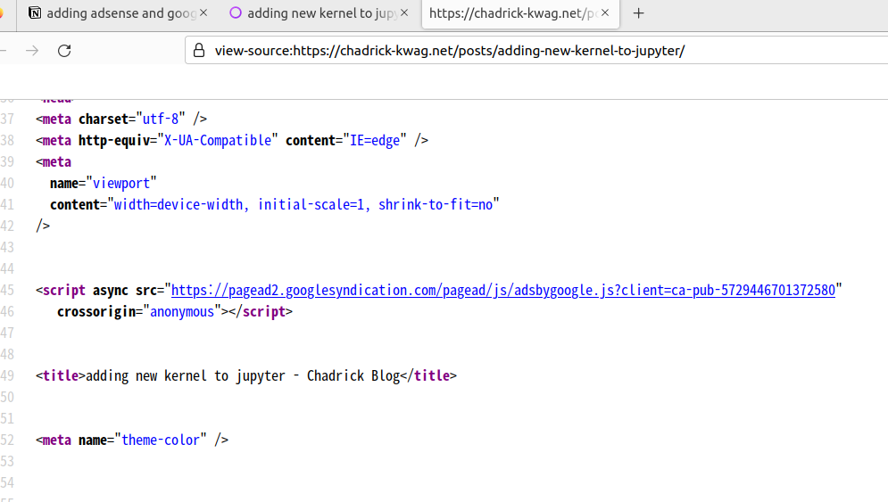
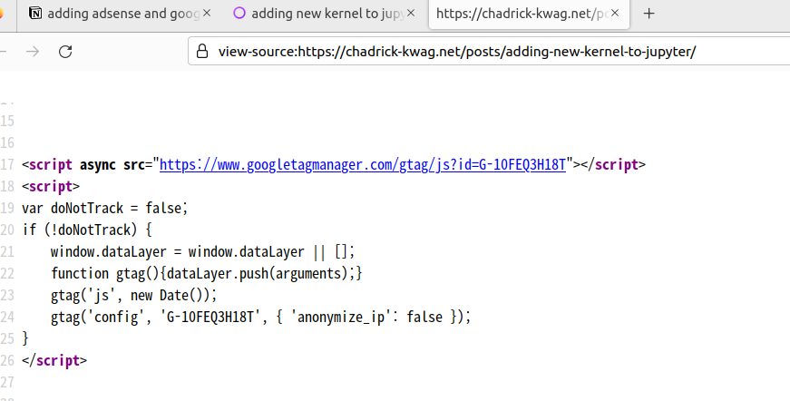

I am currently using `paper` theme for my hugo website.

## adding google analytics

There is an [internal template provided by hugo for google analytics](https://gohugo.io/templates/internal/#google-analytics). This means that you don’t have to copy paste the tracking code to  area and instead can just get away with this by providing GID to the hugo configuration file (`hugo.toml` or `config.toml` )

just add the following to the configuration file(`.toml` file)

```javascript
googleAnalytics = 'G-MEASUREMENT_ID'
```

Also check if google analytics internal template is used in the theme that you are using.

For my case, I can see that google analytics internal template is used in the `head.html` (path: `/themes/paper/layouts/partials/head.html` )

```javascript
...
<!-- Production -->
  {{ if or hugo.IsProduction (eq site.Params.env "production") }}
  <!---->
  {{ template "_internal/google_analytics.html" . }}
  <!---->
  {{ template "_internal/schema.html" . }}
  <!---->
  {{ template "_internal/opengraph.html" . }}
  <!---->
  {{ template "_internal/twitter_cards.html" . }}
  <!-- RSS -->
  {{ range .AlternativeOutputFormats }}

...
```

## adding adsense

unfortunately hugo doesn’t have an internal template for adsense. There were two things that I had to do

### add `ad.txt` file

adsense will require you to expose an[`ad.txt`](https://support.google.com/adsense/answer/12171612?hl=en&visit_id=638339817142195773-3152118506&rd=1) [file](https://support.google.com/adsense/answer/12171612?hl=en&visit_id=638339817142195773-3152118506&rd=1) containing a specific text under the an url like [`http://example.com/ad.txt`](http://example.com/ad.txt)

So after hugo building, I manually added `ad.txt` file under `/public` directory and uploaded to s3. Adsense succesfully acknowledged the file and I was verified.

### add adsense javascript code

There are a few variant of what kind of ads you are going to insert to your website. For me, I chose to go with the `By Site` ads which will just do ad placing by itself.

Get the code, and paste it in your hugo layout that manages the  tags.

In my case, I added the code in `/themes/paper/layouts/partials/head.html` file manually.

```javascript
<head>
  <meta charset="utf-8" />
  <meta http-equiv="X-UA-Compatible" content="IE=edge" />
  <meta
    name="viewport"
    content="width=device-width, initial-scale=1, shrink-to-fit=no"
  />

  <!--google adsense-->
  <script async src="https://pagead2.googlesyndication.com/pagead/js/adsbygoogle.js?client=ca-pub-5729446701372580"
     crossorigin="anonymous"></script>

  <!-- Title -->
  <title>{{ if not .IsHome }}{{ .Title }} - {{ end }}{{ site.Title }}</title>

...
```

After doing these two, rebuild hugo, upload to s3, invalidate all files in cloudfront(so we can discard the cached ones which are probably old files that don’t have adsense, GA code in it) and voila, I can see that the GA and adsense codes can be spotted in html codes both in my homepage and any post pages.




