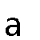
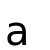

By default, cairocffi will apply AA. If you want to disable or finetune the AA option when writing text, then check out the example code.

```
import cairocffi as cairo

surface = cairo.ImageSurface(cairo.FORMAT_RGB24, 50, 50)
context = cairo.Context(surface)

# create white background
context.set_source_rgb(1,1,1)
context.paint()

# preparing to write text
context.move_to(5,45)
context.set_font_size(40)
context.set_source_rgb(0,0,0)

# changing font options which contains AA options
current_fontoption = context.get_font_options()
current_fontoption.set_antialias(cairo.ANTIALIAS_NONE)
context.set_font_options(current_fontoption)

# writing 'a'
context.show_text("a")

surface.write_to_png("output.png")
```

Here is a no-AA image and a default AA settings image.

- 

  no AA applied
- 

  default AA settings applied

for doc on AA options, check [here](https://cairocffi.readthedocs.io/en/stable/api.html#antialias).
