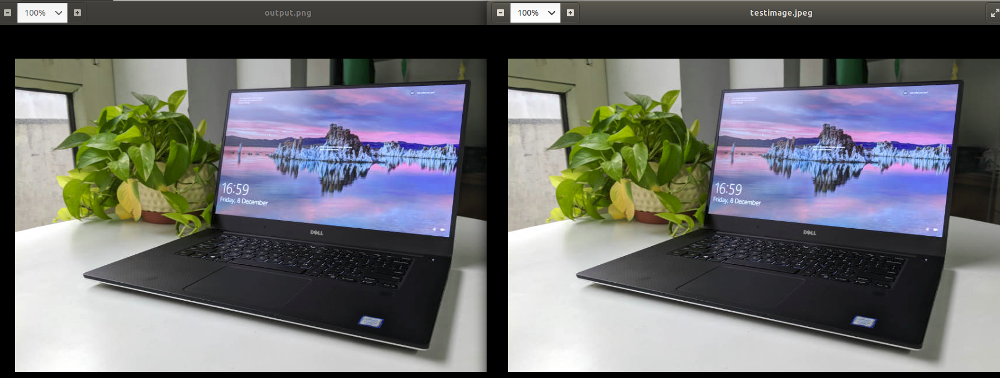

---


title: converting cv2 img to cairo surface(cairo.RGB format)
date: '2018-11-13T00:00:00+00:00'
lastmod: '2018-11-13T00:00:00+00:00'
slug: converting-cv2-img-to-cairo-surface
categories:
- machine-learning
tags:
- "cairo"
- "cairocffi"
- "cv2-to-cairo-surface"
- "opencv"
- "img"
draft: false
---
When working with cairo, occasions arise when the user wants to directly load a surface from an image. Of course, one can use the `create_from_png` method but what if the user already has a variable that hold the image data in memory? I faced such situations often when working with opencv matrices and cairo. Below is an example code which implements a simple way to convert a cv2 matrice directly to a cairocffi surface.

```python
import cairocffi as cairo, cv2


def create_rgb_surface_from_cv2mat(imgmat, opacity=0.5, background_color=(255,255,255)):
    """
    imgmat: cv2 imgmat. in BGR format.
    opacity: in range 0~1
    background_color: the background color to use. tuple format. value range: 0~255
    """

    if opacity <0 or opacity>1:
        raise Exception("opacity must be in range [0,1]")

    img_h, img_w, _ = imgmat.shape
    imgraw_bytearray = bytearray()

    for h_index in range(img_h):
        for w_index in range(img_w):
            pixel = imgmat[h_index, w_index,:]
    
            imgraw_bytearray.append(int(pixel[2]))
            imgraw_bytearray.append(int(pixel[1]))
            imgraw_bytearray.append(int(pixel[0]))


    # instead of using ndarray.tobytes(), the above will make sure that the rgb int values are concatenated.
    # in some cases, the imgmat values are not int, and it is float. in that case, ndarry.tobytes() will not give the size that we desire.
    # imgraw_bytearray = imgmat.tobytes()


    block_num = len(imgraw_bytearray) / 3
    block_num = int(block_num)

    stretched_bytes = bytearray()

    for index in range(block_num):
        start = 3*index
        
        first_index=start
        second_index = start+1
        third_index = start+2

        
        expanded_to_fourbytes = bytearray()

        # reversing the byte array order. since using smallendian
        expanded_to_fourbytes.append( imgraw_bytearray[third_index] )
        expanded_to_fourbytes.append( imgraw_bytearray[second_index])
        expanded_to_fourbytes.append( imgraw_bytearray[first_index])
        
        empty_byte = 0 

        expanded_to_fourbytes.append(empty_byte)
        
        stretched_bytes += expanded_to_fourbytes
        
    format = cairo.FORMAT_RGB24

    surface = cairo.ImageSurface.create_for_data(stretched_bytes, format, img_w, img_h)

    return surface


test_image="testimage.jpeg"

imgmat = cv2.imread(test_image)

surface = create_rgb_surface_from_cv2mat(imgmat, opacity=0.5)

surface.write_to_png("output.png")
```

What the code does is convert the cv2 image matrice into a single python bytearray. Starting from the left-top pixel, the code concatenates the BGR int value to the bytearray.

However, the `cairo.ImageSurface.create_for_data` method takes in a bytearray where every **four** bytes represent a single pixel. However, the bytearray that we concatenated earlier has every **three** bytes representing a pixel. We need to bump up every three bytes into four bytes, where the one extra byte is suffice to be an empty, or should I say have the value 0x00. This is also just 0 in integer.

Please note that the code can be very confusing because of how the bytearray creating and picking from it. It turns out that the bytearray that `cairo.ImageSurface.create_for_data` will take in will need the every four bytes representing a pixel to be in small-endian. That is why I have reversed the order of the every four bytes that is concatenated.

The code should run without errors and here is the original image and the output image.



You can see that both images are identical.

For some reason, if your output image has been created with a bizarre color then it is likely that the small-endian or the RGB/BGR order confusion when dealing with the cv2 matrice or converting it to bytearray could have messed up the RGB order of the surface. The user can tryout changing the order to find out the correct order for your system.

If you want to checkout loading a cv2 matrix directly into an ImageSurface with some specific transparency, check out this [post](/posts/converting-cv2-matrix-to-cairo-surfaceargb32-format).
