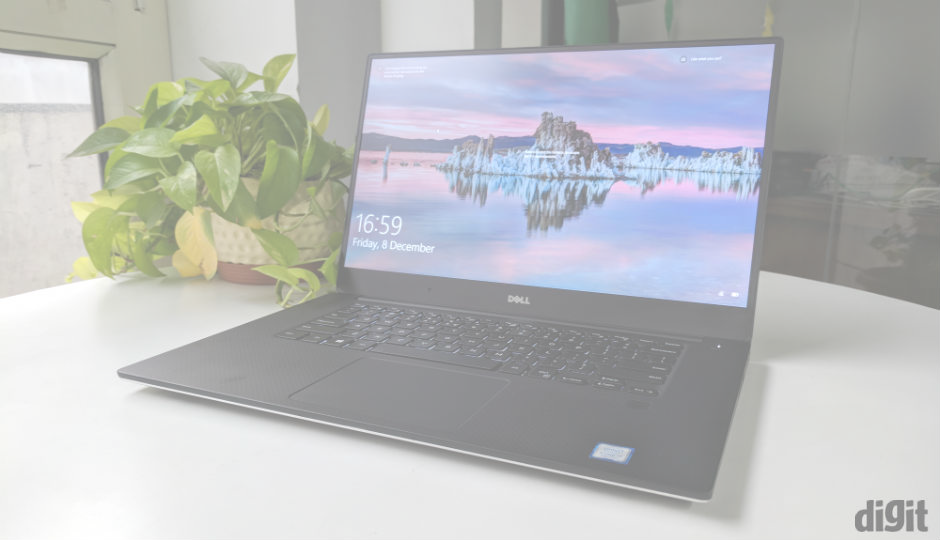
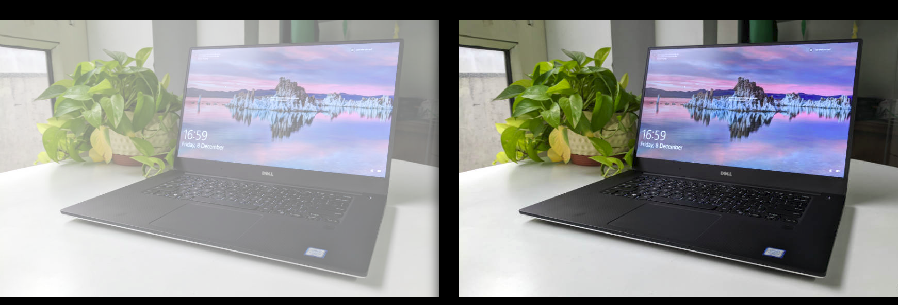
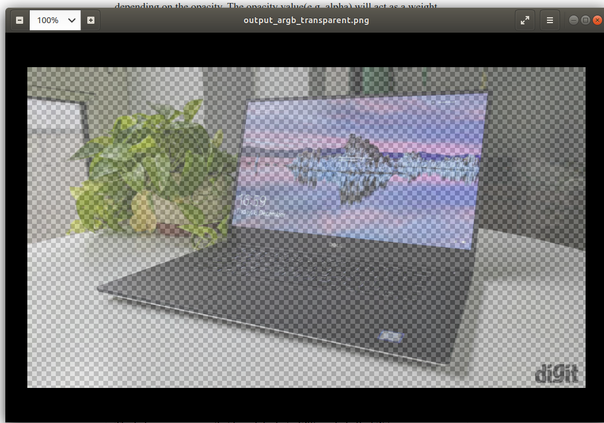

In an [earlier post](/posts/converting-cv2-img-to-cairo-surface), converting an existing cv2 matrix to cairo surface using cairo. RGB format was demonstrated. However, sometimes the user wants to load a specific image as the background in a semi-transparent manner in the cairo surface, like the image below.



I am one of those people because I wanted to draw something on top of an image but make sure that the image is faded out a little so that what I draw on top gets a bit more emphasis. In order to load an `ImageSurface` but with some transparency, the user will have to call `cairo.ImageSurface.create_from_data` method with the `cairo.FORMAT_ARGB32` format. Here is an example code showing how this can be done.

```
import cairocffi as cairo, cv2


def apply_alpha(original_int, opacity, background_int):
    output_value = original_int*opacity + background_int*(1-opacity)
    return int(output_value)


def create_argb_surface_from_cv2mat(imgmat, opacity=0.5, background_color=(255,255,255)):
    """
    imgmat: cv2 imgmat. in BGR format.
    opacity: in range 0~1
    background_color: the background color to use. tuple format. value range: 0~255
    """

    if opacity <0 or opacity>1:
        raise Exception("opacity must be in range [0,1]")

    img_h, img_w, _ = imgmat.shape

    imgraw_bytearray = bytearray()

    for h_index in range(img_h):
        for w_index in range(img_w):
            pixel = imgmat[h_index, w_index,:]
    
            imgraw_bytearray.append(int(pixel[2]))
            imgraw_bytearray.append(int(pixel[1]))
            imgraw_bytearray.append(int(pixel[0]))


    # instead of using ndarray.tobytes(), the above will make sure that the rgb int values are concatenated.
    # in some cases, the imgmat values are not int, and it is float. in that case, ndarry.tobytes() will not give the size that we desire.
    # imgraw_bytearray = imgmat.tobytes()


    block_num = len(imgraw_bytearray) / 3
    block_num = int(block_num)

    stretched_bytes = bytearray()

    for index in range(block_num):
        start = 3*index
        
        index_list = [ start, start+1, start+2]

        expanded_to_fourbytes = bytearray()

        alpha_applied_int_list=[ apply_alpha(imgraw_bytearray[index_list[i]], opacity, background_color[i] ) for i in range(3) ]

        # reversing the byte array order. since using smallendian
        alpha_applied_int_list.reverse()
        for intvalue in alpha_applied_int_list:
            expanded_to_fourbytes.append(intvalue)

        # we want the final result to be non-transparent. therefore use 255
        alpha_byte = 255 

        expanded_to_fourbytes.append(alpha_byte)
        
        stretched_bytes += expanded_to_fourbytes
        
    format = cairo.FORMAT_ARGB32

    surface = cairo.ImageSurface.create_for_data(stretched_bytes, format, img_w, img_h)

    return surface

test_image="testimage.jpeg"

imgmat = cv2.imread(test_image)

surface = create_argb_surface_from_cv2mat(imgmat, opacity=0.5)

surface.write_to_png("output_argb.png")
```

The code is similar to the one from the previous RGB case but with a slight changes. The major difference is that this time we are dealing with alpha. First, since we need to make the original image transparent-ish against some background color(which is not the same as making the original image transparent. more on this later). This is done with the `apply_alpha` function. What it does is it will simply return and int which is somewhere between the original R/G/B value and the background R/G/B value depending on the opacity. The opacity value(e.g. alpha) will act as a weight deciding whether to lean more towards the original value or the background value.

Instead of adding a null byte when extending the three bytes to four bytes, here it will add a byte that contains the value of the alpha of pixel. Since we want the output image to be non-transparent, it will have the value 255 to indicate that it is absolutely non-transparent. Below is the result.



## What if alpha byte is lower than 255?

This is the part I show you the difference of generating an image that is transparent-ish and an image that is actually transparent.

The below is an image that has alpha byte 128(nearly half of 255, so transparency=50%) but with opacity=1.0 (meaning original int values were used as it is instead of finding a value between the original int value and the background int value).



You can see that it really is transparent. Depending on what background color is used, this image can look different.

If what you want is this kind of transparent surface, then please refer to the code below. There are a few differences made compared to the code above.

```
import cairocffi as cairo, cv2


def create_argb_surface_from_cv2mat(imgmat, alpha=0.5, background_color=(255,255,255)):
    """
    imgmat: cv2 imgmat. in BGR format.
    opacity: in range 0~1
    background_color: the background color to use. tuple format. value range: 0~255

    """

    if alpha <0 or alpha>1:
        raise Exception("alpha must be in range [0,1]")

        
    img_h, img_w, _ = imgmat.shape


    imgraw_bytearray = bytearray()

    
    for h_index in range(img_h):
        for w_index in range(img_w):
            pixel = imgmat[h_index, w_index,:]
    
            imgraw_bytearray.append(int(pixel[2]))
            imgraw_bytearray.append(int(pixel[1]))
            imgraw_bytearray.append(int(pixel[0]))

            

    # instead of using ndarray.tobytes(), the above will make sure that the rgb int values are concatenated.
    # in some cases, the imgmat values are not int, and it is float. in that case, ndarry.tobytes() will not give the size that we desire.
    # imgraw_bytearray = imgmat.tobytes()


    block_num = len(imgraw_bytearray) / 3
    block_num = int(block_num)

    stretched_bytes = bytearray()

    for index in range(block_num):
        start = 3*index
        
        index_list = [ start, start+1, start+2]

        
        expanded_to_fourbytes = bytearray()

        alpha_applied_int_list=[ int(imgraw_bytearray[index_list[i]] * alpha) for i in range(3) ]

        # reversing the byte array order. since using smallendian
        alpha_applied_int_list.reverse()
        for intvalue in alpha_applied_int_list:
            expanded_to_fourbytes.append(intvalue)

        # we want the final result to be non-transparent. therefore use 255
        alpha_byte = int(255*alpha)

        expanded_to_fourbytes.append(alpha_byte)
        
        stretched_bytes += expanded_to_fourbytes
        
    format = cairo.FORMAT_ARGB32

    surface = cairo.ImageSurface.create_for_data(stretched_bytes, format, img_w, img_h)

    return surface


test_image="testimage.jpeg"

imgmat = cv2.imread(test_image)

surface = create_argb_surface_from_cv2mat(imgmat, opacity=None)

surface.write_to_png("output_argb_transparent.png")
```
