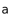
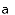
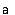
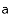
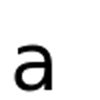

- **INTER_NEAREST** - a nearest-neighbor interpolation
- **INTER_LINEAR** - a bilinear interpolation (used by default)
- **INTER_AREA** - resampling using pixel area relation. It may be a preferred method for image decimation, as it gives moire’-free results. But when the image is zoomed, it is similar to the`INTER_NEAREST` method.
- **INTER_CUBIC** - a bicubic interpolation over 4x4 pixel neighborhood
- **INTER_LANCZOS4** - a Lanczos interpolation over 8x8 pixel neighborhood

from [the official docs](https://docs.opencv.org/2.4/modules/imgproc/doc/geometric_transformations.html#void%20resize(InputArray%20src,%20OutputArray%20dst,%20Size%20dsize,%20double%20fx,%20double%20fy,%20int%20interpolation)).

I use this often when using `cv2.resize` method. For example,

```
import cv2

img = cv2.imread("testimage.png")
resized = cv2.resize(img, (100,100), interpolation=cv2.INTER_LINEAR)
```

## reducing resize results

here is the default image.(50x50)


default image

and here are the results of reducing it to 15x15 with various interpolation methods.



cv2.INTER_AREA


cv2.INTER_CUBIC



cv2.INTER_LANCZOS4



cv2.INTER_NEAREST



cv2.INTER_LINEAR

## enlarge resize results

with the same default image used above, here are the results when it is enlarged to 100x100


cv2.INTER_AREA



cv2.INTER_CUBIC


cv2.INTER_LANCZOS4


cv2.INTER_LINEAR


cv2.INTER_NEAREST
