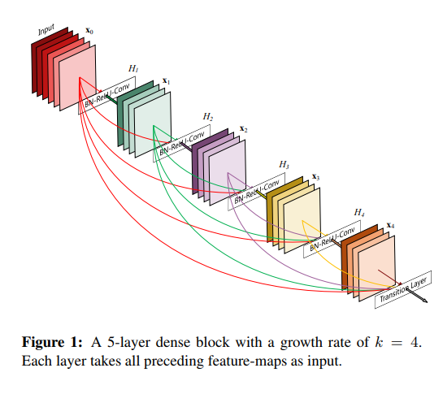
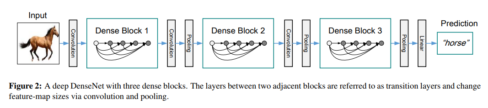
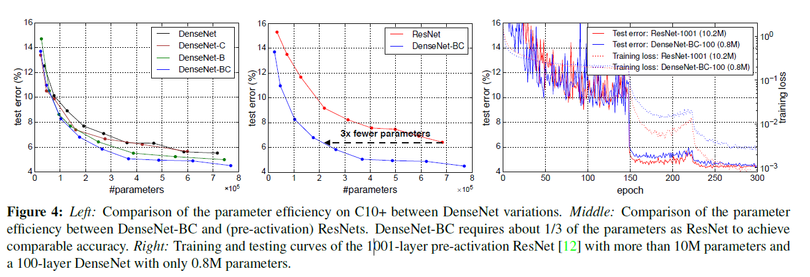

paper url: <https://arxiv.org/pdf/1608.06993.pdf>

## Core Idea

The core of DenseNet is using Dense blocks which is an essential of the idea behind it all. The core idea is that within a block, it contains multiple layers. All previous attempts before this paper only used the layers in sequential manner. An output of a layer is fed to the next layer. However, this paper suggests a different approach which is sending the output of a layer to all of the layers after it. The following figure depicts the idea.

The figure above is a description of a single dense block. The DenseNet consists of multiple dense blocks, like the figure below.

The above is just a simple depiction of how a DenseNet would look like. The real DenseNet as a few variations.

The dense block’s resolution is retained through the block. After the dense block, the user can change the resolution and apply it to another dense block.

## Advantages of DenseNet

- requires fewer parameters than traditional convolutional networks
  - because no need to relearn redundant feature maps
  - Densenet explicitly differentiates between information that is added to the network and information that is preserved.
- improve flow of information and gradients throughout the network, making it easier to train
  - implicit deep supervision
  - also has regularizing effect

## Other Remarks worth noting

> Concatenating feature-maps learned by different layers increases variation in the input of subsequent layers and improves efficiency. This constitutes a major difference between DenseNets and ResNets. Compared to Inception networks [36, 37], which also concatenate features from different layers, DenseNets are simpler and more efficient.

I can agree with the comparison between DenseNet and ResNet because ResNet does a summation instead of concatenation. However I’m not so sure about the comparison between Densenet and Inception Networks. Why does the author say DenseNets are “simpler” and “more efficient”? Is this evaluation solely made based on parameter numbers?

---

## What is a **composite function**?

The term composite function appears in this paper and it describes like this.

> Motivated by [12], we define H as a composite function of three consecutive operations: batch normalization (BN) [14], followed by a rectified linear unit (ReLU) [6] and a 3x3 convolution (Conv).

I checked out the [12] paper mentioned above to see how the author might have been inspired. The way I see it, using BN->RELU->3x3conv instead of just using 3x3 conv on the concatenated inputs is what the authors seems to be inspired by the [12] paper. In that paper, it mentioned pre-activation which is basically adding BN->RELU steps before convolution.

## What is **growth rate**?

Practically, the growth rate is the number of channels, or i.e. number of feature maps that are created for each layer inside a dense block.

## DenseNet-B, DenseNet-C, DenseNet-BC ??

These are variations of DenseNet with a few modifications. The “B” in DenseNet-B stands for “bottleneck”. This is due to introducing a bottleneck layer, which is practically a 1x1 conv layer. This means that the composite function will be changed from BN->RELU->3x3conv to BN->RELU->1x1conv->3x3conv. The reason for doing this is to reduce the feature map size before doing 3x3 conv. The paper says that is is more computationally effective.

The “C” stands for compression. At transition layers, the model can either keep the number of feature maps from the previous dense block to the next, and only change the resolution. However, to make the model more compact, the transition layer could reduce the feature map numbers by a factor. If this approach is implemented, then we add letter “C”.

If both variations explained above are applied, then the model is DenseNet-BC.

## DenseNet-BC performs better than vanilla DenseNet ?!

According to the performance chart on the left, BC variation has lower error rate than vanilla version. Wow… fewer parameters and better performance. Breaking the trade-off barrier!
