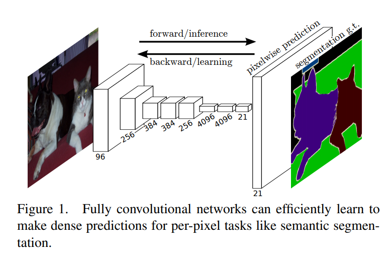
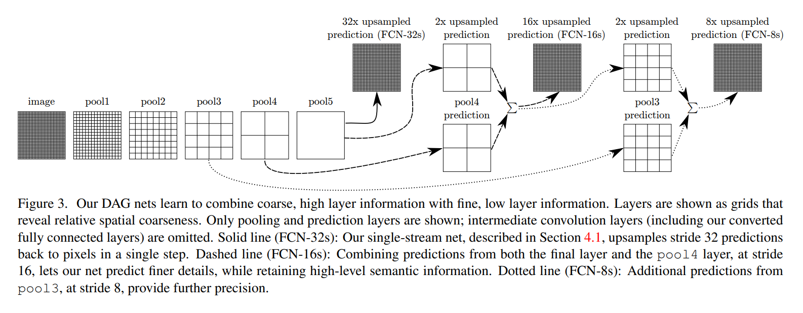
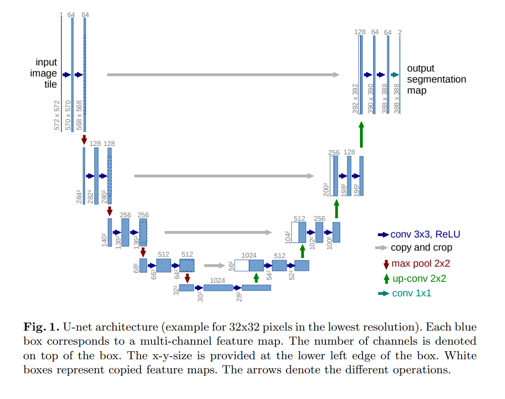
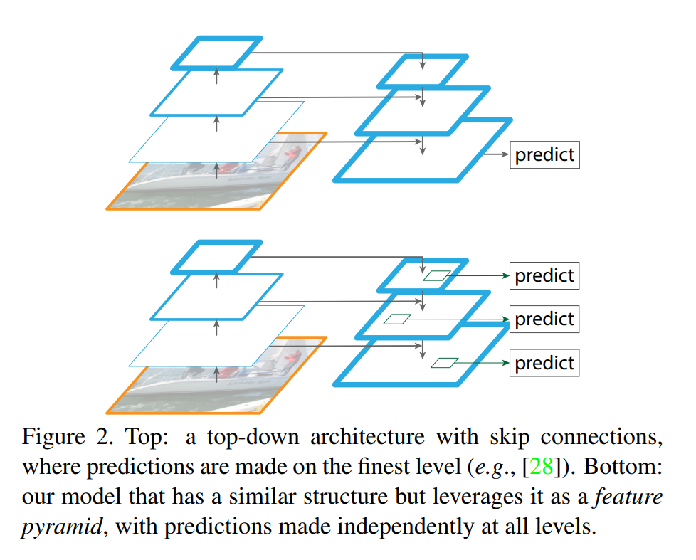

The three all seem to have “downsampling and then upsampling” idea at the core. But what are the differences? Which one is the correct one to coin when referencing the “downsampling + upsampling” idea?

## Fully Convolutional Network(FCN)

submitted: 2014.11.14  
<https://arxiv.org/pdf/1411.4038.pdf>

- remove any dense(fully connected) layers and only use convolution layers.
- downsampling and then do upsampling to get pixel wise prediction to do segmentation.
- also introduce lateral connections, which is combining downsampling feature map and upasmpled feature map on same level.
- when combining lateral connections, the paper simply adds the two.
- upsampling is a layer which is initialized as bilinear interpolation but allow the params to be learned.

this figure shows the downsampling process. upsampling process is not shown in this figure.

this is the upsampling processing of FCN

## U-Net

<https://arxiv.org/pdf/1505.04597.pdf>  
submitted: 2015.5.18

- down and upsampling architecture.
- only the final upsampled feature map is utilized.
- designed for segmentation.

overall approach is based on FCN. But there are differences in detail.

## Feature Pyramid Network(FPN)

submitted: 2016.12.9  
<https://arxiv.org/pdf/1612.03144.pdf>

- down and upsampling. predict for each upsampling level output
- the idea of having down and upsampling, or “encoder-decoder” structure is identical to others.
- however, the paper itself is about using this structured model architecture as RPN which performs better than preceeding methods.
- key unique idea compared to others is predicting with each level output, on different resolution.
- also can be used for segmentation.

the bottom figure is a proper depiction of FPN. the upper figure can be thought as an illustration of UNet.

## Conclusion

To list the three in chronological order, it would be **“fcn > u-net > fpn”**

All three share ‘downsampling-upsampling’ core idea.

I would say FPN is more of a ‘variant’ with more ideas attached to the other two, where the additional idea is “predicting on each sampling level” rather than only utilizing the final upsampled feature map.

FCN, U-net are very similar. Their core model architecture idea and implementation are nearly the same with small differences.

For one, too quote the U-net paper, the small change made in U-net compared to FCN, is having large number of feature channels in upsampling part resulting in a more ‘symmetric’ model architecture.

Another slight difference between UNet and FCN is upsampling method. In FCN, the same level downsampling feature map and upsampled feature map are simply added and upsampled right away. On the other hand, in UNet, it is concatenated and then goes through some conv layers for additional processing.
