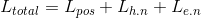
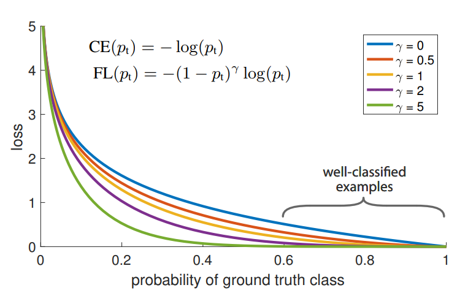

---

title: Focal Loss (a.k.a RetinaNet) paper review
date: '2018-11-18T00:00:00+00:00'
lastmod: '2018-11-18T00:00:00+00:00'
slug: focal-loss-a-k-a-retinanet-paper-review
categories:
- paper-review
tags:
- "focal-loss"
- "object-detection"
- "retinanet"
- "focal"
- "loss-function"
draft: false
---
I have heard so much about `Retinanet` in the realm of object detection and recently I had the chance to read the paper. Surprisingly, the paper is titled with “focal loss” and not “RetinaNet”. The most important lesson that I learned here was that it was the “focal loss” that was the key idea and not RetinaNet. Here are key points that I would like to summarize.

## Starting Question

In the past, there have been two major approaches for designing an architecture for object detection: 1) two-stage detectors and 2) single-stage detectors. Two-stage detectors work in two sequential stages where the first acts as a region proposal network and the second will actually extract localization from the candidates given by the first stage. Single-stage detectors do both of this at one-shot, thus its name. After various works in both approaches, an empirical truth had formed which is: *“two-stage detectors have better accuracy even though they are slower than single-stage detectors”*. Well, one can say that is obvious since two stages somehow must be better than a single stage in size of network.

But really, is the size of the network really what makes this difference? What other reasons could be playing in hidden sight that could make these differences between a two-stage and a single-stage detector? To this question, the authors were very clever to point out that loss is what created this taboo.

## Training = reducing loss

When you learn deep learning basics, the key idea of training is simply gradually updating variables(weights, bias) so that the loss will be minimized. What the authors did was a good old “back to the basics” move.

In object detection, both single-stage and two-stage networks will output bounding boxes and loss will be calculated based on these predictions. The predicted boxes can be roughly divided into

- positives : considered as a match with ground truth box
- hard negatives : nearly a positive but not considered as a match
- easy negatives : not even worthy of consideration. e.g. boxes that boxed only background.

Of course when calculating the loss, all of the predicted boxes will contribute have their own calculated loss values and contribute to the total loss. This can be put as:

where `h.n` stands for hard negatives and `e.n` stands for easy negatives.

The most ideal case would be where hard negatives and easy negatives do not come up in predictions so loss of positives is only used in training. In this ideal case the training would be absolutely efficient since it would be learning how to localize better than before after each training step.

On the other hand, imagine a situation where L_hn and L_en are both large and Lpos is small. In that case, an optimizer would of course reduce the total loss but it would be most likely that it would be reducing the L_hn and L_en instead of focusing minimizing L_pos. Of course, this occasion is somewhat inevitable since in object detection, whether in two-stage or single-stage, the number of negatives(both hard and easy) is much larger than the number of positives. I will explain more on this later.

Assume the very first step of training after initializing the variables in the network. The loss generated from all predicted boxes would be similar at this point. Since the number of negatives outnumber that of positives, [latex](L_{hn} + L_{en}) »> L_{pos}[/latex]. Naturally, the optimizer would be in favor of minimizing [latex](L_{hn} + L_{en})[/latex]. As time passes, the optimizer will reach a point where [latex](L_{hn} + L_{en})[/latex] and [latex]L_{pos}[/latex] becomes similar and from that point on, the optimizer will be working on improving the positive predictions as well. The key point here is that [latex]L_{pos}[/latex] and [latex](L_{hn}+L_{en})[/latex] are in some sort of race with each other.

This mechanism is what is behind the inefficient training that single-stage detectors have been suffering more than its counterpart. Two-stage detectors have a first stage which reduce the number of easy negatives, so L_en is much smaller than in a single-stage detector when calculating loss.

## How to reduce [latex](L_{en} +L_{hn})[/latex] in single-stage detector?

While the above observation gives a heuristic explanation on why single-stage detectors have been suffering performance degradation compared to its counterpart through these years, it also hints on how it may reduce this gap: reduce the [latex](L_{en} + L_{hn})[/latex] to a level comparable to that of a two-stage detector!

This is what focal loss is trying to achieve. In single-stage detectors, it evaluates all anchor boxes in all grids in a feature map. This means that loss of all boxes, regardless of whether they are positive, hard negative, or easy negative, contribute to the loss function. Trying to filter out some negatives at this point with some additional network would be practically modifying a single-stage detector into a two-stage detector. Thus, excluding the boxes that will turn out to be negatives is nearly impossible. Therefore the authors argue that reducing the loss contributed by negatives should be the way to go.

In the paper, the authors propose to use a modified version of cross-entropy loss function instead of the vanilla version. Cross-entropy loss function itself has been widely known to be a good function to use for learning to discriminate binary choices. However, the authors point out that even cross entropy loss that produce sufficient confidence level in object detection generate loss that cannot easily be ignored.

In the figure above, the blue line is the cross entropy. In object detection, although it varies among papers and occasions, I personally have encountered a lot of implementations where an object is considered to be an “object” if it has class confidence over 0.6.  Imagine if a single-stage detector predicts 5 anchor boxes in each grid, and the feature map that it is working on is the size of 7x7. This produces 245 boxes in total. Assume that there are 5 objects in this given image and that would make 5 ~ 10 ground truth boxes could exist. That means that the remaining 235 boxes are negatives. At this point, let’s assume the worst case. the positives have not been learned by the network and the probability of these positives boxes are somewhere near 0.02 so that each of the positive boxes generate a loss of 5. That means [latex]L_{pos}= 5\times10 = 50[/latex]

On the other hand, because it is the worst case here, the negatives have been learned well by the network and its probability has been correctly predicted with 0.6 confidence. That means that each negative box created a loss approximately 1. That translates to [latex]L_{hn}+ L_{en} = 235 \times 1 = 235[/latex].

50 vs 235. If these values are used as it is when calculating the loss, there is no doubt in which direction the optimizer will train towards. To reduce the dominance of negatives in total loss based on their sheer number, the authors propose to add a modulating factor in cross entropy loss. This can be expressed as,

[latex]FL(p_t)=-(1-p_t)^\gamma log(p_t)[/latex]

where [latex]\gamma[/latex] is a tunable focusing parameter. As shown in the figure below, with a larger focusing parameter, the loss is very small even at confidence levels that used to produce some amount of loss.

If we use this loss function in the previous example, the loss of 235 negatives would reduce drastically to a level, hopefully, comparable to the loss of positives.

The effect of using focal loss is:

- the loss of well-classified examples is down-weighted
- reduces the loss contribution from easy examples and extends the range in which an example receives low loss

Although this effect is favorable towards more efficient training, I think this modulation factor can neutralize the fundamental purpose of training if applied too strongly. Unless a separate loss function is used for positives, the focal loss will reduce the loss of positives when they are gradually becoming more well classified. Even the authors stated that through experiments they empirically found [latex]\gamma=2[/latex] to work best.

To address the class imbalance, alpha-balanced cross entropy loss is used as a baseline. But this is concept is not a part of focal loss but rather a technique to address a different issue called “class imbalance”.
