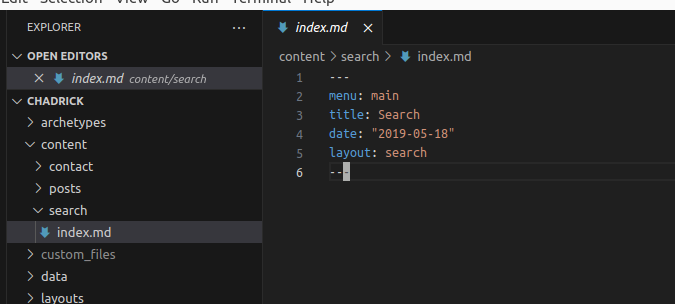
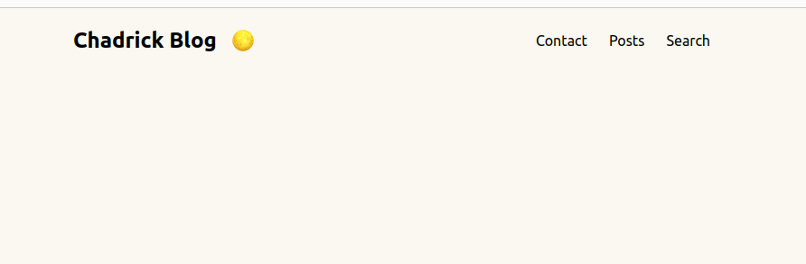
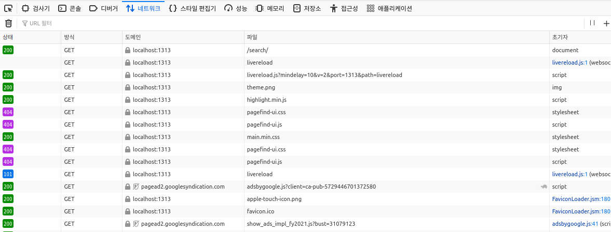
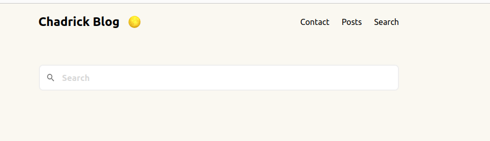

**PageFind** is a great library for implementing search feature in hugo. It creates a search index based on the the html files created by hugo build and allows this search index to be used in a separate search page prepared by the user. Besides that, it provides a nice UI search box from the start so unless I want to customize the css, I can just use the provided default one and it still looks good.

[The official guide](https://pagefind.app/docs/) is simple and easy. But, it didn’t work in my hugo project.

## adding pagefind html code

Creating a search index using pagefind npm package was easy. All I had to do was run `npx pagefind --site public` from my project root so that it will rummage through all html files under `public` directory generated by hugo build.

However, the the trouble was adding the small html/javscript code that pagefind official docs said to add in hugo.

```javascript
<link href="/pagefind/pagefind-ui.css" rel="stylesheet">
<script src="/pagefind/pagefind-ui.js"></script>
<div id="search"></div>
<script>
    window.addEventListener('DOMContentLoaded', (event) => {
        new PagefindUI({ element: "#search", showSubResults: true });
    });
</script>
```

Of course, I created a “Search” menu and a content page for it.



In one of the articles that I googled, the author simply copied the html/javascript code in the content page markdown file and it seems to work. But it didn’t work for me and I still don’t understand why it didn’t work for me.

Since the key point of adding this code is that this code should appear on the ‘search’ page that I prepared, I decided to go with assigning a separate layout for this ‘search’ page only and insert the pagefind html code in this layout file.

I created a layout file under `layout/page/search.html` like the following.

```javascript
{{ define "main" }}
<link href="/pagefind/pagefind-ui.css" rel="stylesheet">
<script src="/pagefind/pagefind-ui.js"></script>
<div id="search"></div>
<script>
    window.addEventListener('DOMContentLoaded', (event) => {
        new PagefindUI({ element: "#search", showSubResults: true });
    });
</script>
{{ end }}
```

My ‘search’ page markdown file (located in `contents/search/search.md`)

```javascript
---
menu: main
title: Search
date: "2019-05-18"
layout: search
---
```

Because I set the `layout` param in front matter, hugo will use the `layout/page/search.html` layout when building this page.

## hugo server not serving pagefind files

Up to this point, my plan looked flawless. But after hugo build and running it with `hugo server`, my search page still didn’t work. I could open the search page, but there was no pagefind search box included in it.



I opened chrome developer tools and found that for some reason it was not able to fetch [`http://localhost:1313/pagefind/pagefind.js`](http://localhost:1313/pagefind/pagefind.js) and css files. WTF? All other pages open without any problems and why is it unable to fetch pagefind related files?



After a lot of googling, it seemed like hugo server itself does a lot of things under the hood without the user noticing and I came up with a suspicision that hugo server was somehow not seeing the pagefind files in the `public` dir. And by default, hugo server uses memory cache when serving files and perhaps for some reason hugo server was not mem caching pagefind files properly. Therefore I tried running hugo server with `--renderToDisk` option which means to serve directly from disk file and not use memcache. And this time(full cmd: `hugo server --renderToDisk`), I can see the pagefind search box in my search page!



What a hassle…

Come to think of it, [in the pagefind developer video](https://www.youtube.com/watch?v=WgoBoX4qTk8), the developer used python http.server to run its pagefind demo and perhaps there was a reason why he didn’t use `hugo server` . I still don’t know the exact reason why a raw hugo server won’t serve pagefind files but at least the problem wasn’t on pagefind itself.

## bonus: restricting pagefind index creation to only post htmls

One small tip for my pagefind implementation was restricting pagefind indexes to **only** posts. If I pagefind on `public` dir, it will go through **all** html files. But some of my html files include html files for `tag` or `category` pages. I didn’t want pagefind search results to show these tag/category pages since they seem redundant and occupy top search result slots which didn’t look good. I wanted search results to show only posts.

Therefore I modifed my pagefind cmd to `npx pagefind --site public --glob posts/*/*.{html}` so that it will only go through post htmls when creating a search index.
