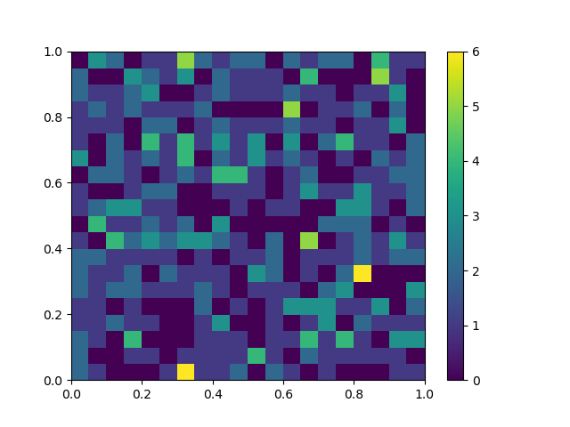

here is the sample code for drawing a single axis in a figure.

```python
import matplotlib.pyplot as plt, numpy as np, os

figure = plt.figure()

sample\_size = 500
x\_arr = np.random.rand(sample\_size)
y\_arr = np.random.rand(sample\_size)

# since x,y range is 0~1, create bin for x and y with space of 0.05.
# this bin will be used for both x and y axis in this example.

space = 0.05
common\_bin\_arr = np.arange(0,1+space\*0.5, space)

plt.hist2d(x\_arr, y\_arr, bins=common\_bin\_arr)
plt.colorbar()

outputdir = 'testoutput/t1'
if not os.path.exists(outputdir):
    os.makedirs(outputdir)
savepath = os.path.join(outputdir, 'save.png')
figure.savefig(savepath)


```



The above is the result.

I have tried to create several subplots and add heatmap to each one with individual colorbars on its side, but it seems this is hard to implement.
