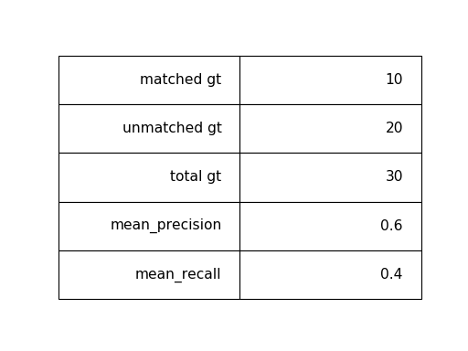
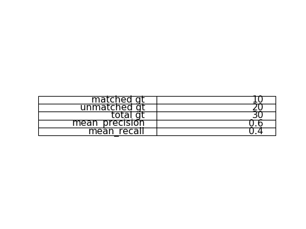

```python
import matplotlib.pyplot as plt 

fig = plt.figure(dpi=80)
ax = fig.add\_subplot(1,1,1)

table\_data=\[
    \["matched gt", 10\],
    \["unmatched gt", 20\],
    \["total gt", 30\],
    \["mean\_precision", 0.6\],
    \["mean\_recall", 0.4\]
\]

table = ax.table(cellText=table\_data, loc='center')
table.set\_fontsize(14)
table.scale(1,4)
ax.axis('off')

plt.show()
```

output:



`table.scale` function will help adjust the row height to match to the font size.

Without the `table.scale` function, here is what the output looks like.


