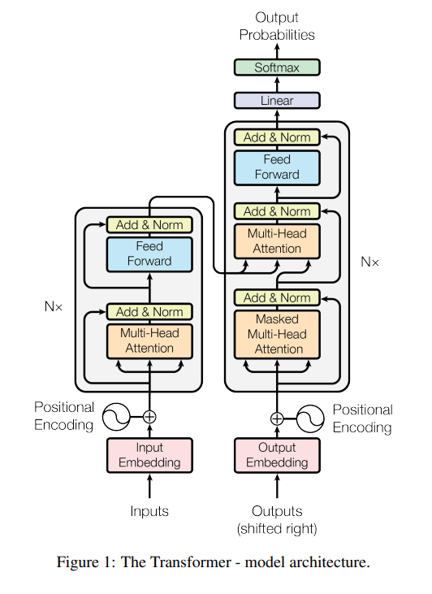
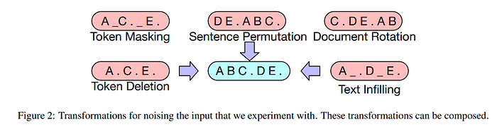
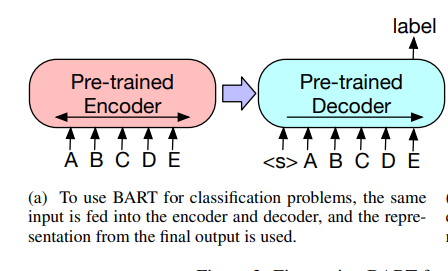
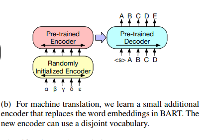
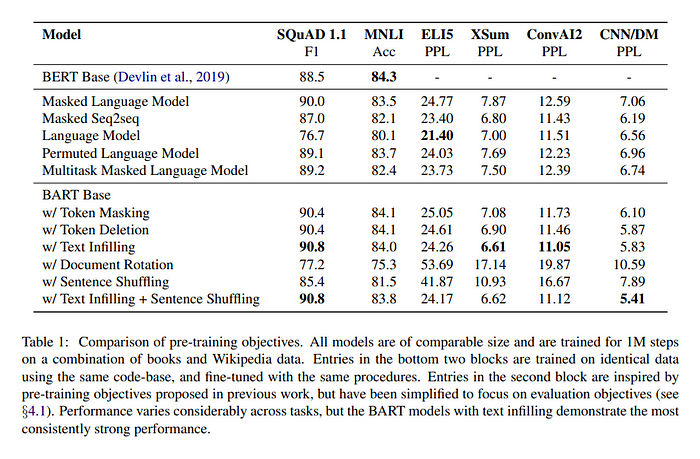

arxiv: <https://arxiv.org/abs/1910.13461>

# key points

- propose autoregressive model named BART, which is architecturally similar to standard transformer encoder + decoder
- Check out 5 pretraining tasks, and experiment which pretraining task is most helpful
- test BART performance with large scale pretraining on downstream tasks

---

# Model Architecture

encoder and decoder of standard transformer architecture

This work introduces BART, which is fundamentally nearly identical to standard sequence-to-sequence transformer architecture, with a few modifications

- use GeLU instead of RELU
- different layer size  
  - base version: 6 layers for encoder, 6 layers for decoder  
  - large version: 12 layers for encoder, 12 layers for decoder
- each decoder layer additionally performs cross-attention with output fron final hidden layer of encoders.
- doesn’t have feed-forward network at the very end

---

While the model architecture is quite simple, the key contribution of this work is an elaborate experimentation on the various pretraining tasks. While many other papers were about “oh we used this pretraining task along with others and got better performance! WOW”, this paper is more about “from all those many pretraining tasks, which are **really** helpful and effective?”

# Pretraining Tasks

tasks are all about recovering from document corruption. five types of “noising” methods are used.

## token masking

follows BERT.

## token deletion

delete token and make the model to restore deleted token at the right position.

## text infilling

multiple words are selected in a span, and replaced with single MASK token. this will teach model to predict how many tokens are missing.

## sentence permutation

shuffle sentences and make model restore them.

## document rotation

select random token. change document ordering to start from selected token. make model predict the start of the original document.

# Finetuning

To evaluate the model performance(and eventually find which pretraining tasks contribute most to performance), the following downstream tasks are used for finetuning.

## sequence classification

same input sequence is fed to encoder and decoder.

Final hidden state of final decoder token is used for classification.

Similar approach to [CLS] token output in BERT but difference is that in BART we use the final token’s output so that the output token is a result of attending to all previous input tokens.

## token classification

feed input sequence to both encoder and decoder.

The top hidden state of decoders are used as representation to classify each corresponding input token.

## sequence generation

input sequence is fed to encoder, while the decoder autoregressively generates output.

## machine translation

At first glance, one may ask: isn’t this just a part of “sequence generation” task? and yes it is but this specific task takes a slightly different approach.

Instead of finetuning the BART model itself to the current downstream task(machine translation), it uses a pretrained BART model as a submodel, where another small encoder is attached to the BART encoder.

This configuration is to show that a pretrained BART model itself as a whole can be utilized by adding the small front encoder for machine translation task on a new language.

The existing BART’s first encoder’s embedding layer is replaced to a randomly initialized encoder, and then the entire model is trained end-to-end. This new encoder can use a separate vocabulary from the pretrained one.

When fine tuning in this configuration, the training is split to two phases. The first phase will only train parameters of the new encoder, BART positional embeddings, and self-attention input projection matrix of BART’s first encoder layer. On the second phase, all model parameters are updated.

# Pretraining Task Comparison

As mentioned, in this section the authors analyze which pretraining tasks are effective.

The authors do this investigation where 5 other models trained with similar pretraining tasks metnioned previously are compared against 6 downstream tasks.

The results are summarized in the following table.

The authors’ conclusion from this experiment on pretraining tasks can be summarized as following:

- performance of pretraining methods varies significantly across tasks
- token masking in crucial
- left-to-right pretraining improves generation
- bi-directional encoders are crucial for SQuAD
- pre-training objective is not the only important factor. architectural choices matter such as having relative position embeddings, segment-level recurrence, etc.
- pure language models perform best on ELI5 downstream task.
- BART achieves the most consistently strong performance

# Large scale pretraining experiment

Recent work show that downstream task performance improves significantly when pretraining is done with large batch sizes. So the authors also test this method, but with only combination of text infilling and sentence permutation since this setup shows the best performance during pretraining objective comparison experiment.

After pretraining in large batch sizes, the authors test the performance on downstream tasks.

## discriminative task

overall BART performs similar to other models

## generation tasks

for summarization, BART performs better than pervious works. Especially outperforms by a significant margin in XSum dataset which is highly abstractive.

for dialogue, BART outperforms others.

for abstractive QA, BART does better than others but still the task is very challenging even for BART.

## machine translation

It experiments the “machine translation” setup mentioned in one of the pretraining tasks where the a pretrained BART is reused by adding a fresh new encoder at the front.

This experiment compares against baseline transformer architecture, using WMT16 Romanian-English dataset.

Results show that using BART in this way wasn’t effective.

---

*details on datasets and test results used for downstream tasks can be found in the paper*
