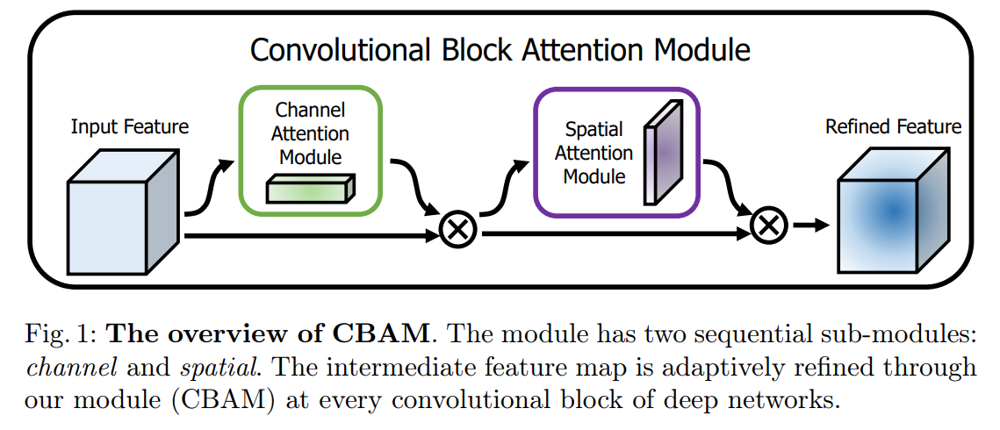
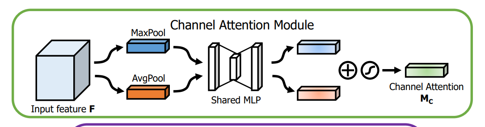
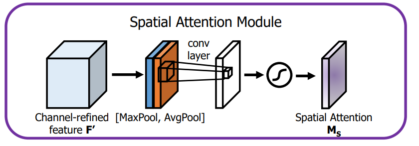
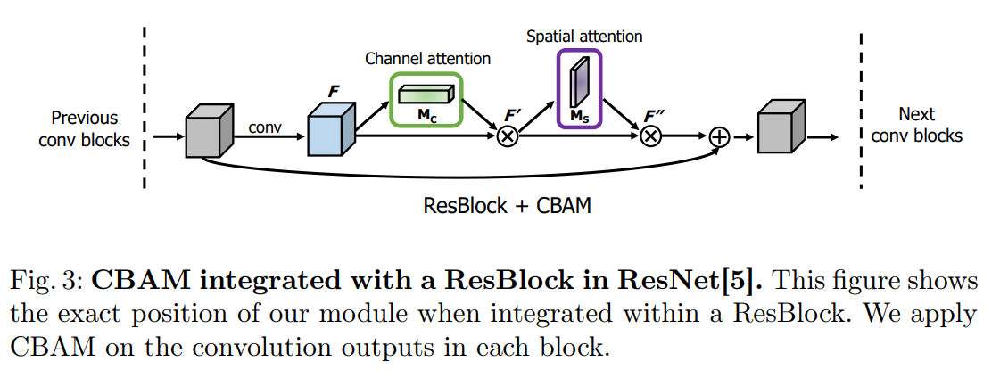

arxiv: <https://arxiv.org/pdf/1807.06521.pdf>

## key point

trying to attach attention module to CNN. but instead of blindly attaching it which would compute a 3D attention map which is computationally expensive, this work proposes to compute spatial attention and channel attention separately which achieves a similar effect with much less parameters.

Personally the idea reminded me of depthwise separable convolution.

The CBAM consists of two modules: channel attention module and spatial attention module. The flow is like this figure.

## Channel attention module

for a given feature map, extract channel attention vector using two pooling methods at the same time. It uses both average pooling and max pooling on each channel feature. So we get two Cx1x1 vectors, one produced by average pooling and another by max pooling. The two go through a simple bottleneck dense layer network. The two outputs are then combined by summation and sigmoid is applied. The final result is a Cx1x1 vector which contains the importance of each channel of the original feature map.

The channel attention vector will be applied to the original feature map point wise, which will create a F' vector which is shaped the same as the original feature map, F.

## Spatial attention module

Channel wise processing has been done in channel attention module so the next step is to process the features in width and height dimension. The output of channel attention module is still CxHxW. The spatial attention module will apply average pooling and max pooling pointwise, which will produce two 1xHxW features. Concatenate these two and apply 7x7 convolution, and then apply sigmoid function which will result in 1xHxW shaped feature, which is called spatial attention map.

Apply this spatial attention map to F' pointwise, resulting in a CxHxW vector and we get the final output of CBAM.

The input and output of CBAM has the same shape, so this module can be easily applied to existing methods. For example, the following figure shows how CBAM can be incorporated to a Res block.

## Different structures?

Since CBAM consists of two independent modules, one may think about applying them in parallel instead of sequentially. The authors say that they tested it and using it in sequential manner gives better results.

Also the authors say that they tried using spatial attention module first instead, but it gave worse results. Thus, CBAM proceses channel attention module first.
