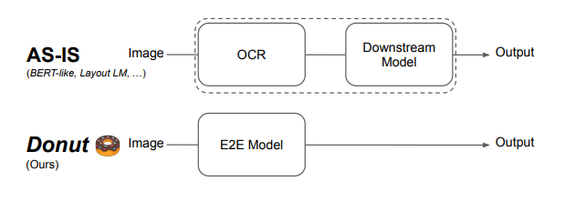
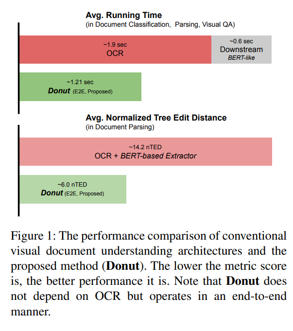
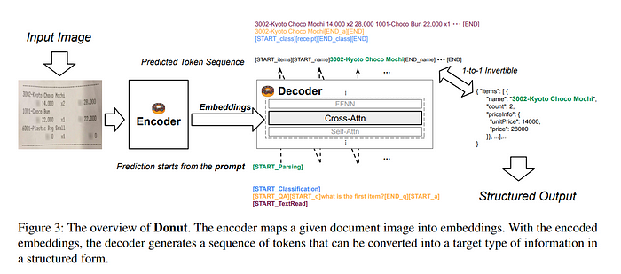
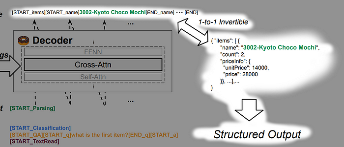
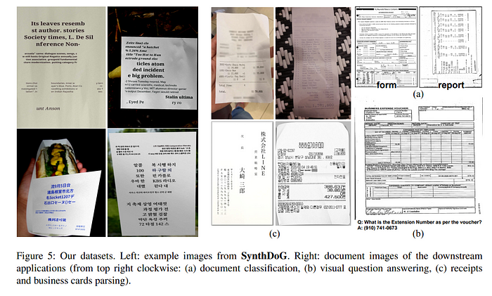
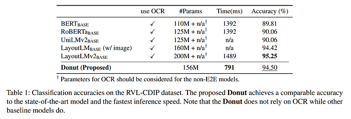
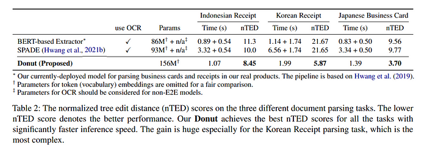
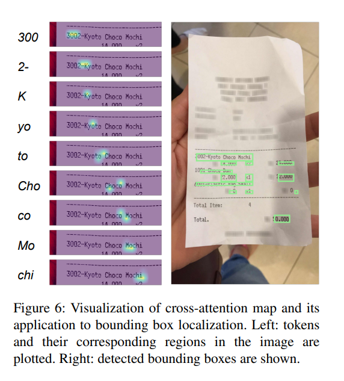
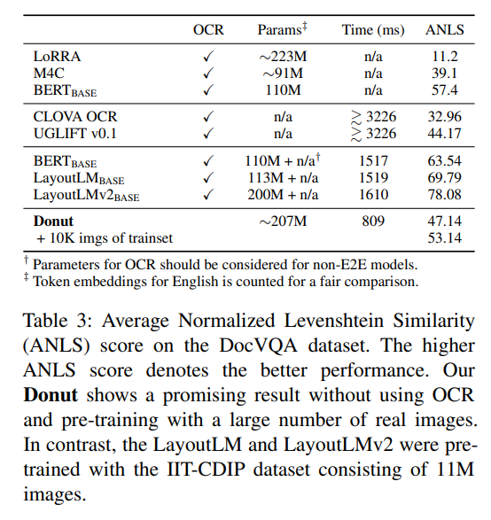

arxiv: <https://arxiv.org/abs/2111.15664>

# Key Points

- visual document understanding model which does OCR + downstream task in one step with a single end-to-end model
- outputs are generative, and formatted to be convertible to JSON, which makes this architecture highly compatible to various downstream tasks.
- present SynthDoG, a synthetic document image generator used in this work

# Overall Structure

While previous works have adopted a two stage approach, by first extracting text and then using models that use text as input and output desired document information, this work proposes to do these two separate tasks in one shot.

Due to this difference, this work outperforms previous works in terms of speed.

The model architecture consists of a visual encoder and textual decoder

# Visual Encoder

convert input image(HxWxC) to embedded feature(Nxd), where N=feature map size(width x height of final feature map) swin transformer was used

Authors doesn’t mention a specific input image size.

# Textual Decoder

use multilingual BART for decoder architecture

Due to speed/memory considerations, only used first 4 layers of BART.

Does cross attention between text input sequence and visual encoder’s output(visual embeddings).

Since it has a decoder it can be autoregressive

# Model Input and Output

The model takes in two inputs:

- image
- text with prompt

text input varies based on the downstream task. It uses special tokens to represent a specific task. If the task requires more than just a token, for example a question answering task, the text input can include the question text as well.

The output will differ on each task. But for cases when the output is structured, then the output will be a sequence which can be converted to JSON format. Below is an example where the output sequence conforms to use special tokens to mark the start and end of a field, which can be turned into a JSON format.

If the output tokens are wrongly structured, i.e. [START_NAME] exists but [END_NAME] doesn’t exist, simply treat the field as lost.

# Synthetic document generator

Previous works relied on using large scale document image datasets for training. But this is not feasible when targeting real world documents and when required to handle other languages than English.

Therefore the authors came up with their own synthetic document generator which renders document images. It can have various backgrounds, layouts, and text. The authors mention that they also used some image rendering techniques to imitate real photographs.

The following are some examples of generated images

# Pretraining

1.2M document images are generated with syndog and is used for training set. It uses English, Korean, Japanese text from Wikipedia.

The model is training to read all the texts in the images in the reading order from top left to bottom right.

# Finetuning

finetuning is done for each downstream task.

This work interprets all downstream task as a JSON prediction problem, and three types of downstream tasks are performed.

# Document Classification

shows comparable performance with SOTA

# Document Parsing

task is to extract desired structured information from input document image.

evaluation metric: normalized tree edit distance(nTED)

this work shows best performance.

also localizing extracted value can be done with attention maps, and creating bounding boxes with them are not so bad.

# Document VQA

shows lower performance than LayoutLMv2. But considering that LayoutLMv2 was pretrained with 11M sized large dataset of real document images, while this works used synthetic images and only 1.2M images, this performance gap could be explained.

