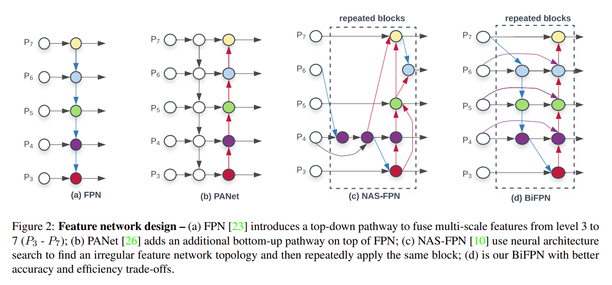
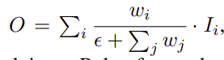
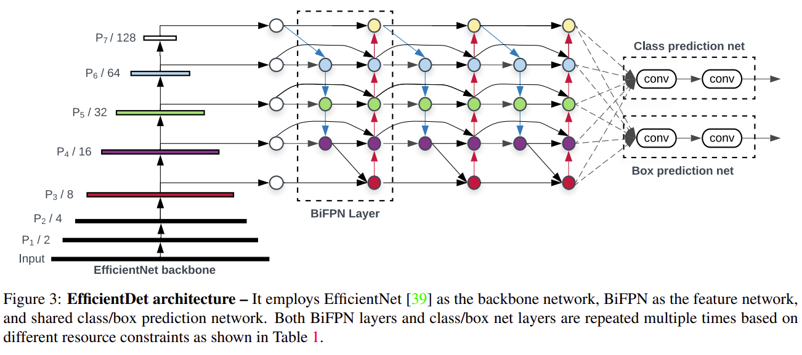

arxiv link: <https://arxiv.org/abs/1911.09070>

## key points

- multi scale with weighted bi-directional fpn.
- model scaling. compound scaling method, which jointly scales up resolution/depth/width for all backbone, feature network, box/class prediction network.
- use efficientnet backbone

## Bi-directional FPN

Here are the key points of bi-directional FPN

- enhancement from PANet with some modifications
- remove nodes with only one input. reason: no feature fusing will happen so it would be okay to eliminate this and also save computational cost
- use original scale feature during upward path same level aggregation(more residual connections)
- do this top-down, bottom-up path multiple times
- weighted: let the network learn the weight. there are a few candidates, but the paper adopts fast normalized fusion

here is the formula for fast normalization, where all `w` values are outputs of relu, so its value is guaranteed to be >=0:

## Network Structure

