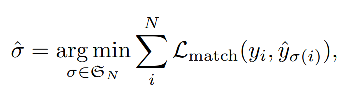
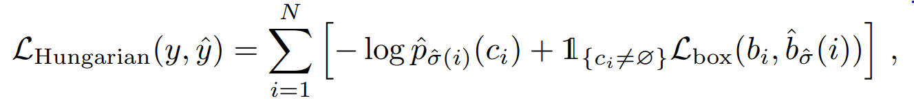
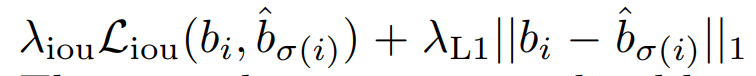
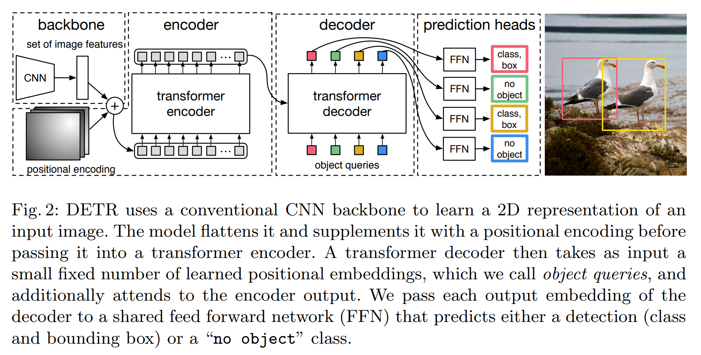

[arxiv link](https://arxiv.org/pdf/2005.12872.pdf)

## key points

- introduces transformer into the domain of object detection
- compared to existing approaches, no need for anchor priors and post processing such as NMS to handle with multiple box predictions matching to single gt. this is possible thanks to matching stage

## matching stage

the transformer will make total of N predictions, and in order to apply loss function during training, the model needs to find which prediction matches to which ground truth. This is done by bipartite matching, which finds a one to one pair between prediction and gt label based on ‘matching cost’.

The above equation, sigma stands for matched result, and L_match stands for matching cost. We want to find a matching result which will result in the lowest total matching cost, and this optimal matching can be done by Hungarian algorithm. I’ll have to dig more into this algorithm tho.

## loss function

while reading the paper, I first was confused between the matching cost and loss function. But they are two different things, and loss function takes place **after** matching is done.

The loss is shown above and the paper calls it the “hungarian loss”. I’m not sure why its called like that but the formula is quite self explanatory. It sums up loss for all matched pairs determined from our previous matching stage. The first term accounts for the class, and the second term accounts for the box coordinates.

The paper notes that since in most cases “no object” matches outnumber valid object matches, exposing loss function to ‘no object’ class imbalance. Therefore, the paper noted that it down weighted the sum of ‘no object’ losses by 10.

How box coordinates are predicted is related to box loss. Since DETR doesn’t utilize anchors, the box dimensions are predicted directly. In other words, if there was an anchor, the anchor’s center position and width/height will be used as a basis(set as ‘1’) and the model prediction can predict offset/factor values from this basis.

Because DETR directly predicts box coordinates, it suffers from scale issues. For example, a big object bounding box will have width of 0.2. But a small object will have width of 0.02. If we use l1 or l2 loss, then the training will be too biased towards big objects and small object detection will be weak only because of scale difference.

To mitigiate this drawback, the authors propose using GIOU loss along with l1 loss for calculating box loss.

From what I understand from reading about GIOU, I wonder why the authors just didn’t ditch l1 loss and use GIOU only. Perhaps this is due to emperical reasons.

## Architecture

the following figure nicely summarizies the overall structure of DETR.  
one FFN is shared across all transformer outputs.

## auxiliary loss

- an auxiliary loss was used in decoder.
- helpful to train model to predict correct amount of objects
- add FNN and hungarian loss after each decoder layer

## modified for segmentation

if we add mask header on decoders, we can use the model for segmentation
