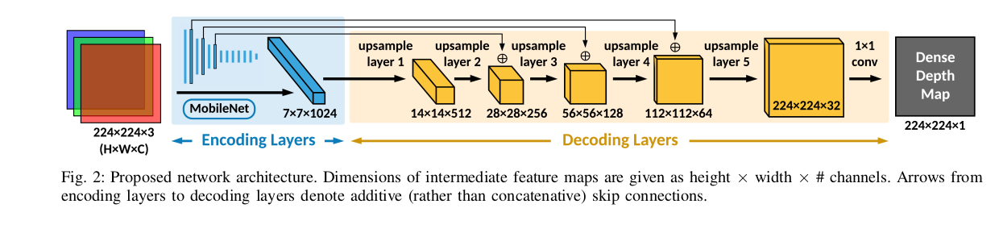
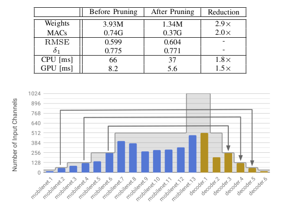

arxiv: <https://arxiv.org/abs/1903.03273>

# key points

- model to predict depth map
- maximize speed by making it light as possible
- focus not only on encoder network but also on decoder network for speed improvement
- mobilenet for encoder, nearest-neighbor interpolation + NNConv5 for decoders, use skip connection, use depthwise separable convolution where ever possible, do network pruning, use TVM compiler stack to optimize depthwise separable convolution which is not optimized in populate DL frameworks.

## differences with prev works

while previous works focused on improving accuracy without considering real-time speed performance, this work focuses on making fastest possible depth predicting model at the cost of only slight accuracy drop.

## encoder

use mobilenet as encoder. mobilenet uses depthwise decomposition, which reduces computational complexity.

## decoder

- nearest-neighbor interpolation is used. I think the author chose this because it does less computation.
- for upsampling operation, the authors use NNConv5 module which is 5x5 convolution + nearest-neighbor interpolation. the convs are replaced with depthwise separable convolutions.
- do upsampling after convolution layer to reduce complexity.
- skip connections between encoder and decoder layers on the same level. three levels do it. addition is done rather than concatenation to avoid increasing channels.
- in ablation study, when concatenative skip connections are used, the accuracy is slightly better but it requires more parameters. The authors decided that the cost of more params which slows down the model is not work the very small accuracy improvement.

## network pruning

netadapt is used to prune network. The reduction of weights and channels are amazing. There is absolutely negligible accuracy drop.

## more speed optimization

- TVM compiler stack to further reduce inference runtime on target embedded platform.
- depthwise separable convolution is not yet optimized in populate DL frameworks. So to reduce inference time, using TVM compiler is a good choice
- In ablation study, resnet18 which is a heavier model than mobilenet actually runs faster because it doesn’t use depthwise separable convolution in unoptimized runtime.
