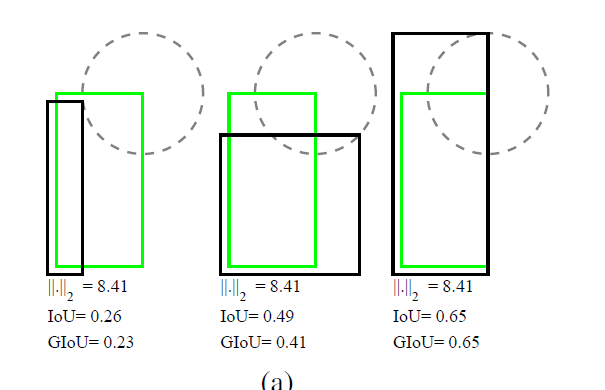
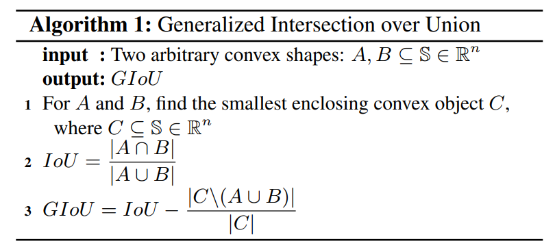
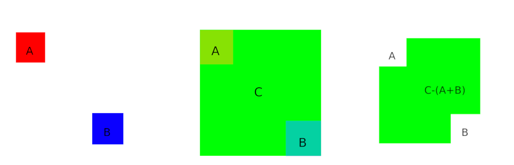
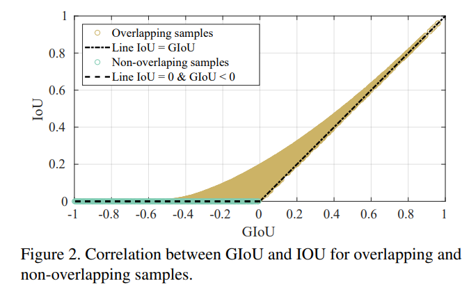

arxiv link: <https://arxiv.org/abs/1902.09630>

## key points

- using l1/l2 norm losses may not always align with the objective of improving IOU
- IOU is a good metric but they cannot be directly used as loss because it cannot backpropagate when there is no overlap at all
- GIOU is a modified IOU formula that can be used as loss because it can be backpropagated even when two boxes do not overlap

## why l1/l2 norm loss doesn’t exactly translate to improving IOU

At a first glance at l1/l2 norm loss, this statement seemed awkward because the objective of l1/l2 norm loss is trying to get the the four vertex coordinates correct as possible, which will naturally contribute to improving IOU. However, the paper shows a great example of why this conception may not be true in practice.

Of course, if we use l1/l2 norm loss and if some model reaches a point where it nearly accurately predicts the vertex position, then we could say l1/l2 norm loss does translate to improving IOU. However many times in practice when training a model, we find the model doesn’t predict the exact values but rather with a small margin and we know it is near impossible to always get the correct exact value at all times.

Assuming that l1/l2 norm loss training results in a model that can predict a vertex position with a certain amount of margin, the following figure shows that while the l1/l2 norm loss would be the same for all cases, the IOU values can be significatly different depending on where the fixed-marginalized vertex position is.

the green is the ground truth box. if the top right vertex of predicted bounding box has a fixed distance with the top right vertex of the ground truth, then there could be various possibilities of drawing the predicted box. But each predicted bounding box can have a wide range of IOU values.

This good example shows that perhaps l1/l2 norm loss is useful for training a model to get a certain good level of IOU, it will struggle to improve further to get a better IOU because from the l1/l2 norm loss point of view, the latent space point that seems to reduce l1/l2 loss right now may not be in the best interest of improving the IOU.

## un-backpropagatable IOU

IOU is a good evaluation metric but unfortunately it cannot be directly used as a loss function.

When there is an overlap between two boxes, then it could be. But when there is no overlap, the IOU value is zero and we cannot calculate a gradient from it.

## backprpagatable gIOU

generalized IOU intends to solve this issue. The key point to the solution is to make the modified metric to have some backpropagatable value even when there is no overlap between two boxes. The authors suggest the following modified IOU formula.

Up to 2, its easy to understand since its just repeating the definition of IOU. But 3, which is the definition of GIOU, is confusing because of the symbols. The following figure explains the last term of GIoU.

So practically, GIOU=IOU - (C-(A+B))/C

The key points of GIOU is that even when there is no overlap between A and B, while IOU would be zero regardless of position/dimension differences of A and B, GIOU will have values that constantly change based on the positions and dimensions of A and B respectively, even when there is no overlap between A and B.

This property means that GIOU is differentiable even when A and B is not overlapped and thus it can be backpropagated.

The following figure shows this property. This figure shows that when A and B has overlap, then IOU values change in the range of 0~1 and so does the GIOU value from 1~(some minus value). However, when A and B has no overlap, while IOU value is fixed to 0, GIOU value can move around in range of -1~0, thus backpropagatable.

## Comment

I think this is a simple and yet ingenious and effective method to solve the critical drawback of IOU. And the experiments support this too.
