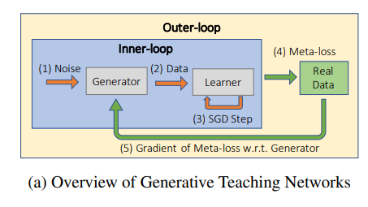
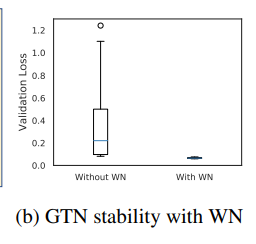
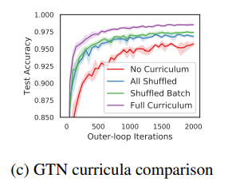

<https://arxiv.org/abs/1912.07768>

This work suggests that surrogate data need not be drawn from the original data distribution.  
This paper investigates the question of whether we can train a data-generating network that can produce synthetic data that effectively and efficiently teaches a target task to a learner

propose new method to create synthetic data, called Generative Teaching Networks(GTN)  
this has two loops

1. inner loop: train learner network
2. outer loop: train generator network which produces synthetic training data that will be fed to learner network

using synthesized data from GTN speeds up training significantly. But it only has advantage in speeding up, not at achieving SOTA performance.

synthetic data generated by GTN are agnostic to weight initialization of learner network(??), and learner network architecture (??)  
-> this attribute is useful to accelerate evaluation in NAS

Unlike a GAN, here the two networks cooperate (rather than compete) because their interests are aligned towards having the learner perform well on the target task when trained on data produced by the GTN

In the inner-loop, the generator G(z, y) takes Gaussian noise (z) and a label (y) as input and outputs synthetic data (x).

The learner is then trained on this synthetic data for a fixed number of inner-loop training steps with any optimizer

We sample zt(noise vectors input to the generator) from a unit-variance Gaussian and yt labels for each generated sample) uniformly from all available class labels.

In the outer-loop, the learner θT (i.e. the learner parameters trained on synthetic data after the T inner-loop steps) is evaluated on the real training data, which is used to compute the outer-loop loss (aka meta-training loss). The gradient of the meta-training loss with respect to the generator is computed by backpropagating through the entire inner-loop learning process.

my question: how can meta loss be backpropagated to generator, when the meta loss calculation doesn’t involve the generator? Or am I misunderstanding at some point?

meta-gradient training ??

Through experiment, the authors found that weight normalization is essential to meta-gradient training so that training does not diverge.

learned curriculum?

With GTNs however, a curriculum can be encoded as a series of input vectors to the generator (i.e. instead of sampling the zt inputs to the generator from a Gaussian distribution, a sequence of zt inputs can be learned) ???

A curriculum can thus be learned by differentiating through the generator to optimize this sequence (in addition to the generator’s parameters)

Through experiment, the authors found that “full curriculum” policy gives best training performance than other variants. therefore, in all experiments, full curriculum is used by default.

training with GTN synthetic data is **not aiming at achieving SOTA**, but rather training as fast as possible, to allow more efficient NAS operation. in other words, GTN is interested in so called ‘few-step accuracy’.

We would not expect training on synthetic data to produce higher accuracy than unlimited SGD steps on real data, but here the performance gain comes because GTNs can compress the real training data by producing synthetic data that enables learners to learn more quickly than on real data.
