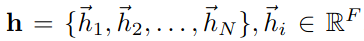
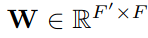
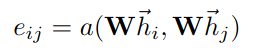
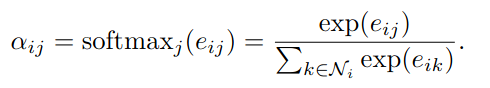
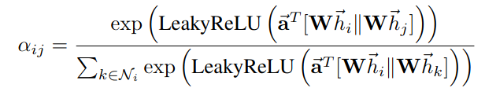

arxiv: <https://arxiv.org/abs/1710.10903>

# key points

- introduce “graph attention network(GAT)” which consists of “graph attention layers” which incorporate the “self-attention” idea from transformers to graph neural network
- the graph attention layers work by calculating weights of a node’s neighbors from the features of the neighbors by taking other neighbor’s existence into account. This is why the authors say they used “self-attention”

## How does graph attention layer work

Say we have N node features where F = dimension size for node’s feature

instead of using them raw, apply a weight matrix to transform them to a desired dimension size.

so now we have (N, F') shaped vector representing N node features where feature’s dimension size is changed to F'.

The idea of creating ‘output’ node feature by aggregating node features of neighbors is same as in graph convolutional network(GCN) but we want to learn the weight of neighbors from the neighbor characteristics themselves, thus the idea of “self attention”.

The paper suggests to get the attention score from the two connected node’s features. Which we can express it generally in the following formulas. Note that when calculating the final attention score(alpha_ij) we only consider e_ij values of the connected neighbors for node i for the delimiter. This masking operation is analogous to “masked attention” in transformer’s attention mechanism.

One big difference between graph attention layer and transformer’s self attention is how e_in value is calculated. In the original transformer self attention, we did this by creating query and key matrices, and then applying dot product between i-th query vector and j-th key vector to get the attention score between i-j pairs. But in graph attention layer, the authors propose to do this by simply concatenating i-th and j-th node feature vectors and applying a linear layer which will reduce (2F',) shaped vector into a single scalar value. So, the above “general” formulas can be specifically defined as following:

“||” operation stands for concatenation. The authors has chosen “leaky relu” for non linear activation function for the single linear layer which acts as attention mechanism.

The graph attention layer also adopts multi-head attention method, and the authors says that this helps to stabilize training.

While the authors say they used concatenation to aggregate each attention head’s output into one, they used averaging for the very last layer since it is more “sensible” but I don’t quite understand what they mean by it.

## Performance

Better than previous works on all tests.
