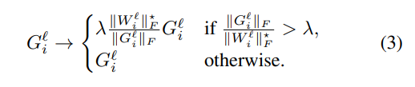

---

title: 'paper review: "High-Performance Large-Scale Image Recognition Without Normalization"'
date: '2021-03-02T00:00:00+00:00'
lastmod: '2021-03-02T00:00:00+00:00'
slug: paper-review-high-performance-large-scale-image-recognition-without-normalization
categories:
- paper-review
tags:
- "adaptive-gradient-clipping"
- "agc"
- "nfnets"
- "normalizer-free"
- "high"
draft: false
---
arxiv: <https://arxiv.org/pdf/2102.06171v1.pdf>

## key points

- introduce NF nets which combines multiple ideas to avoid using batch norm to get on-par performance
- but along with just using a bunch of non-BN techniques, this paper introduces adaptive gradient clipping(AGC) to make it actually train well to reach comparable results matching that of using BN

## benefit of batch normalization

- good
  - smoothens loss landscape, enabling larger lr and larger batch size
  - regularizing effect
- the bad
  - expensive computation
  - discrepency in behavior in train/test
  - breaks independence bewteen training examples in minibatch
  - leaks information, which causes problems in sequential modeling tasks, contrastive learning algorithms.
  - performance degrade when there is large variance during training
  - BN is sensitive to batch size, and perform poorly when batch size is too small.

## NFNets

- propose NF resnets
- doesn’t use normalization layers
- employ different residual block
- looks like it also used scaled weight standardization to prevent mean-shift in hidden activations.
- employ dropout, stochastic depth
- this way it outperforms BN trained resnets on low batch size. it doesn’t in large batch size.
- does not outperform efficientnets

## Adapative gradient clipping(AGC)

- to scale nf-resnets to larger batch sizes, use adaptive gradient clipping.
- below is the AGC policy  
    
  ratio of norm of gradient(G) to the norm of weights(W) provide simple measure of how much a single gradient descent step will change the original weights.
- clip gradients based on unit-wise ratios of gradient norm over weight norm. this works better empirically.
- still, the clipping threshold(**λ**) is a hyper-parameter.
- AGC can be thought as a relaxed version of normalized optimizers.
- using AGC, larger batch sizes can be used in training.
- benefit of using AGC in smaller batch size is smaller
- not using AGC in last layer is good practice

## ablation study

- out of 4 levels, the third level seems to be the best place to increase capacity.
- depth pattern = changing number of depth levels, or the size of each level / width pattern = changing channel size
- scaling drop rate of dropout was good practice. This seems to be important since NFnets don’t receive the regularization effect that existed in batch norm.

## Comments

- efficientnet: inverted bottlenet block ?
