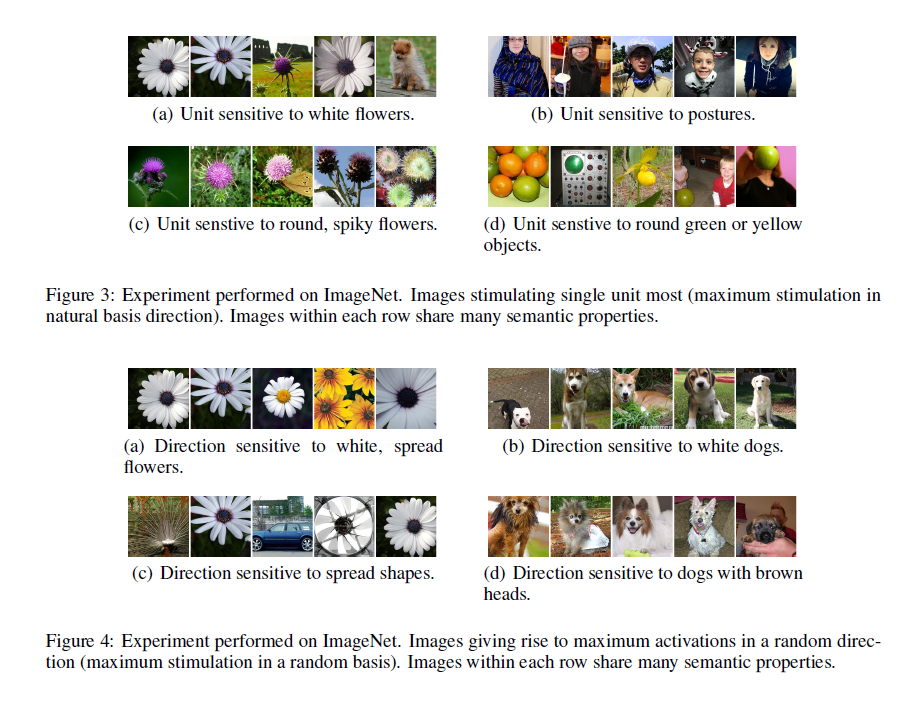
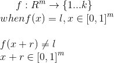
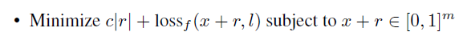
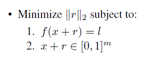
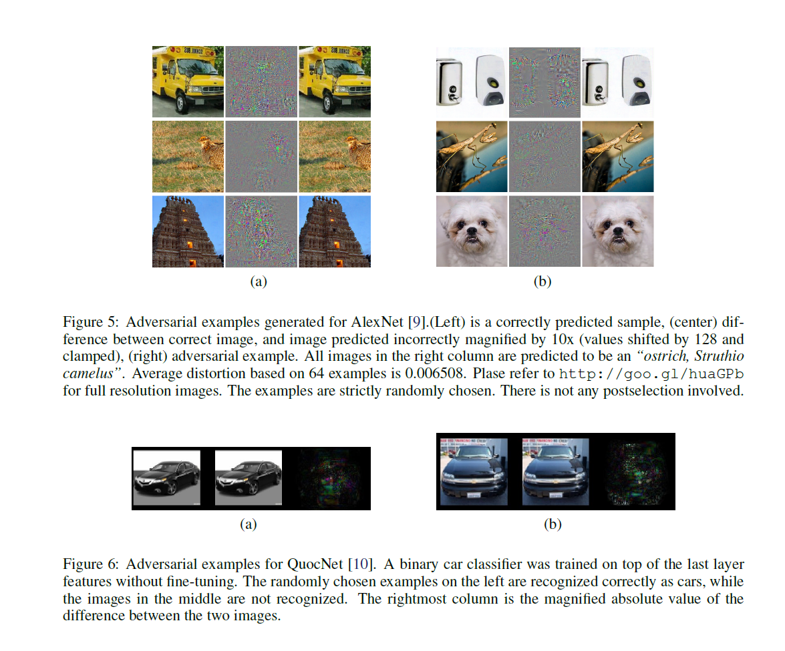

---

title: 'paper review: Intriguing properties of neural networks (getting adversarial
  samples using L-BGFS method)'
date: '2019-12-08T00:00:00+00:00'
lastmod: '2019-12-08T00:00:00+00:00'
slug: paper-review-intriguing-properties-of-neural-networks
categories:
- paper-review
tags:
- "adversarial-example"
- "adversarial-sample"
- "l-bgfs"
- "adversarial-attack"
- "intriguing"
draft: false
---
paper link: <https://arxiv.org/pdf/1312.6199.pdf>

It is not a single node or unit of a layer that describes one kind of feature but it is the space, or all the nodes in a layer that defines some feature. In other words, it is not a single node’s value that measure a strength of some similarity/feature but the direction of the output vector of a layer.

## Adversarial Examples

> The adversarial examples represent low-probability (high-dimensional) “pockets” in the manifold, which are hard to efficiently find by simply randomly sampling the input around a given example.

> The above observations suggest that adversarial examples are somewhat universal and not just the results of overfitting to a particular model or to the specific selection of the training set. They also suggest that back-feeding adversarial examples to training might improve generalization of the resulting models.

> This kind of smoothness prior is typically valid for computer vision problems. In general, imperceptibly tiny perturbations of a given image do not normally change the underlying class. Our main result is that for deep neural networks, the smoothness assumption that underlies many kernel methods does not hold.

> The adversarial examples represent low-probability (high-dimensional) “pockets” in the manifold, which are hard to efficiently find by simply randomly sampling the input around a given example.

Finding adversarial examples is similar to hard-negative mining.

To find adversarial example, one must first find a minimizer D(x,l) which will find a minimum value of r which will satisfy the following conditions.

here, ‘f’ is a function representing a classifier network.

The objective is to find the `r` that will distort the correct classification and at the same time, try to find the `r` to be as small as possible. Since the neural network is such a complicated function, we can only hope to approximate to get a small `r` as possible.

To solve this problem, the authors propose using an optimization method called L-BGFS upon an objective function(or one could say this as a loss function, since we are “minimizing/optimizing” it anyway just like we do with loss functions in deep learning). The objective function is as follows:

Oh and by the way the `|r|` above actually refers to the L2norm of the `r` vector, and is mention as follows:

`loss_f` function is the negative cross entropy function and will be computing how different the iterative input(“x+r”) is to true label. Note that this is the “negative” of cross entropy which means that minimizing the “negative” of cross entropy is actually trying to deliberately get the correct answer wrong, which is exactly what we want. At the same time, the objective function contains `c|r|` which represents somewhat the “magnitude” or “length” of the perturbation vector, `r`. Minimizing `c|r|` also goes along with our intention to keep `r` as small as possible. Here, `c` acts as a hyperparameter which controls the balance between the negative cross entropy loss and the perturbation vector size.

The existence of `c` confused me at first be cause the objective function is then a function of two variables(“r” and “c”), not one(just “r”). After reading the paper and code implementations, I came to the conclusion that `c` could be interpreted in two versions. First, by looking at its effect in the objective function, `c` can be interpreted as a loss weight coefficient which balances between the negative cross entropy loss and perturbation vector size. The other interpretation is seeing `c` as a scale factor for the perturbation vector `r`. Or, both it could be both at the same time.

The authors mention that minimum `c` will be found through performing line-search. After some studying, “line-search” is a method where in this case, would mean first optimizing the objective function with some fixed constant `c` to find `r` first, and when `r` is found then finding an appropriate value of `c` that will minimize `c|r|` as much as possible and still get the job done(which in this case would be satisfying `f(x+c|r|)!=l` ). So, it is kinda confusing to discriminate `r` and `c|r|`. Perhaps it could be just my mistake to confuse them all, but I think the readers get the key points of the objective function by now.

There is a tensorflow implementation on executing l-bgfs( <https://www.tensorflow.org/probability/api_docs/python/tfp/optimizer/lbfgs_minimize> ) but in read code implementations, it is rarely used. Here are some code implementations of searching for adversarial samples using L-BGFS.

- <https://github.com/zoujx96/adversarial_BFGS_TensorFlow/blob/master/adversarial.py>
- <https://github.com/sunyi199374/L-BFGS-Based-Adversarial-Input-Against-SVM-/blob/master/L-BFGS_Based_Adversarial_Attack.py>
- <https://github.com/tensorflow/cleverhans/blob/master/cleverhans/attacks/lbfgs.py>

As for learning some basics on what L-BGFS, line-search is, I found the reference mention in the tensorflow l-bgfs function doc to be useful.

- Jorge Nocedal, Stephen Wright. Numerical Optimization. Springer Series in Operations Research. pp 176-180. 2006 ( <http://pages.mtu.edu/~struther/Courses/OLD/Sp2013/5630/Jorge_Nocedal_Numerical_optimization_267490.pdf> )

Check out 176-180 for L-BGFS. If you aren’t familiar with Hessian matrix and line search method(as I did), checking out chapter 2 really helped.

Below are some examples of adversarial examples created and it is quite shocking to see how small doses of difference that is insensitive to humans can make huge differences to the neural network.

