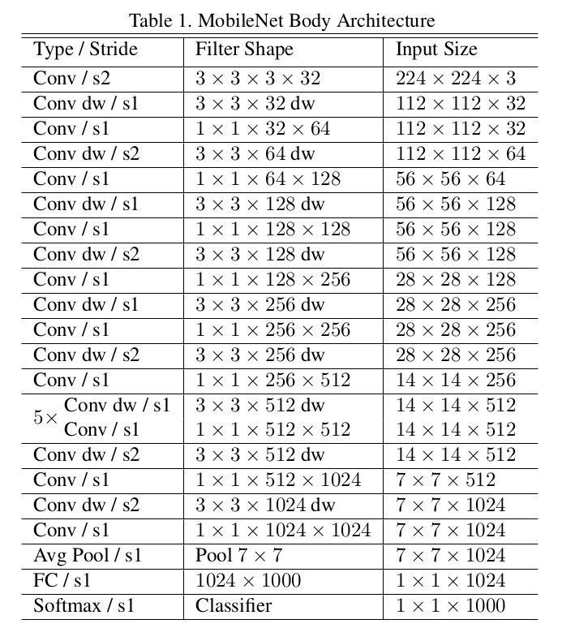
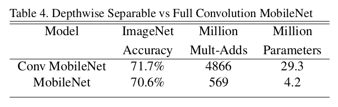
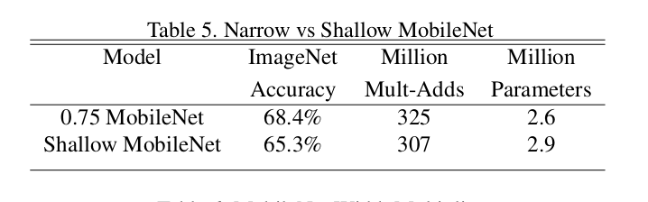

arxiv: <https://arxiv.org/pdf/1704.04861.pdf>

## key points

- focus on optimizing for latency, small networks.
- use depthwise separable convolutions, to reduce computation as much as possible
- further reduce size of models based on width/resolution multiplier, but at the cost of accuracy

## depthwise separable convolution

This is a combination of depthwise convonlution + pointwise convolution.

**depthwise convolution**: applying conv for each channel. by avoiding apply conv kernel across all channels at once, computation can be reduced. In other words, depthwise convolution achieves less computation at the cost of ignoring calculation of iteraction between channels.

**pointwise convolution**: simply applying 1x1 convolution, thus the name ‘pointwise’. The purpose is to aggregate the information of each channels in each pixel, and output a feature from these informations. Applying pointwise convolution supplements depthwise convolution since depthwise convolution did not exchange any information between different channels.

Depthwise convolution + pointwise convolution does pretty much similar effect as what a standard convolution does with lower computation. But it will not be able to account for interactions between different pixel values within a kernel between different channels.

Through calculation, the authors show that depthwise separable convolution requires 8~9 times less computation than a standard convolution, which allows drastic reduction in computation and model size.

The authors tried other factorization in spatial dimension on convolution but it did not save much computation.

## network structure

- use depthwise separable conv all except first layer.
- all layers followed by batchnorm and relu except the final dense layer.
- down sampling done with strided conv.
- total 28 layers.

## training

- in training, use less regularization and data augmentation since small models have less trouble overfitting. no side heads, label smoothing.
- important to put very little or no weight decay on the depthwise filters since there are few parameters.

## width/resolution multiplier

**width multiplier**: to make smaller models, the input and output channel size will be reduced by a factor. value between 0-1.

**resolution multiplier**: factor reducing the input image widht/height. naturally, this has the effect of reducing the total number of pixels to work with, thus reducing computation. The authors use input image size of 128, 160, 192, 224 for both width and height.

## experiments

using depthwise separable conv instead of standard conv reduces accuracy by 1% but param size reduction is much significant.

shallow vs thinner model comparison. make model thinner by using width multiplier, and shallower model just removes one layer. result shows that thinner model has higher accuracy despite less parameters, but has more mult-add operations. Very interesting experiment. For this case, having more depth at the cost of each layer channel size seems to be a better choice.
