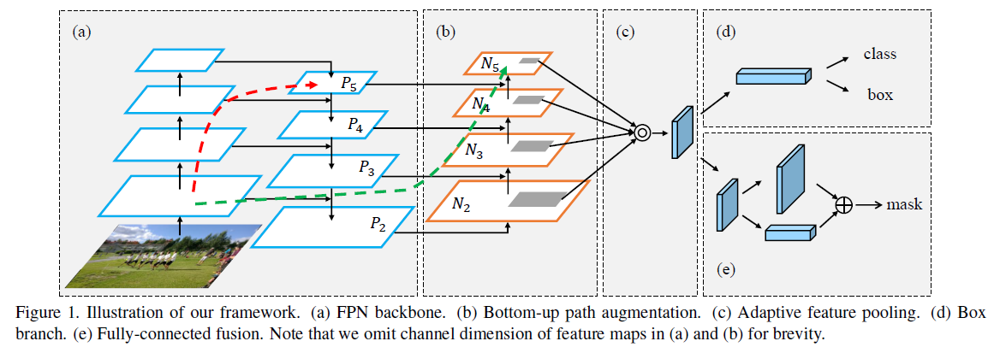
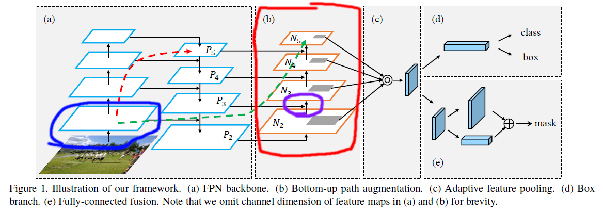
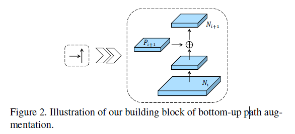
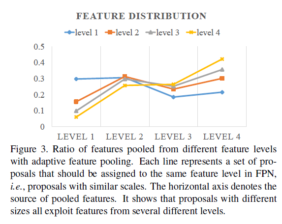
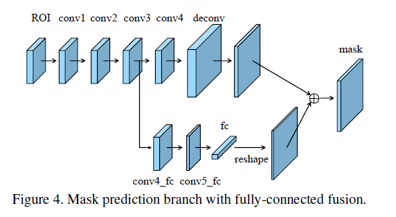

arxiv: <https://arxiv.org/abs/1803.01534>

## key point

this paper propose a network structure(“PANet”) with bottom up path augmentation and a few other tweak methods which results in better instance segmentation performance.

PAnet’s overall structure looks like the following.

it adds new methods on top of FPN, and the main addons are

- bottom-up path augmentation
- adaptive feature pooling
- fully connected fusion

## bottom-up path augmentation

red box is bottom up path augmentation

This addition is simply another down sampling path after the FPN. The main idea behind this method is to allow low level features to interact more directly with high level features. In the figure above, the blue boxed feature map which is created at the early stage of network contains low level features. Although FPN will mix information from this low level feature with high level feature map(P5 in the figure above) through the red dotted path, this feature interaction occurs across many layers. Since the distance between these two feature maps are far, the authors assert that they do not exchange information efficiently.

Therefore the authors add bottom-up path augmentation which is another down sampling path but with simple and short connections so that the blue boxed low level feature map can interact with the high level feature map(N5, in this case) across only a few layers. This “shorter” interaction path is depicted as the green dotted path in the figure above. Just by seeing this figure, one can easily question how can the green path possibly be “shorter” than the red path, but this confusion occurs due to not closely paying attention to that the black arrow paths in FPN actually consists of a large number of layers(conv layers, max pooling, etc.) while the black arrows in bottom-up path augmentation only have a few layers. This is how the green dotted path indicates a “shorter” or “more direct” interaction between the low level feature map(blue boxed) with a high level feature map(N5).

To provide a shorter path for low level features, the down sampling operations used in bottom-up path augmentations are kept minimal. These operations(purple circles in the figure above) can be summarized like this figure.

N_i goes through one 3x3 conv layer, and same level feature map obtained previously is combined which results in a new downsampled feature map, N_i+1. 3x3 conv and combination is all that takes place here. Very simple indeed.

## adaptive feature pooling

extract roialign features from each level feature map in bottom up path instead of only one level.

The authors did an analysis(figure below) which shows that regardless of roi size, it gathers a significant proportion of the entire information from all levels.

## fully connected fusion

for segmentation branch, instead of only using convolution layers which cannot really capture global context, it will add a fc(fully connected, dense) layer sub branch which will gather global context and feed it back to the output of conv layers to get better segmentation performance.

## other methods applied

the final version of the model uses some other methods too, such as multi scale training, multi gpu synchronized batch normalization, heavier head.
