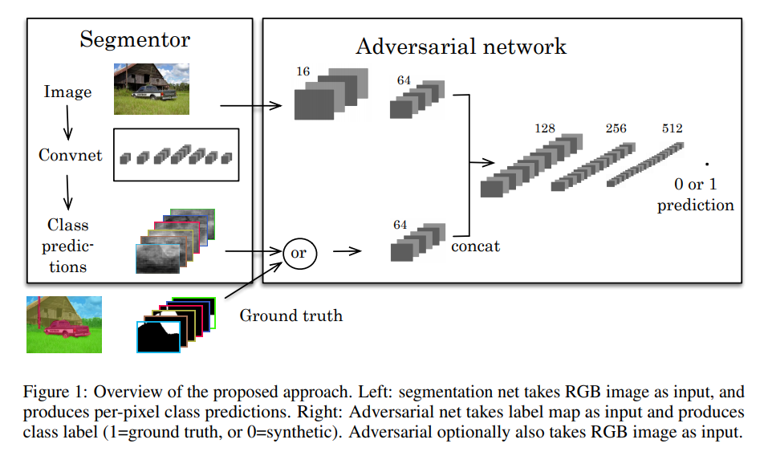
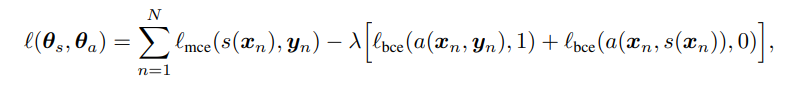
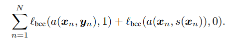
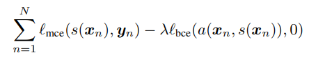
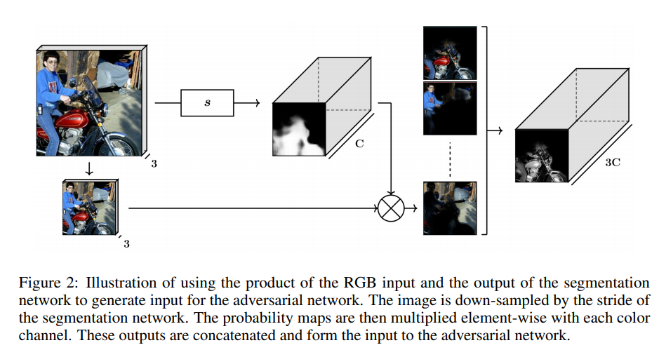
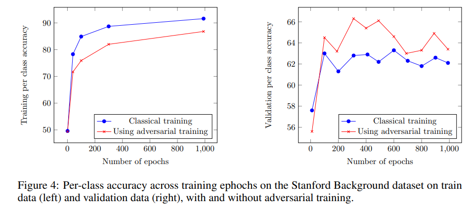
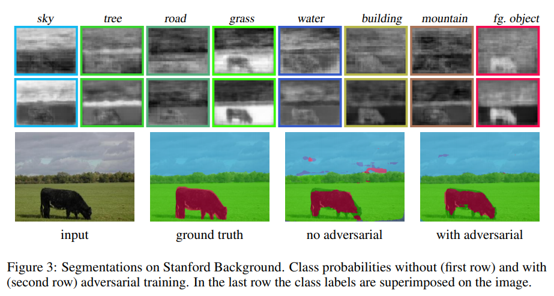

<https://arxiv.org/pdf/1611.08408.pdf>

## key point

use adversarial net to distinguish if input masks are from segmentation net or ground truth.

---

this allows to add auxiliary loss, like below:

where

- mce: multi class cross-entropy
- bce: binary cross entropy
- s(): segmentation network
- a(): adversarial network
- y: ground truth
- x: input
- s(x): segmentation network output for given input

however, the paper gives a confusing explanation of how the above loss function can achieve both segmentation network and adversarial network optimization.

The paper states the following loss is the target function for improving adversarial network.

And the following is target function for improving segmentation network.

the first term is a normal loss function for segmentation network. The intention of the second term is to disturb adversarial network to predict segmentation output as segmentation output.

However, adding the loss for adversarial network and loss for segmentation network doesn’t exactly match to the overall loss stated above.

When using the segmentation network output as input of adversarial network, the original image should be masked by each class segmentation network output. This can be depicted as following:

Using this approach, the authors show that by applying adversarial learning to semantic segmentation, it gained some regularizing effect.

Here, we can see that by applying adversarial training, the trained model is less likely to overfit (left figure) and able to be more generalized (right figure).

Below is an example comparison of adversarial training.

