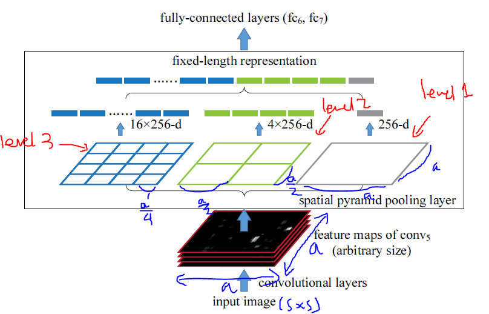

arxiv: <https://arxiv.org/abs/1406.4729>

## key points

pools a fixed number of features from final feature map of backbone which can be fed to the dense layer afterwards, thus allowing network to work in a non-fixed input size manner.

## how does it work?

the authors understand that convolutional layers don’t care about input size and fc layers are dependent on input size and these two contradicting attributes limit a network to work on a fixed input size. The authors try to bridge this difference with spatial pyramid pooling(SPP) layer.

Assume we have a backbone network which has multiple conv layers. And the input size is `s x s`. After the conv layers, the feature map size will come down to `a x a`. At this point, SPP will do its operation at a few levels. For each level, the SPP will divide the feature map into `n x n` bins. In other words, it can be thought that each bin is created by a sliding window with a size of ceil(a/n) and a stride of floor(a/n). The number and division size of each level is up to the user.

For each bin, the authors pool for each filter, and the paper says that it used max pooling.

This way, the number of bins created in each level is consistent, thus the output of SPP is constant regardless of input size. This allows to retain the same fc-layer to be attached after SPP layer.

The authors say “variable input size” but I see that they only work with square input sizes only. I think SPP is also applicable with non square sizes too. But perhaps the authors left this out to make experiments easier.

## training

the authors do two type of training

1. single size training: only with input size of 224x224
2. multi-size training: with input size of 224x224 and 180x180

## classification experiments

results show that using multi-size training gives slightly better results than single size training.
