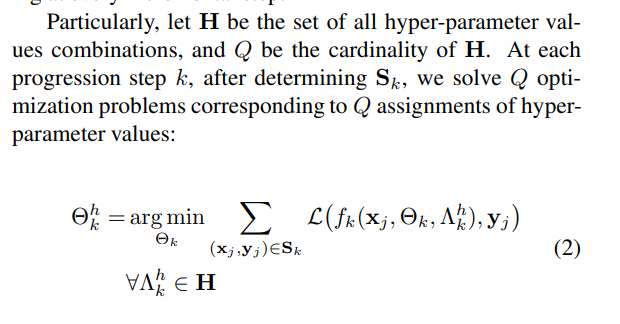
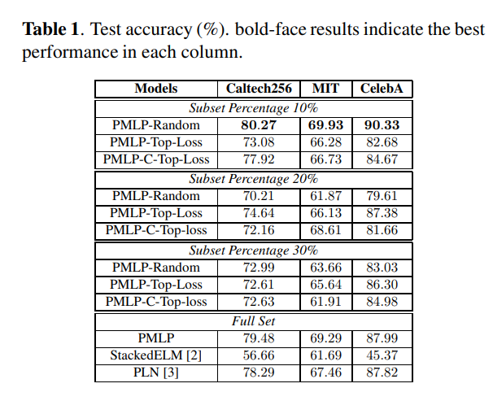

paper link: <https://arxiv.org/pdf/2002.07141v1.pdf>

## What is PNNL?

> Progressive Neural Network Learning(PNNL) is a class of algorithms that incrementally construct the network’s topology and optimize its parameters based on the training data. At each incremental training step, a PNNL algorithm adds a new set of neurons to the existing network topology and optimizes the new synaptic weights using the entire training set.

At first, I was confused of the concept of PNNL because I misunderstood that PNNL is about updating the network weight values. However this interpretation is practically every batch training step, which is not what PNNL is about. PNNL is about modifying the network “structure” and not just the weight values. This distinction must be made clear if a reader is unfamiliar with PNNL just like I was.

The paper’s introduction provides some PNNL methods worth looking into: PLN, StackedELM, HeLMGOP, etc.

Regardless of what PNNL method is used, the user will take a progressive step where the trained network up to that point will be evaluated against some set, observe the evaluation results and extract a direction of progression and update the network structure according to it.

## What this paper is about

This paper does not focus on trying to introduce a novel PNNL algorithm, but rather an empirically sought out execution strategy of PNNL algorithms.

This paper shows experiment results by changing “the set that is evaluated against during the progressive step” and how “online hyper parameter selection” can benefit PNNL procedure.

## Subset Sampling

The first focus point deals with “subset sampling”. PNNL algorithms will have to be run against some kind of dataset and it would impractical to use the entire training dataset to do this since it would be computationally and time exhaustive. Therefore it is practical to use only some portion of the training set for PNNL. As for subset sampling method, three different methods are considered:

1. random sampling: uniform randomly select M samples from the entire training set. Easiest option to implement.
2. Top-M Sampling based on miss-classification: at each progression step, get loss for all samples in training dataset. select M sample which gives the highest loss.
3. Top-M Sampling based on diverse miss-classification: problem with method2 is that the selected M samples may be biased to a single or a few classes. This in return may lead to biased progression, which is undesirable. To prevent such worst scenarios, method 3 takes a different slightly different approach. Gathering loss values for all samples in training set part is identical to method 2. But instead of blindly selecting M samples which have the highest loss values, method 3 will perform K-means clustering with the output vectors for each training samples, where a predefined cluster size(C) will be used. After clustering is done, then select int(M/C) samples from each cluster, in the order of highest loss value in each cluster. This way, we will get the same M sized subset while ensuring that the subset is not biased towards a particular output class/classes.

Although the paper stated on going over all the samples in a training dataset in method 2 and 3, I think this could itself be a huge cost. Perhaps even the selection of which training samples to use for the pool of subset candidates could be randomly selected.

## Online Hyperparameter Selection

> Since PNNL algorithms gradually increase the complexity of the neural network, it is intuitive that the model might require different degrees of regularization at different stages. Besides, with subset sampling incorporated, we train new blocks of neurons with different subsets of training samples at each step, which might require different hyper parameter configurations.

This is the reason proposed by the paper for adopting online hyperparameter selection. I agree with the reasoing but I’m do not fully understand how the paper plans to implement this. The following is the equation and brief explanation of the method used by the authors:

It may not be correct but here’s the version that I understood:

- by now subset(S_k) is prepared using whatever subset sampling method
- cardinality of hyperparam space(**H**) is Q. i.e. there are Q different hyper params under consideration.
- naturally, we have theta_k which is the weight values of the model for current progression step.
- for each H’s cardinality, we solve the equation above. In other words, find the value that gives lowest sum of losses for subset for each hyper parameter variation. Doing this for each hyper parameter, which would mean solving this equation for Q times, we will get a set of hyper params which is deemed optimal for reducing loss.

I’m not confident if I have understood this well, but the paper is not comprehensive about it so that’s the best I can do for now.

## Experiment

Here are the setup conditions:

- three public datasets are used.
- four different subset size: 10%, 20%, 30%, full training set
- three different subset selection method
- all attempts apply online hyperparameter selection
- progression rule of HeLMGOP is used
- to quote: *“subset selection was used to only speed up progression process(topology construction). final topologies were fine-tuned with full set of training data."*  
  => I have no idea about when one should make this transit during this experiment though…

The most important result is the following table.

which concludes “10% subset size, with random subset sampling, adopting online hyperparameter selection gives the best training results”.

The experiment results also provides comparisons on training time, but I think this is relatively unimportant.

Quoting the paper on why the best performing settings are as such:

> Random sampling with a small percentage leads to the general effect that different blocks of neurons are optimized with respect to diverse subsets of data. The final network after optimization can be loosely seen as an ensemble of smaller networks. On the other hand, when a subset of data persists being miss-classified throughout the network’s topology progression process, the corresponding sampling strategies will bias the algorithm to select only these samples and reduce the diversity of information presented to the network.
