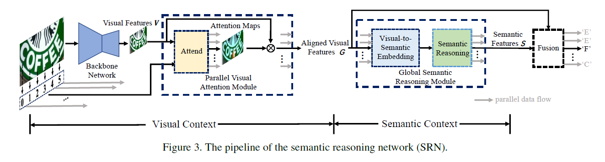
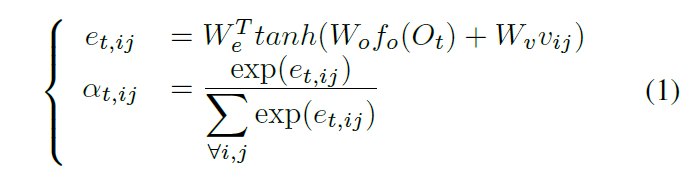
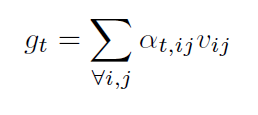
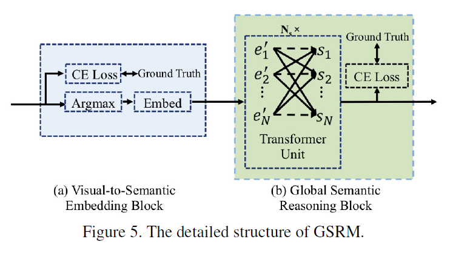
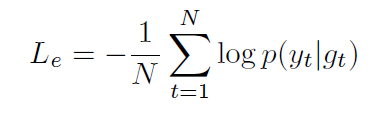
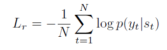
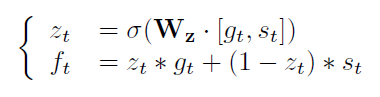
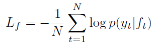
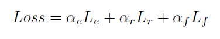

arxiv: <https://arxiv.org/abs/2003.12294>

## key point

this approach will try to take global context into account by adopting transformer, and also use similar structure to reason semantic content.

SRN consists of four parts

1. parallel visual attention module(PVAM)
2. global semantic reasoning module(GSRM)
3. visual-semantic fusion decoder (VSFD)
4. backbone network

## backbone network

- use FPN to aggregate hierarchical feature maps.
- 2D features extracted from this is fed to two stacks of transformers.

## parallel visual attention module(PVAM)

- use transformer to generate N features, which will eventually lead to N characters.
- existing attention based methods are inefficient due to time-dependent terms. IOW, the decoding is RNN approach which relies on previous step hidden state, which makes it impossible to get features for all time steps in parallel.
- so a new attention method, parallel visual attention is introduced.
- for the decoding part which usually requires sequential processing, this work tweaks to make it unnecessary for sequential processing. Originally, like the Bahdanau attention, the decoding for every step would require the previous hidden state. But this work replaces using previous hidden state to using each step position value which releases decoding to require previous step, and thus allows parallel calculation for all steps.

- through this module we get aligned visual features, noted as “g_t”. please don’t confuse this with ground truth.

## global semantic reasoning module(GSRM)

consists of two parts: visual-to-semantic embedding block, semantic reasoning block.

### visual to semantic embedding block

- with the aligned features from PVAM, it first tried to match with ground truth characters, which gives Le, a cross entropy loss.

- at the same time, it argmaxes the gt to fixate the character predicted, and then goes through an embedding layer, which will gives features noted as “s_t”

### semantic reasoning block

- a transformer module which is applied upon the output of embedding layer from VSEB.
- the meaning of this operation is trying to check whether the characters of each position are appropriate based on the characters selected by the VSEB. I think this module can be thought as a spell checker stage done in a DL approach.
- the output of this module will be N features. since this output can be thought as an output from a spell checker, we can also make a comparison with this and the ground truth characters, and thus Lr loss can be calculated.

## visual semantic fusion decoder

- now we have a string prediction from visual features and from global semantics(through checking relationships between predicted characters) and have two losses, one for each. But we can also try to combine these two features and calculate a cross entropy loss too.
- This is what this module does, and instead of simply adding/concat/dot producting, it uses gated unit which is simply allowing the weight between two features to be also learned.

- After doing this fusion, we calculate CE loss with ground truth once more, which is Lf.

- The total loss is a weighted sum of three ce losses.

## model training

- training is divided into two steps: warming-up and joint training.
- on warmup, train SRN without GSRM. After that, in joint training stage train the whole pipeline.

## ablation study

- using GSRM is better than without it.
- instead of GSRM, tried using CTC, 2D-attention, forward/backward semantic reasoning strategy. GSRM is most of the times better than all. Interesting to see CTC sucks at all times.
- in feature fusion, gated unit is mostly better than other strategies such as add, concat, dot.
