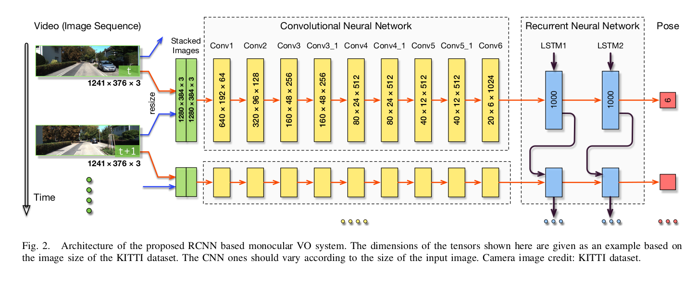

---

title: 'paper review:"DeepVO: Towards End-to-End Visual Odometry with Deep Recurrent
  Convolutional Neural Networks"'
date: '2020-12-18T00:00:00+00:00'
lastmod: '2020-12-18T00:00:00+00:00'
slug: paper-reviewdeepvo-towards-end-to-end-visual-odometry-with-deep-recurrent-convolutional-neural-networks
categories:
- paper-review
tags:
- "deepvo"
- "dl-based-vo"
- "visual-odometry"
- "reviewdeepvo"
- "end"
draft: false
---
arxiv link: <https://arxiv.org/abs/1709.08429>

# key points

- propse dl based VO using RCNN
- end to end approach. previous attempts used CNN for single image. this work will combine with RNN to overcome this drawback.

## model structure

- two consequtive images are stacked and fed as input.
- cnn layer outpus are sequentially fed into RNN part.
- lstm used for rnn.
- model output is pose estimate for each time step.
- what exactly is the output format? outputs are positions and orientations.
- the authors say that since the cnn layers of their work is about extracting geometry which should not be dependent on appearance, it is not a simple matter as just plugging in backbones from famous classification models. this module is inspired by optical flow estimation. But what kind of difference are they talking about? only adopting a few layers of CNN? keeping architecture simple?
- mse loss function
- CNN layers are transfer learned from pretrained flownet model.

## Comments

the authors mention in the end that even though DL based VO is quite good, they think it is not yet good enough to replace classic geometry based approach. Rather, it could be a useful supplement. But I think this could be because they had limited training data, as the authors mentioned in the paper.
