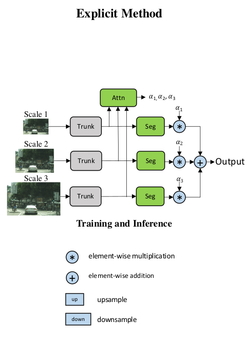
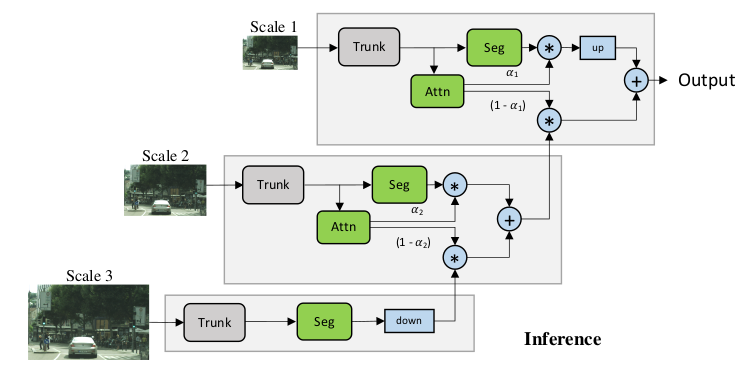
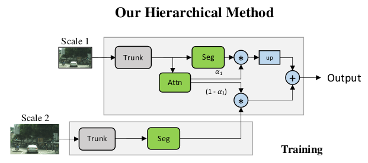
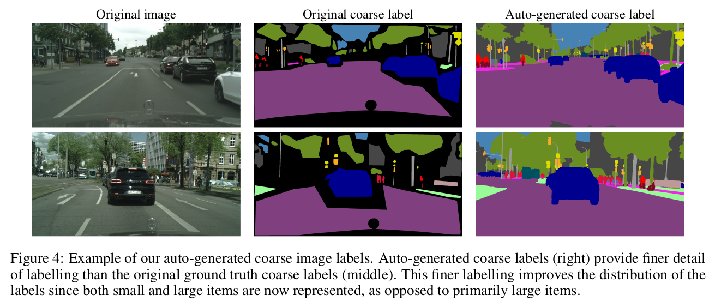

arxiv: <https://arxiv.org/abs/2005.10821>

## key points

- hierarchical attention mechanism. By using this, the model can handle multiple, non-fixed scaled image inputs
- auto-labelling to get find labels from coarse labels and use then in training to increase performance

## Hierarchical attention mechanism

This approach is unique and I was mindblown at the idea. And approach that can handle different scales that is not fixed? And can handle multiple scales dynamically at the same time??

Previous works and my prejudice was that when handling multi scale, it is inevitable to use a pyramid-like structure something like this:

However, this work cleverly uses a structure like the following to avoid the restrictions of the existing “explicit” method.

The trunk and seg modules in this figure are the same and shared. This cascading like structure is what allows this work to handle multiple scales with un-fixed scales at the same time fluently. The training is done with only two scales: the default and some other scale.

The attention module will act as a mask indicating which pixels should try to get more information from the other scaled image. This paper used bilinear upsampling for upscaling/upsampling. By training with different but unfixed scales, the trunk and segmentation module will learn to handle different scales.

The trunk, which is the backbone, HRNet-OCR is used for performance and resnet50 is used for ablation study.

## Auto-Labeling

This work mentions that it refined coarse labeled data into fine labeled data using auto-labeling. The figure below shows well about what it tries to do.

I was very impressed, but the paper doesn’t describe in detail about how it has done it. But it does mention a few things.

The authors say that they have trained a “teacher” model with coarse and fine labelled images. I guess the input is the coarse image and the output is the fine labeled image. After this joint training, then do auto-labeling on coarse images with this teacher model.

But I have some questions on this:

- is this teacher model the same as the model structure introduced in this paper? Or some other model structure?
- when training the teacher model, what train data is used? Is is synthesized? Is there some public dataset for this purpose?
