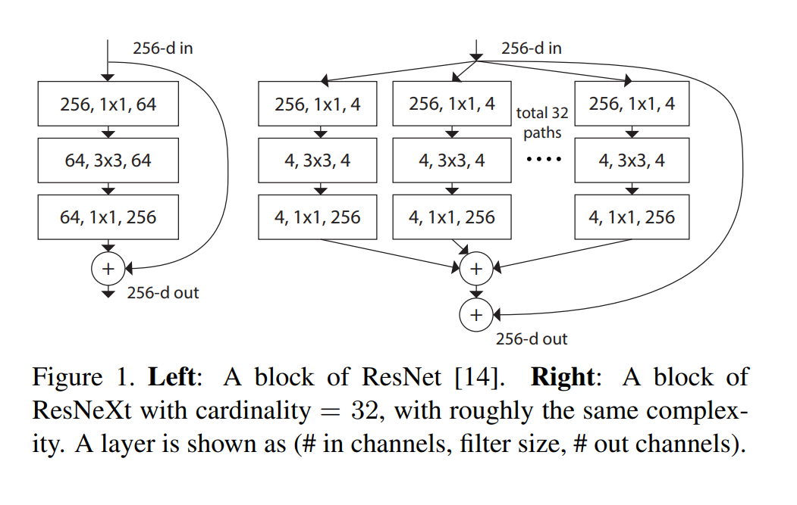
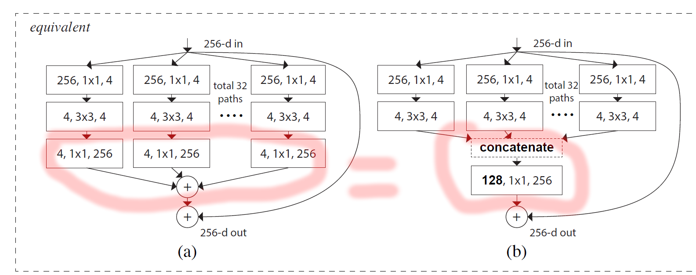
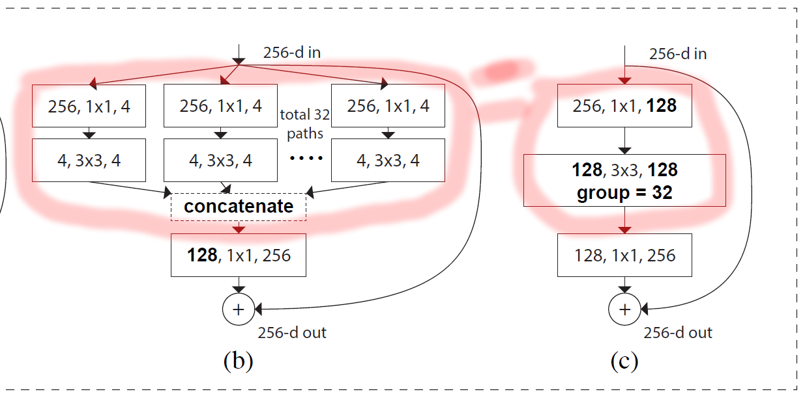
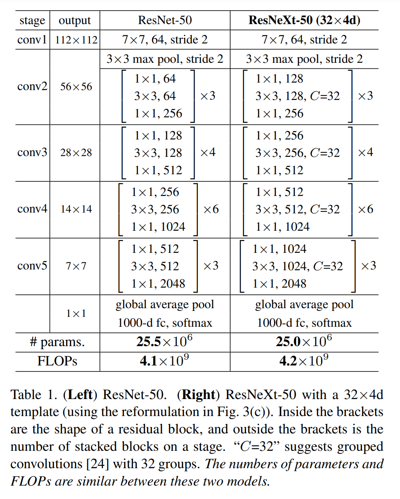
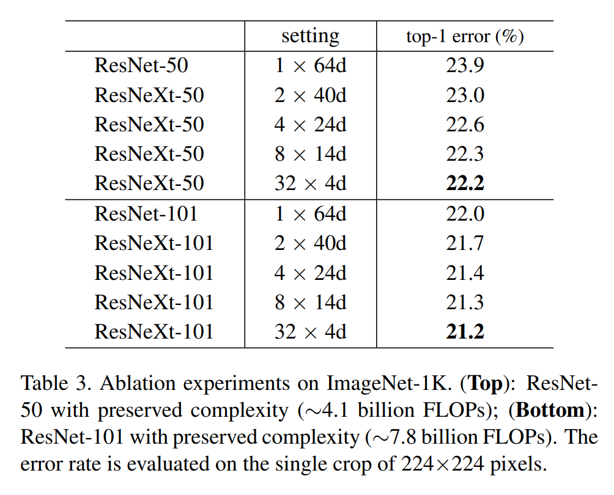
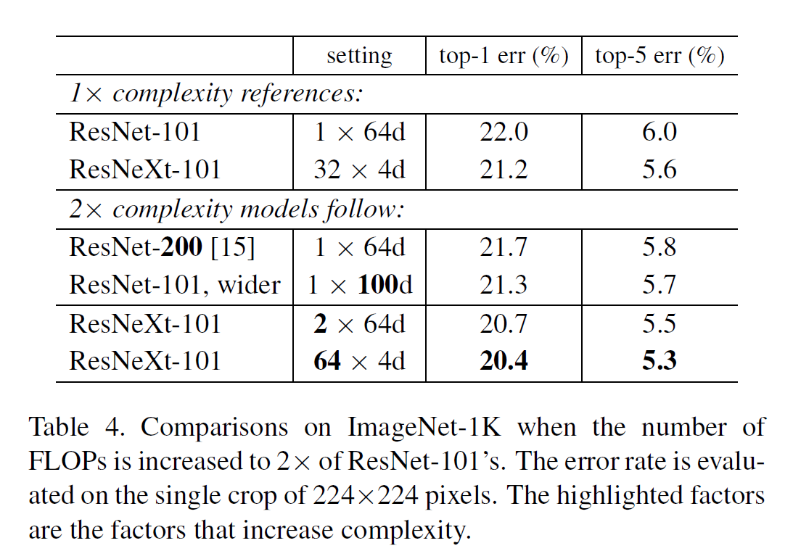
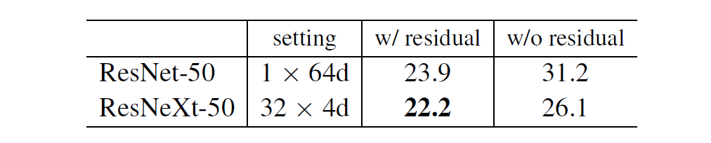

# key point

- compared to resnet, the residual blocks are upgraded to have multiple “paths” or as the paper puts it “cardinality” which can be treated as another model architecture design hyper parameter.
- resnext architectures that have sufficient cardinality shows improved performance
- tldr: use improved residual blocks compared to resnet

## Different residual block

the key difference in resnext architecture is that it uses different residual block structure compared to resnet. This difference is well depicted in the following figure.

as you can see the right block is the block used in resnext and instead of bottling the incoming 256 dimension vector to 64 channels and then bumping it back up, it drastically reduces the channel size to 4 and bumps back up to 256 but does this operation multiple times in parallel. This parallel approach is the paper’s key idea and they call it ‘cardinality’.

This kind of approach was taken from inception’s ‘split-transform-merge’ approach used in their blocks.

## Block can be implemented using Grouped Convolutions

The new block introduced above can be reformulated to use grouped convolutions. First the new block can be reformulated to the right diagram in the figure below.

The two are practically identical because in the original block (left), on the third level it does 1x1 pointwise convolution to bump up channel from 4 -> 256, and then we simply add them to aggregate the results from each branch(cardianlity). This aggregation operation is practically the same as just first concatenating the 4-channel vectors from each branch(cardinality) to create a 128-channel vector, and then applying 1x1 pointwise convolution on it. This switch is possible because of “pointwise” operation. if this wasn’t pointwise and some kind of 3x3 conv, then this equivalence is not possible.

This replaced structure is by definition what grouped convolution does. Therefore, we can say that the two diagrams in the below figure are identical.

Therefore, we can say that the originally proposed new block structure in this paper can be implemented using grouped convolutions.

# Efficient Use of Model Capacity

by using the upgraded blocks, the authors note that resnext architectures can achieve better performance with the same complexity as resnet. The authors prepare resnet-50 and resnext-50 which is designed to have similar parameter number and FLOPs.

the authors test these two with imagenet and shows that resnext-50 has better performance.

this experiment also empirically show that having more cardinality helps with achieving better performance.

## Increasing cardinality is better than deeper/wider architecture

The paper does another experiment. If we had the choice to increase complexity of architecture, which would give the best results?

- increase cardinality
- increase depth
- increase width

The performance results for baseline and modified architectures for each approach is summarized in the table below.

One question that arises is why use resnet to show effect of “depth/width” increment while using resnext as comparison for showing effect of increased cardinality. Shouldn’t the paper have also used resnext to show the effect of increased depth/width to make the comparison fair?

Setting this question aside, the paper concludes that increasing cardinality is better than increasing depth/width of architecture to achieve better performance.

## aggregations make block features more robust

The paper tests effect of removing residual connections in blocks for both resnet and resnext, The results are as below. The numbers are error rate, so higher the worse.

This experiment suggests that the “split-transform-merge” strategy used in resnext allow it to have more meaningful representation in its output features.
