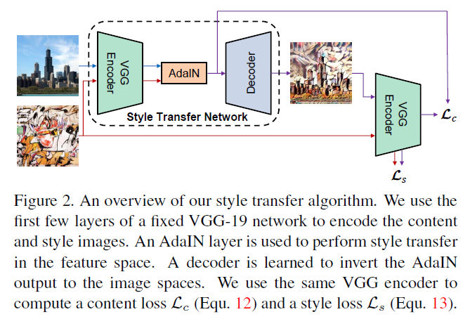
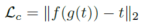
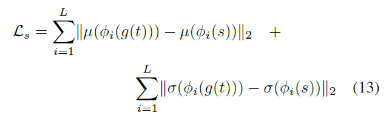
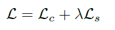
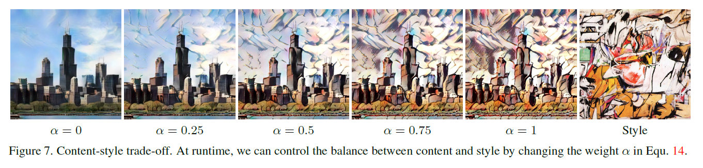
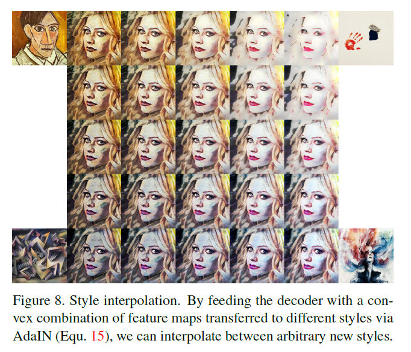
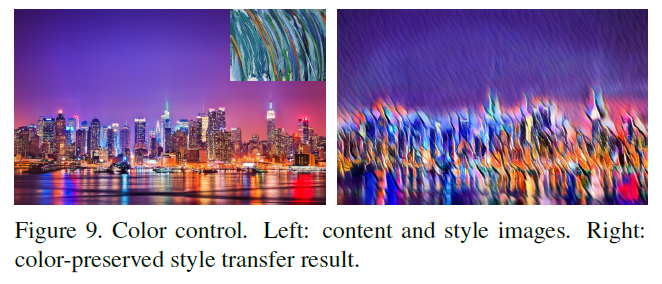
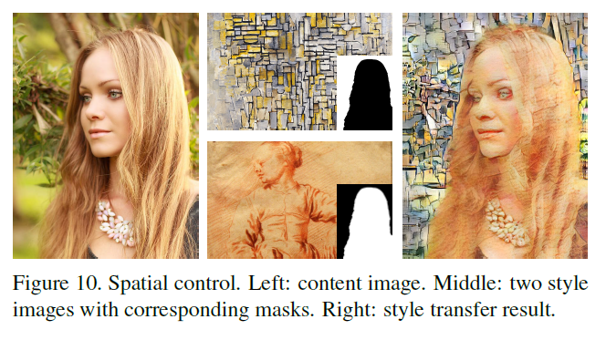

arxiv: <https://arxiv.org/pdf/1703.06868.pdf>

## key points

- arbitrary style transfer in real time
- use adaptive instance normalization(AdaIN) layers which aligns the mean and variance of content features
- allows to control content-style trade-off, style interpolation, color/spatial control

## previous works

- optimization approach using backprop of network to minimize style loss and content loss. This can be used with many different styles without retraining but it takes multiple backprop iterations so it is computationally and time expensive
- feed forward network that will transfer a fixed style to an input image. drawback is that this network is trained for a single style only.
- this work will allow to handle many styles(even unseen ones) at one forward flow.

## Normalizations are effective at stylization

Batch normalization is popular due to its effectiveness in training in all kinds of networks but its has particularly been found to be effective at image generation. The key idea of batch norm is normalizing the mean and standard of each channel features across all mini batches.

Another work found that replacing BN with Instance normalization(IN) gave even better stylization results. The key difference between IN and BN is that IN applies mean/std normalization for each channel but for each sample instead of across all mini batch.

Another work goes one step further and allows the IN parameters are swapped for each style.

These three works indicate that controlling the feature’s mean and standard affects the style of the images.

## AdaIN

If the feature statistics determine the style, then perhaps we can modify a feature’s statistic to change the style?

This idea provided the foundation for AdaIN.

AdaIn will receive content input x and style input y, and it will simply align the channel wise mean and variance of x to match those of y.

It doesn’t have learnable parameters that controls the affine parameters and instead these parameters are computed by style input.

## Network structure using AdaIN for style transfer

the paper proposes the following structure to utilize AdaIN for style transfer.

At the core is a VGG-19 encoder, which is pretrained and only the first few layers will be used. This encoder will not be trained, thus its weights are fixed. Both content image and style image will go through the encoder. For the first few layer’s feature maps, the style image’s feature statistics will be harvested. The content image will also go through the VGG-19 encoder, where each layer’s statistics will be replaced with those of style image feature maps.

The last feature will then be fed to the decoder, which will upsample the feature map back to original input size and output a style transferred output image. This decoder network is the trained network.

For training, the output of decoder’s style and content will be used for loss.

The output of decoder’s style must be close to the style image’s style, and the content must be close to the content of content image.

These two objective functions can be defined as follows.

content loss

This is the content loss. ‘t’ is output of AdaIn layer, the feature that will be fed into decoder(‘g()’). ‘f()’ function is the VGG encoder network. This content loss is thus targeting to minimize the euclidian distance between the “style transferred embedding vector(t)” and “VGG encoder passed vector of the generated stylized image”.

In a way this makes sense, since if the generate stylized image has succeeded in transferring the style, then re-embedded version of itself should be close to it’s maker, which is ‘t’. But because of this approach, **I think** this content loss is partially containing some aspect of style loss. This is because the encoder’s feature maps contain both content and style information, and this content loss is working with features coming out from the first few layers of VGG network, and not the whole VGG network. I think if we used the output of the complete VGG network and used their distance as content loss, then it might be more close to a more “pure” content loss.

Or on second thought if the main assumption made by this paper was the style information is represented by the feature’s mean/std statistics and the rest contributes to the content information, why not melt this idea to the content loss? In this case, both ‘t’ and ‘f(g(t))’ were modified to have equal mean/std and then the distance between these two were used as content loss. But this is just my spontaneous suggestion.

This was a complicated content loss to interpret but the authors mention that this version of content loss give better training performance.

The following is the style loss, and its interpretation is much more simple.

style loss

Adding these two losses is the final loss, and the style loss weight factor(lambda) will control which loss will be more emphasized.

total loss

## Content style trade off

Unfortunately this cannot be done in real-time, since this is controlled by the loss function’s style loss weight. Therefore if you want to adjust the content, style trade off, you will need to retrain it with new style loss weight.

## Style interpolation

this can be done in real-time without any retraining. Simply run two style images and get two sets of style feature statistics. Use some intermediate value for the statistics when doing style transfer.

## Spatial and color control

the style statistics include colors too according to the experiment results above. But what if we want to keep the color and transfer other aspects of styles only? The paper suggests this can be done by preprocessing style image’s color distribution to match the content image’s color distribution. Specifically how to do this is not mentioned in the paper. Then performing style transfer to content image will output an image which retains the colors of the content image but with other style aspects transferred.

spatial control can be done by masking two areas with two different style images. For each mask, the corresponding style image’s feature statistic should be used and the other parts should use the other style image’s feature statistic.

