arxiv: <https://arxiv.org/abs/2108.04539>

# key points

- use text and spatial information. doesn’t utilize image feature
- a better spatial information encoding method compared to LayoutLM
- propose new pretraining task: Area Masked Language Model

# spatial information encoding method

For each text box, get four corner point x,y coordinates and normalize them all with image width/height. For each corner, calculate relative positions with same corner of other bounding boxes. Then apply sinusoidal function, and concatenate x and y embedded vectors into one.

So, for a pair of two bounding boxes we get the four corner’s relative position embedded vector, and each vector will go through its own linear matrix operation, and then all of them will be added up to get spatial feature vector.

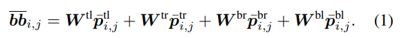

tl: top-left, tr: top-right, br: bottom-right, bl: bottom-left

multi head attention modules share relative position embedding  
sinusoidal function is used because it will be better at handling continuous distances compared to grid embedding.

the final attention between two bounding boxes are sum of text feature and relative spatial feature calculated between the two text boxes.

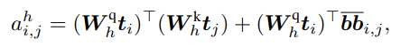

the first term on the right side is standard query-key multiplication in transformers with text information embedded vectors.

by using four corners' coordinates, this method can incorporate not only distance but also relative shape and size.

# Area Masked Language Model

this masks all text blocks in a randomly chosen area.

procedure

- random select text block
- expand that area. expansion rate is sampled from exponential distribution with hyper parameter
- find other text boxes inside area and mask them out
- try to predict text inside masked tokens

The figure is an example

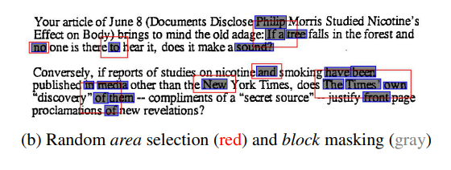

this method will make the model to learn nearby local context.

# Model Architecture

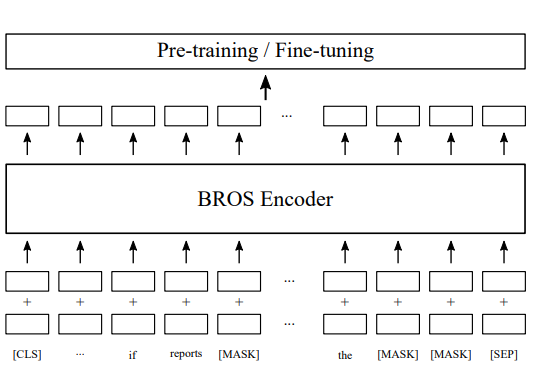

The overall structure is identical to that of BERT. It looks like the only difference is the position encoding and embedding which is infused at the very first input sequence.

# Pretraining

use two tasks, TMLM(the normal token masking used in bert) and AMLM to stimulate the model to learn both individual and consolidated(?) token representations.

use IIT-CDIP dataset where text boxes are extracted by using naver clova ocr api. no performance difference when other OCR was used according to the authors.

# downstream performance

two differently sized models are used

- BROS-base
- BROS-large

Four downstream task datasets(FUNSD, SROIE, CORD, SciTSR) are used.

For each dataset, two tasks are executed: 1) entity extraction(EE) and 2) entity linking(EL)

## word ordered performance

It seems that the text boxes given in downstream datasets are ordered in a human readable manner by default. This ordering allows to apply BIO tagger for EE/EL task without worrying about the ordering of text boxes mixed up in an incomprehensible way. Assuming text box ordering is given properly,

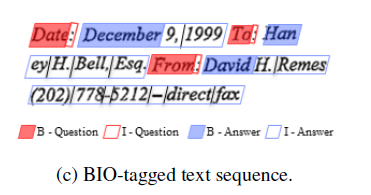

example of BIO tagging

BROS show similar or better than model using visual or hierarchial features.  
BROS is better than other models in all datasets, except SciTSR.

## performance without word ordering

So what if the text box ordering is not ensured? This scenario is also tested by randomly shuffling word ordering and SPADE decoder is used to restore word ordering afterwards.

A SPADE decoder will help to create directed relation graph of tokens, and it works slightly differently when used for EE and EL.

### SPADE for EE task

SPADE works in two steps:

1. initial token classification: finding starting tokens of entities

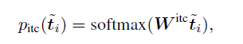

2. subsequent token classification: finding “next” token for a given token(which can be either initial token or subsequent token of an initial token)

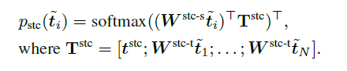

these two steps are well depicted in the following figure

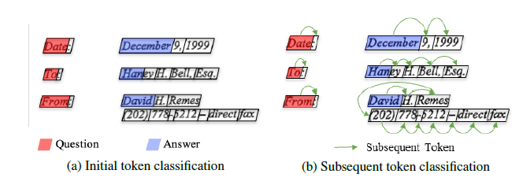

### SPADE for EL task

Since entities are already extracted for EL task and all we need to do is linking the entities, in this case SPADE will examine all token pairs and check if the pairs are linked.

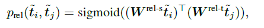

Note that in this case we use sigmoid and not softmax activation. This allows a token to have more than one link, which is useful to represent hierarchial structures among tokens.

This procedure will result linking like this figure.

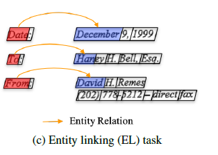

One detail I’m not clear about is that the formula seems to examine in token level, which is word level. But considering the fact that an entity can consist of multiple words(tokens), there is a mismatch on the base unit at work: word vs “words”. Did the authors use some other token that represents each entity? or did they have some post-processing function that merges all links of each token in a multi-token entity?

From the figure it looks like the first token of each entity is paired and examined. But in this case, wouldn’t it be trying to find a link between entities by just looking at the first word? This sounds like its working with so little information even when more is available.

---

Back to talking about performance, in this setting, BROS show best performance in all tasks except SciTSR.

while the large performance drop in BERT is somewhat expected, significant performance drop appears also in LayoutLM and LayoutLMv2, while BROS only goes through minor performance drop.

the authors goes through some other “somewhat-sorted” ordering methods to try to find out why this difference occurs but no clear explanation is concluded.

# Training sample efficiency

the authors also test out the capability of learning with fewer training examples.  
BROS shows highest efficiency. In other words, BROS can achieve same performance with fewer training samples.

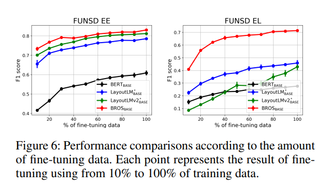

# Ablation Study

both proposed spatial encoding and the new pretrain objective contributes to increase in performance.

in terms of performance: absolute position encoding < simple relative position encoding < BROS relative position encoding

# Comments

- doesn’t mention tokenization strategy. but from the figures, it looks like it embeds word as a whole but no sure.
