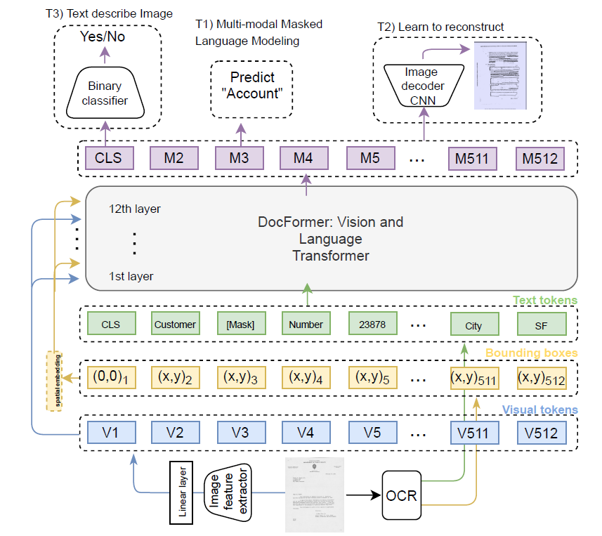
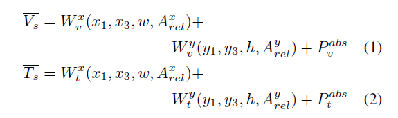
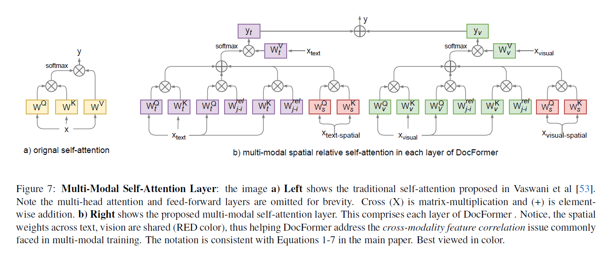
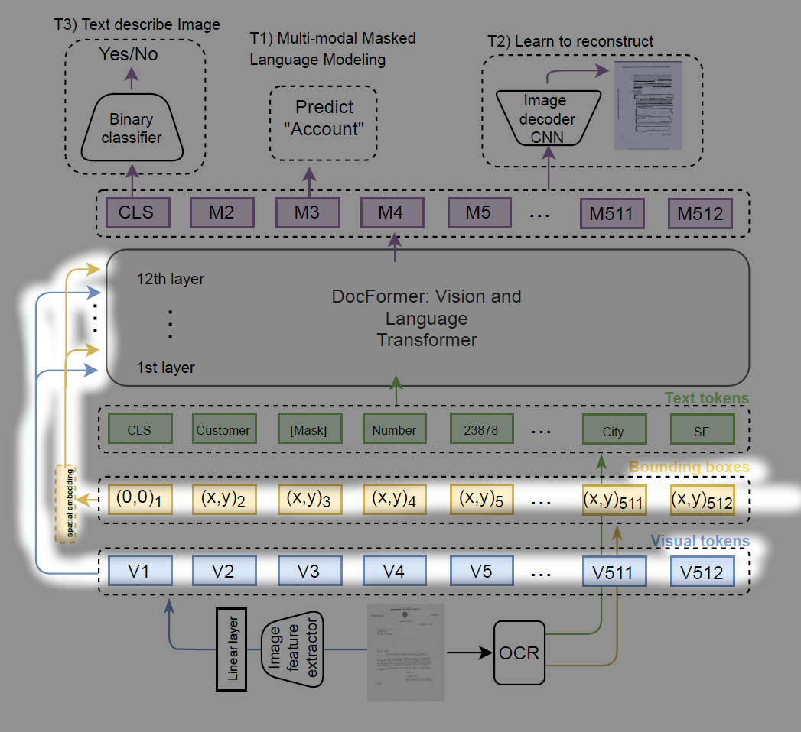
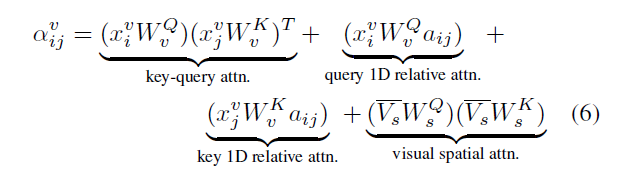

arxiv: <https://arxiv.org/abs/2106.11539>

this work proposes a backbone for visual document understanding domain. It uses text, visual, spatial features.

## Key points

- use text, visual, spatial features
- at each encoding layer, keep feeding in visual and spatial features on the input side. This has the ‘residual’ connection effect.
- text and visual features are processed separately
- when incorporating spatial features, the spatial feature weights are shared for both text and visual features

## Model Structure

The following figure depicts the model structure.

- It is an encoder only transformer architecture
- CNN backbone is used for visual feature extraction. This is also trained end to end (meaning it doesn’t use some pretrained model weights)
- although it will be explained later, the visual and language features go through self attention separately, while they share spatial features.
- note that spatial and visual features are feeded to every layer’s input. This follows the ‘residual connection’ idea and this helps because for each layer, its spatial/visual dependency may differ.

There are three input features to prepare

## visual feature

The visual feature preparing method is unlike other that I have seen. The entire document goes through the following steps

- go through CNN layers, downscaling in each layer. At the final stage, shape=(W,H,C)
- use 1x1 conv to change channel size to wanted channel size. (W,H,C) -> (W,H,D)
- flatten and transpose. (W,H,D) -> (WxH, D) -> (D, W*H)
- apply linear layer to change last dimension size to N. (D, WxH) -> (D, N)
- transpose. (D,N) -> (N, D)

and tada we have the input sequence lengthed array of vectors with desired dimension(D) that embeds the fisual features!

Squashing the WxH dimension into N was an unexpected turn for me. It feels like mushing a well sliced cake and saying it still does represent a cake. But as long as it works…

## language feature

Do text embedding using wordpiece tokenizer.

## spatial feature

The spatial feature will embed the text’s bounding box coordinate information. For each word’s bounding box we encode top-left and bottom-right coordinate using separate layers for x and y values respectively. We also encode width, height, and distance to corresponding corner of the bbox on its right and distance bewteen centroids.

This work proposed to create separate spatial encoding for visual and language feature. This is due to the idea that spatial dependency could be different for visual and language features.

Also add 1-d absolute position encoding feature as well.

This process can be summaried with the following equations.

V_s: spatial feature for visual feature

T_s: spatial feature for text feature

## Multi-Modal Self Attention Layer

So then how are these features going to do self attention?

The following figure will give you an overall idea of what the multi-modal self attention layer proposed by this work looks like.

The figure shows how the newly proposed self attention is different from the vanilla transformer self attention.

The MM self attention does self attetion for text and visual features separately, and only merges them at the very final stage.

For both text/visual MM self attention, it has does the vanilla self attention operation with text feature or visual feature. For text MM self attention, the incoming text feature will be the previous layer’s output by default, and for the very first encoding layer it will be the text feature we discussed above.

For visual MM self attention however, the visual feature input for every encoding layer will be the visual feature we first obtained in the above. In other words, the visual feature is identically used for input of all encoding layers. And this “same vector feeding” is also applied for spatial features.

visual feature and spatial features are reused for all encoding layers.

MM attention operation equation for visual features.

Apart from the vanilla self attention operation, three more terms are introduced for both visual/text MM self attention.

1. query 1-D relative attention
2. key 1-D relative attention
3. visual spatial attention

terms 1) and 2) seem to be incorporating the relative position information from both i-th and j-th token’s perspective. But personally, I’m not sure about the philosophy behind these two terms because considering these two terms mean that this model architecture is relying on 1-D position information and thus means it is permutation-sensitive. i.e. the ordering of tokens matter.

The third term is where the 2-d relative positions and other bbox dimension information get to influence the attention score. But one thing to note is that this term doesn’t work with the actual distances between the two token’s spatial information. The ‘relative’ position here is actually the distance to the bbox on the “right”.

This modified attention score will go through softmax to get the final attention score.

Note that the weights used to interact with incoming spatial features(W_s^Q, W_s^K) are shared between visual and text MM self attention. The authors say this helps to correlate features across modalities. Personally I agree only half about this statement. Sharing the weights applied to visual/text spatial features does make sense with ‘correlating spatial features regardless of visual or text MM self attention’. But the spatial features for visual and text are different because they do not share the weights that are used when obtaining spatial feature vectors. This is just my opinion though.

In the end of the encoding layer, we get visual attention map and text attention map. Since the shape of these two are the same and we need to merge their information into one, we simply add them.

## Pretraining

do three pretraining tasks

### Multi-Modal Masked Language Modeling

for a sequence of text, corrupt(do masking) the text and make the model reconstruct it.  
compared to some other works, this task does not mask the image area of [MASK] tokens. This is to intend the model to use visual features to supplement text features.

### Learn to Reconstruct

similar to MLM, but reconstruct masked image. The final output feature of [CLS] will go through a shallow decoder to reconstruct the document image.  
the final multimodal outputs are gathered and used to reconstruct the original image with the original image size.  
Since the input visual features were created by going through cnn-> (W_H,d) -> (W_H, d) -> (d, W*H) -> (d,N) shape changing process, the reverse can be done to get a reconstructed image from the final multi-modal global output.

### Text Describes Image

using the [CLS] token’s final output representation, add a binary classifier and try to predict if the input text matches the input document image. This task targest global features which is different to other two tasks which focus on local features.

---

The final loss use in training is a weighted sum of each task’s loss.

## Model Variants

two variants are used:

- Docformer-base: 12 layers, hidden_size=768, n_head=12
- Docformer-large: 24 lyaers, hidden_size=1024, n_head=16

## Performance

test on four datasets: FUNSD, RVL-CDIP, CORD, Kleister-NDA.

on all four datasets, either base or large variant achieves the best score compared to other works. Sometimes ‘base’ variant shows better performance.

## Ablation Study

- using shared spatial embeddings does help to improve performance
- doing pretraining helps a lot. (kinda obvious)
- having deeper projection heads can be better or worse, depending on downstream tasks' dataset size. If dataset to finetune on has size in the range of low-to-medium, then shallow projection head is better. But on medium-to-large datasets, deeper projection heads could be beneficial.
- having spatial features and newly proposed multi-modal self attention layer both contribute to higher performance.
- all three pretraining tasks contribute to higher performance
