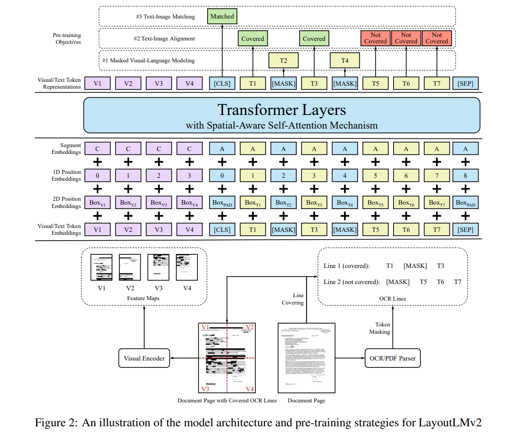
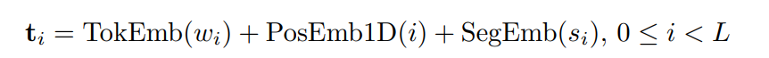
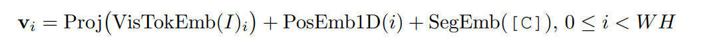
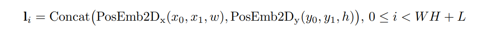
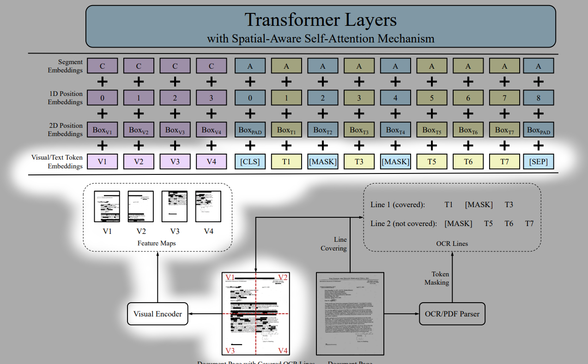
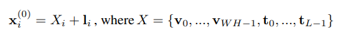
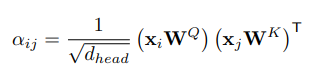
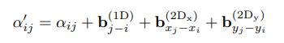
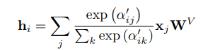

---

title: 'paper review: "LayoutLMV2: Multi-Modal Pre-training for Visually-Rich Document
  Understanding"'
date: '2021-11-19T00:00:00+00:00'
lastmod: '2021-11-19T00:00:00+00:00'
slug: paper-summary-layoutlmv2
categories:
- paper-review
tags:
- "document-understanding"
- "kie"
- "layoutlm"
- "layoutlmv2"
- "multi"
draft: false
---
arxiv: <https://arxiv.org/abs/2012.14740>

LayoutLMv2 is a work improved from LayoutLM. This line of work focues on creating a model for document understanding. The main task of this genre is to extract useful information when a document is given. In this case, it tries to extract information when a document image is given. Therefore text and visual features are used as inputs.

# Key Points

- use 1-D and 2-D relative position encoding to boost performance
- use image feature in pretraining task

## Overall Model Structure

The figure shows the overall structure of the model. The spatial aware self attention layers are not depicted in detail though. The very first input is where all text, visual, positional embedding are fused and injected.

## Text embedding

tokenize text using wordpiece and add 1-d position embedding and segment embedding to get final text embedding.

segment embedding: either ‘A’ or ‘B’ for text embedding. By default just use ‘A’ and use ‘B’ for some special occasions.

## Visual embedding

use ResNext-FPN as backbone of visual encoder. The entire document image is resized to 224x224 and goes through visual encoder. The output feature map is average pooled, and flattened, which will give W*H amount of vectors. this goes through linear projection to get a fixed dimension vectors.

the overall visual embedding is this + 1-d position embedding + segment embedding

1-d position embedding is to compensate positional information being lost during flattening the feature map with W*H grids.

segment embedding: single value “C” is used.

## Layout embedding

embed spatial information which are position coordinates.

- normalize and discretize all coordinate values to range [0,1000]
- embed left top coord(x1,y1) and right bottom coord(x2,y2) and width and height of textbox. so 6 values will be embedded but the x axis values(x1,x2,w) and y axis values (y1,y2,h) will be embedded separately by using two embedding layers.
- The two separate vectors will be concatenated at the end to get the final layout embedding vector.

empty bounding box is used for CLS, SEP, PAD tokens.

---

one thing that might be confusing is that visual embeddings are themselves a part of the input sequence. Look at the overall structure figure, and you will notice that the visual embeddings are split into several tokens and these are mixed with text embedding tokens. In other words, the input sequence

length = (visual embedding token count) + (text embedding token count)

and visual embedding are not somehow fused with text embeddings directly to create some input embedding that represents visual and text information at the same time.

the purpose of ‘segment embedding’ may be confusing as well. From the overall structure figure, we can see that it acts like a flag which allows to discriminate whether a token is a visual embedding(“C”) or a text embedding(“A”). “B” could also be used for text embedding but it isn’t used in the figure and I guess it could be used in special occasions where some sort of discrimination is needed even among the text embeddings.

# encoder operation

the very first input to the encoder is a sequence of vectors where visual embedding tokens and text embeddings tokens are concatenated into one long sequence.

with this vector sequence, apply normal self attention to get attention map. This part is the same as any other transformer self attention layer.

However, before applying softmax to get final attention scroe, this work proposes to infuse relative position information at this point.

The relative 1-D position, and relative 2-D position information(relative x value and relative y value) is infused by adding scalar values obtained by passing through three relative values.

The x,y used when calculating relative 2-D position information is the left-top corner coordinates of each bounding box.

After this operation, we get a new attention score map and we apply softmax on this to get the final spatial-aware attention scores.

# pretraining

use IIT-CDIP dataset by extracting word-level bounding boxes by using Microsoft Read API. three tasks are used for pretraining.

### Masked Visual Language Modeling

randomly mask some text tokens and ask model to retreive the masked text tokens. The image crops of the masked text tokens are also blanked out so that the model is not given any image clues.

### Text Image Alignment

random select some text tokens, and “covers”(seems to be pratically the same as blanking out) the corresponding image crops areas. Then the model is asked to predict for all tokens whether a text token is “covered” or not.

Doing this in word-level would be extremely ineffective since the entire document image is resized to 224x224 which is a small size and think how small the word crop area would be shrinked to. It would probably be a few pixels and in some cases, it might not even occupy any pixels at all. Covering this such a small are of pixels and asking the model to predict if the word area in the image was covered or not would be asking a bit too much.

Therefore, the authors suggest to do this task not in word-level but in line-level containing multiple words. The area of line would be bigger than a word and thus would occupy a meaningful amount of area in the 224x224 reshaped document image.

### Text-Image Matching

from the output representation at [CLS] token, predict whether the image and text are from the same document image. Negative samples are generated by using an image from another document image or dropping it(blacking out I suppose…).

## Experiment and Performance

This work tests its performance on 6 datasets: FUNSD, CORD, SROIE, Kleister-NDA, RVL-CDIP, DocVQA

it performs well on all of them though the metric comparison with BROS should be checked.

## Comments

- I was skeptical with TIM pertraining task because it seemed to a harsh task to perform considering that the document image is resized to 224x224 where the letters are barely recognizable. Trying to check if the text matches inside such a small document image seems like a confusing task for even humans. But it is surprising to see that this task does help to increase performance
- In my first run on reading this paper, I misunderstood about visual embedding. I thought for each word token, the word crop image feature was obtained and infused with the word tokens' text embedding. But I was wrong and the visual embedding doesn’t work per word token but itself is used as a token and the global document image feature is utilized. This visual embedding will interact with text embeddings through self attention operation.
- this work uses wordpiece as tokenizer
