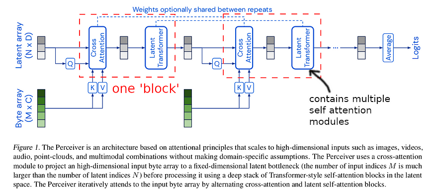
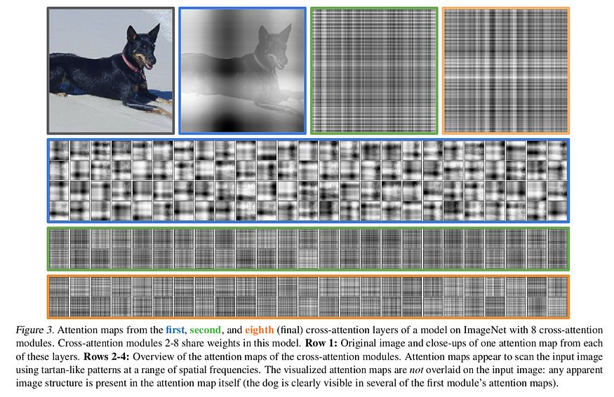

arxiv: <https://arxiv.org/abs/2103.03206>

# key points

- use learnable latent array with a fixed size as query in transformer module in perceiver architecture
- raw inputs can be long since it will be use as key and value in transformer module
- do cross attention to fusion input data into latent array. this allows perceiver to decouple input size to the quadratic transformer complexity
- do self attention on latent arrays
- use one cross attention and multiple self attention as one block, and stack this multiple times and we get the perceiver architecture.
- use fourier feature for position encoding if input data requires it
- perceiver works well for image, video, audio, 3d point clouds

# Idea behind coming up with perceiver

transformers are being used not only in NLP but in other domains, such as image classification, notably VIT.

but applying transformers to other domains until now meant customizing the overall architecture to overcome limitations of transformers, and the biggest obstacle is the transformers’ quadratic complexity depending on input sequence size.

The input length becomes a serious problem when using other domains such as image, audio, video because these data are very large compared to that of text.

Perceiver tries to overcome this quadratic complexity problem and at the same time suggest an architecture which can directly handle input from various domains including image, audio, video, etc.

# Architecture

consists of two modules

1. cross attention module
2. self attention module

If you are familiar with the internals of transformers, the differences between the two would be obvious.

To briefly explain the difference, the two share the core idea. Query, Key, Value arrays are given and the weights for Value array is calculated from multiplying Query and Key array. The difference between the two is whether the Query array is identical to Key and Value array.

Cross attention module is key to perceiver’s strategy to avoid quadratic complexity. The lengthy input array(MxC) will be used as Key and Value array. For the Query array, a latent array(NxD) is used. This latent array has a sequence length much smaller than input array and in the paper it uses 1024. There for in this case the complexity is O(MN).

The self attention module is done by using latent array for all Q,K,V. Therefore the complexity for this module is O(N²).

For each block which consists of one cross attention at the beginning and a few self attention modules coming after that, the overall complexity become O(MN +LN²), where L is number of self attention layers inside the latent transformer. By keeping size of N fixed to a value much smaller than M(input array length), the perceiver can use multiple transformers even when input array is long.

Perceiver chains multiple blocks like these, and this allows multiple points where the latent array can interact with the long input array. One can interpret this as latent array iteratively extracting information from the input array.

weights between blocks can be shared, but not the first cross attention module because doing this made training unstable. This was found empirically.

for cross attention module, inputs are applied with layer norm +linear layers

initial latent array is learned, and initialized randomly using truncated normal distribution of mean=0, stdev = 0.02 and truncation bounds [-2,2]

no dropout used

residual design. input of the module are added to output of module before moving on to the next block.

# Use fourier feature as position encoding

image, audio, video, point cloud data all require indexing information and fourer feature is a well known position encoding method. The authors experimented learnable position embedding, but it lead to lower performance. For images, when absolute coordinates were used instead, the model overfitted.

# Experiments in other domains

model trained with LAMB optimization.

## image

Perceiver shows competitive results compared to ResNet and VIT.

The authors show attention maps of cross attention modules to gain insight.

The first cross module attention maps resembles the input image. But the other cross modules, which share weights, show high frequency tartan-like pattern. This is assumed to be due to the FF positional encoding, because the authors say this type of pattern did not show when using learned positional encodings.

## audio & video

video dropout helps.

audio+video fusion gives better performance than single modality. But lower than SOTA which uses late fusion.

## point cloud

use architecture with 2 cross attention and 6 self attention layers for each block

use higher maximum frequency than for image to account for irregular sampling structure of point clouds

use 64 frequency bands. more than that led to overfitting

SOTA(pointnet++) is achieved by doing more sophisticated augmentations and feature engineering it is sensible that perceiver performs lower than SOTA. but compared to other architectures trained with the same level of augmentation as perceiver, perceiver works best.
