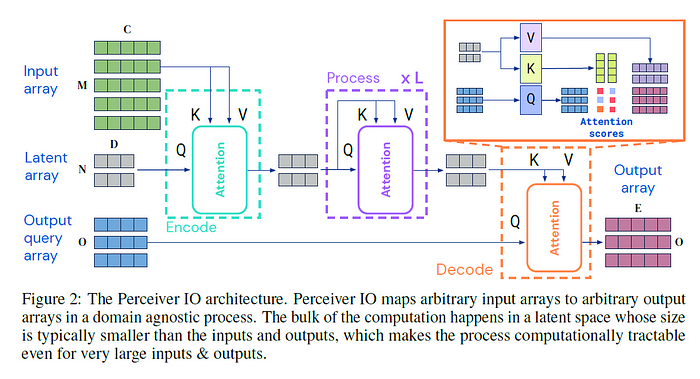
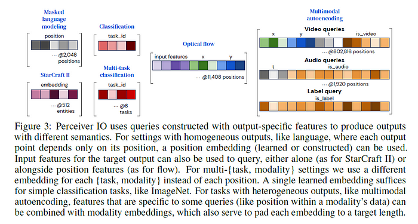

---

title: 'paper summary “Perceiver IO: A General Architecture for Structured Inputs
  & Outputs”'
date: '2021-09-27T00:00:00+00:00'
lastmod: '2021-09-27T00:00:00+00:00'
slug: paper-summary-perceiver-io-a-general-architecture-for-structured-inputs-outputs
categories:
- paper-review
tags:
- "perceiver"
- "perceiver-io"
- "io"
- "general"
- "architecture"
draft: false
---
arxiv: <https://arxiv.org/abs/2107.14795>

# Key points

- developing upon the Perceiver idea, Perceiver IO proposes a Perceiver like structure but where output size can be much larger and still keep overall complexity linear. *(Checkout summary on Perceiver* [*here*](https://medium.com/nerd-for-tech/paper-summary-perceiver-general-perception-with-iterative-attention-6fd5c926f4fb)*)*
- same with Perceiver, this work use latent array to save input information and run this through multiple self attention. Since the latent array size is fixed, complexity does not depend on input length.
- when producing output, use cross attention between latent array and “output query array” with a length matching to that of desired output size. This happens only once, so the overall complexity is still linear.

# Background

Perceiver was a great proposal since it allowed the transformer to work with much longer sequence lengths. But still the output is limited to the latent array size and thus it was only able to use for classification tasks.

The main advantage of perceiver was that it alleviated the length restriction of input. Then how can we also alleviate the length restriction on the output?

# Proposed structure

At the very first step, cross attention module is used to receive input array and mix it into latent array. The several self attention modules are applied to the latent array. In the last part, another cross attention module is used, where the latent array is used as Key and Value while “output query array” is used as query. This last cross attention module allows to finally output an output array where the length will be same as output query array.

The key difference with the Perceiver is the last part where we can control the output array size by configuring the length of output query array.

Another key difference is that in Perceiver the input array is fused into latent array not only in the first stage, but several more times in between the overall structure. This practice is not used in Perceiver IO. The paper doesn’t mention why, but personally I wonder why because periodically infusing input array to latent array looks like a method to increase the model performance.

Then how to prepare “output query array”? it depends on the task you want to do. It should consist of information relevant to deduct the output. For example, for a classification it could be a single learnable vector. For image or video which has spatial/temporal information, output query array could contain position encodings. For multi task, each array in output query array could represent each task. The following figure shows the output query array structure used in this paper for various tasks.

# Experiments

Since Perceiver IO structure can input long sequences and also output long sequences, the paper goes to lengths where no tokenizer is used and the UTF8 bytes are used for NLP. Suprisingly UTF8 byte level Perceiver IO matches performance of BERT using sentencepiece tokens.

The simple Perceiver IO structure performs well in other tasks such as optical flow, multimodal autoencoding, and as a replacement to original transformer used in Starcraft RL framework.
