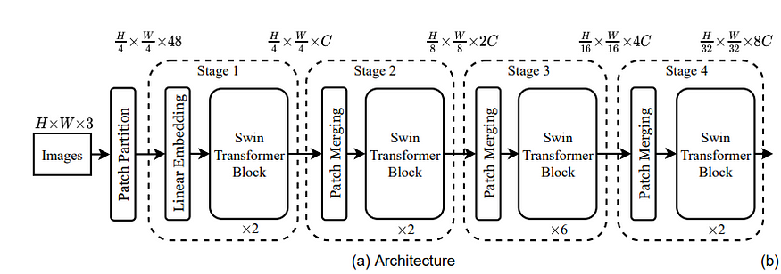
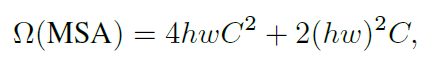
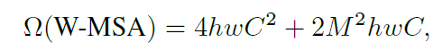
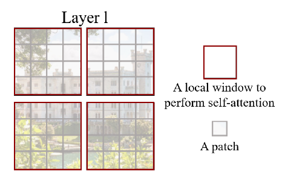
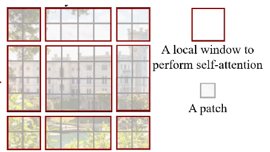
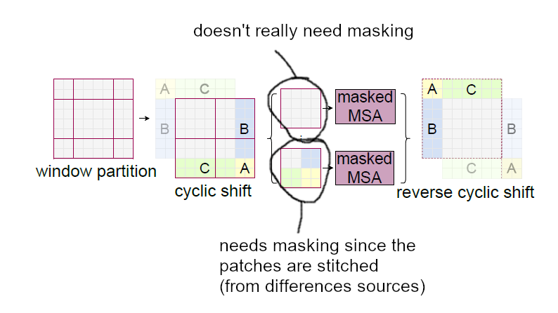
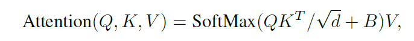
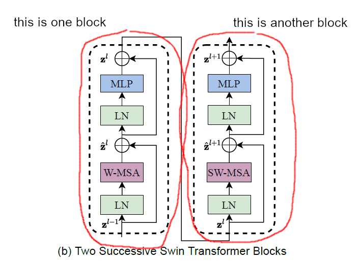
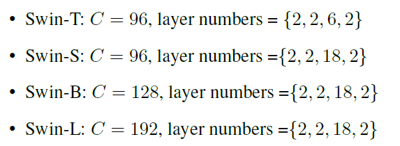

arxiv: <https://arxiv.org/abs/2103.14030>

# Key points

- multi scale feature extraction. Could think of as adoption of FPN idea.
- restrict transformer operation to within each window and not the entire feature map → allows to keep overall complexity linear instead of quadratic
- apply shifted window to allow inter-window interaction
- fuse relative position information in self attention

# Background

transformers are starting to be adopted in image domain

previous works, such as VIT, DEIT are a good step forward but they lack in some parts, mainly

- cannot handle different image scales
- quadratic complexity

this work will try to overcome these drawbacks

# Architecture

with incoming input image, flatten 4x4 pixels into one vector. So non-overlapping patches of 4x4, where each pixel has three values for RGB, each patch will be converted to a vector with length 4x4x3=48. This vector will go through a linear embedding layer and converted to have dimension C.

This goes through a modified transformer blocks, called ‘swin transfomer blocks’ and this has some modifications which will be described later. After this we still get a feature map where each element has dimension C. This transformer and the linear embedding layer in front of it is called “stage1”

From this point on, the feature maps go through several repetition of ‘patch merging + swin transformer blocks’ and this procedure will each be called as a “stage”.

patch merging is grouping 2x2 adjacent patches by concatenating the four elements and then apply linear layer. For example, the first patch merging, since the input feature map’s each position will have vector size of C, concatenating 2x2 patches into one will give a vector with length of 4C. The linear layer following it will change channel size from 4C to 2C. This procedure acts as downsampling reducing width and height of feature map by 2. After patch merging, swin transformer block is applied.

As you can see each time apply ‘patch merging + swin transformer blocks’, we get a reduced feature map. This is repeated 3 times and overall we get 4 feature maps from different scales.

This is the backbone structure which can be supplied to object detection, classification, or segmentation.

# Swin transformer block

Then what’s is so special about the swin transformer? Three ideas are at the core of swin transformer

- split patches into windows, and apply transformer only within patches inside each window → this will restrict transformer complexity form increasing respect to each feature map’s patch total number to the window size(number of patches inside each window)
- after slicing patches into windows and applying transformer at the first time, the window splitting will be shifted and then transformer will be applied again → allows adjacent windows to interact with each other.
- add relative position bias

# Window partitioning

each window will cover MxM patches, and the default value for M=7. If it was a normal transformer multi-head self attention module, the complexity would be

But with limiting transformer to each window area, the complexity is now reduced and dependent on M².

The partitioning of MxM patches starts from the very left-top corner of the feature map. The following figure shows an example when partitioning by 4x4.

# Shifted window partitioning

The shifted version partitioning starts from (M/2, M/2). The following example is when M=4

The leftovers(partitions that are not fully MxM size) are patched together in a cyclic manner. Its hard to put it into words, so the following figure will show how stitching remaining pieces are stitched together.

These “stitched” windows are not “pure”, in other words area are actually not adjacent in terms of actual position, so when applying self attention on this window, we apply mask to each sub-area so that non-adjacent sub-areas to not exchange information during self attention.

Another advantage of this ‘stitching’ approach is that the number of partitions of shifted window partitioning is the same as that of when normal window partitioning is applied. If we did not do stitching, and instead just regarded leftovers as a window then the number of partition will be larger than the number of partitions from normal window partitioning. This disparity could be come significant when window size is smaller than feature map size.

For the stitched window’s results’ sub areas, it needs to be restored to its original positions so make sure to apply ‘reverse cyclic shift’.

# Relative position bias

The authors added relative position information to the QK product before applying softmax to calculate Value matrix weights for Query.

When MxM windows exist for a feature map, then the relative position value either for x or y axis will be somewhere in the range (-M+1 , M-1). To integrate this relative position information we prepare a learnable parameter matrix(B^) with shape (2M-1, 2M-1). Each element will represent a vector that represent the relative x,y position differences. The actual relative position bias matrix(B) will be sampled from B^.

Through experiments, without any bias or using absolute position embedding gave inferior performance.

# Windows self attention and Shifted Window self attention is chained

One transformer block will consist of (windowed or shifted window self attention module + MLP). And when sequentially chaining swin transformers, the self attention module should be toggled between windowed self attention and shifted window self attention module. The following figure shows an example of this rule applied for 2 swin transformer blocks.

# Small Details

- After window MSA(multi-headed self attention) or shifted window MSA, 2 layer MLP (GELU in between) is applied. input for MSA(window/shifted window) and 2-layer MLP passes layer norm first.

# Architecture Variants

The paper creates a few variants of the swin transformer architecture so that the model size is comparable to ViT/DeiT model or ResNet-50, ResNet-101. The model sizes are controlled by size of C (initial feature map’s channel size), layer size of swin transformer block in each stage, window size, expansion factor of MLP layer, etc.

In the paper window size(M) is fixed to 7, MLP layer’s expansion factor is 4, head’s dimension is 32, and the following table show the variants and its C, swin transformer block’s layer size.

The terms are used in a consufing manner here but the swin transformer block’s layer size = swin transformer block # in each stage.

# Experiments

# Image Classification

tested on imagenet. Compared to transformer variants (VIT, DEIT), Swin transformer performs better. compare to conv-net varaints such as EfficientNet is performs slightly lower but considering that EfficientNet is an outcome of extensive architecture optimization, the authors note that swin transformer has potential to do better.

# Object Detection & Instance Segmentation

tested on COCO. Compared to modified DeiT and Resnet backbones, Swin transformers perform better.
