arxiv: <https://arxiv.org/abs/2008.13367>

## key points

- another anchor-free point based object detection network
- introduce new loss, varifocal loss which is a forked version from focal loss. Makes some changes from focal loss to compensate positive/negative imbalance futher.
- instead of prediction classification and IOU score separately, this work predicts a single scalar which represents a combination of these two. The authors say that this approach shows better results when doing NMS postprocessing.
- star-shaped box feature representation.

## Intro

This work applies new ideas on top of FCOS + ATSS. Highly recommend reading on both network/methods. Especially, ATSS is the positive/negative sampling method adopted in this paper which helps to understand this paper smoothly.

FCOS is also a anchor-less object detection network where each point in each feature map predicts object class and ‘centerness’. This approach of separately predicting object class and some scalar representing the localization of the bbox(in this case ‘centerness’) may seem okay and intuitive, but it doesn’t perform so well when doing NMS postprocessing. Othere networks which adopt a similar approach, normally used the classification scalar as confidence, or multiplied this confidence with ‘localization’ scalar(such as ‘centerness’) to use it as a ranking criteria. However, this value doesn’t perform so well in NMS, according to the authors.

## IoU-aware Classficiation Score(IACS)

So the authors proposed to predict a single scalar which is already a multiplied value of object classification and localization metric and directly use this value in NMS for ranking. The authors came up with IoU-aware Classficiation Score(IACS). This method will fill in the gt class object’s IoU value instead of class’s confidence value. The IoU value will be the IoU value bewteen the predicted bbox and gt bbox. In other class’s slots, gt value shall be set to zero. One point to be careful is that the gt value of gt class is dynamic.

## Star Shaped Box Feature Representation

The decision on object class and confidence of the prediction is delegated to IACS. Then what about the actual bounding box coordinates? To this question, the paper uses “star shaped box feature representation”.

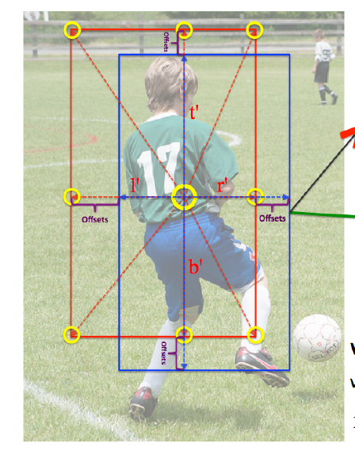

figure to show what the l,t,r,b values mean

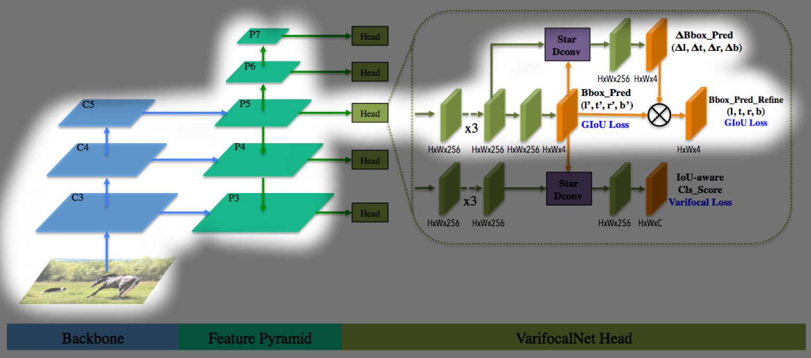

network path related to bounding box prediction.

For each point in the feature map, the network predicts an initial bbox by predicting 4 values: (l',t',r',b') each representing the initial bbox’s left, top right, bottom values from the given point. Then for each point, gather the 9 points on left, right, top, bottom corners and middle points, and the given point itself. Gather these 9 points and apply **deformable convolution** on it. Using this new feature, predict the bbox offsets which is again 4 values: (dl, dt, dr, db). A more appropriate name would be ‘scaling factors’ since the final (l,t,r,b) values are obtained by (dl_*l', dt_* t', dr* r', db * b'). This secondary step is called ‘bouding box refinement’ in the paper and the authors say this helps the predicted bbox to be closer to ground truth.

At this point I’m curious on how the actual implementation handles clipping the l,t,r,b values, but this part is not mentioned in the paper. I guess I’ll have to check out the code implementation for these little details.

I wondered why this method is called ‘star shaped’ but I think I know why. If we draw lines from the center point to the other 8 points in the boundary, it kinda resembles a star.

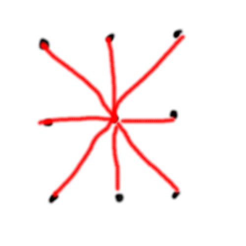

hmm… I don’t really agree that this looks like a star…

## varifocal loss

Back to IACS. We know what the network wants to predict(IACS), but how to incorporate the ‘evolved’ version of focal loss?

The focal loss nicely handles class imbalance by power multiplying the predicted value by gamma, and the formula is shown below.

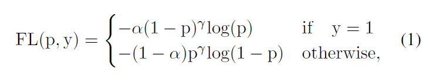

focal loss formula. p=predicted probability, y=ground truth

This work borrows this idea **only** for negative sample’s loss calculation. For positive samples, it uses the bce loss but with one difference: it multiplies bce loss with gt value. This modified versions' formula is shown below and we call it ‘varifocal loss’.

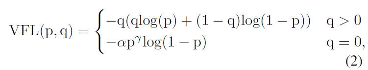

varifocal loss. p=predicted probability, q=ground truth probability, alpha=weight for negative loss, gamma=controls stength of ‘focal loss’ method in negative loss

Using focal loss for negative samples make sense, since the proposed network will inevitably be making a lot of predictions for each points in each feature map which won’t even become valid object bboxes in the end. This work is clever to not adopt this focal method for positive samples, and adopt BCE loss instead.

Another clever point about positive sample loss is that its not the vanilla BCE loss. the ground truth value(=q) is multiplied to the BCE loss. Lets see how this small change modifies the positive sample loss in our favor.

For the vanilla BCE loss, the loss value changes like below, where the graphs are changed by the ground truth value(=q).

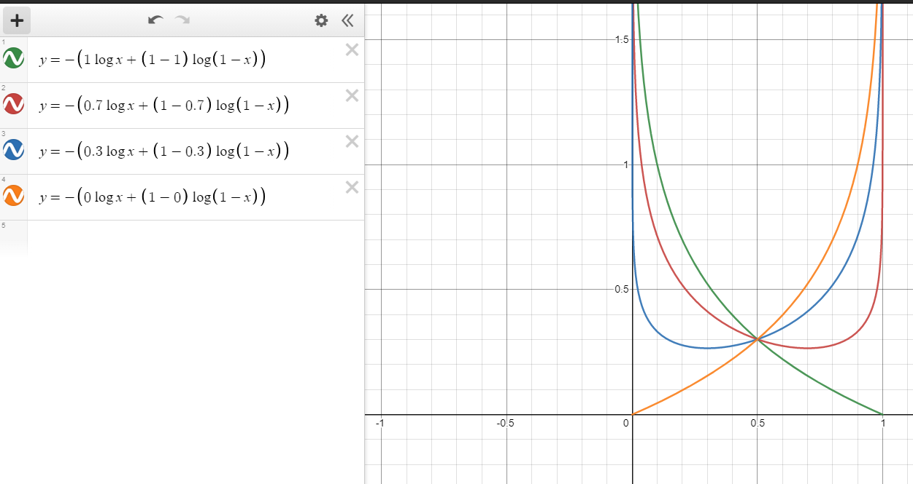

vanilla BCE loss graphs

The same graphs for modified BCE loss is shown below.

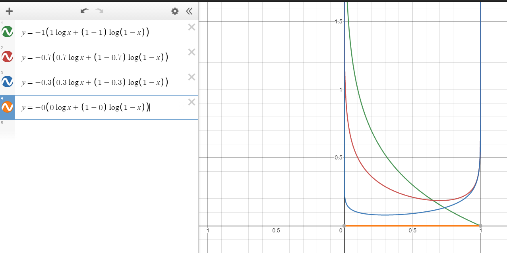

modified BCE loss graphs

In the vanilla version, the loss graph for different q values show a symmetric behavior pivoting on q=0.5. The loss graph for q=1.0 and q=0.0 is the same, except that its just flipped horizontally.

However for the modified BCE loss, the loss graph for q=1.0 and q=0.0 is drastically different. For q=0.0, the graph is just flat. No gradient contribution is going to appear for this curve. For q=1.0, the graph is the same as that in the vanilla BCE loss and this curve will generate gradients that will optimize to the q value. Like this, we can see that the loss curve is effective as the q value is closer to 1.0 and become meaningless as the q value approaches 0.0. Since we want to boost the loss value for more “sure” positive samples, the modified BCE loss is more favorable than the vanilla BCE loss.

## Entire Network Structure

The three main enhancements proposed in this paper are

- star shaped box feature representation
- varifocal loss
- IoU aware classification score

And the network structure that incorporates all this is shown below.

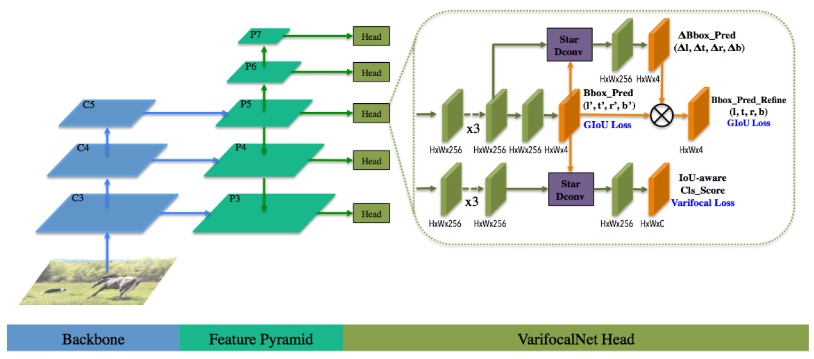

The backbone and feature pyramid is adopted from previous works, and all the new ideas are applied in the head networks attached to feature maps of each level.

The paper call this as **VFNet**

## Loss

The entire loss is a weighted sum of

- varifocal loss
- initial predicted bbox loss
- refined bbox loss

And this can be put into a formula like this:

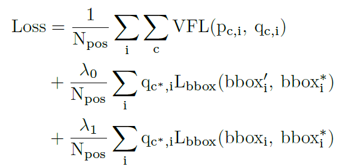

i: point index, c: class index, p=predicted IACS value, q=gt IACS value, L_bbox=GIOU loss function, bbox'=initial predicted bbox, bbox=refined predicted bbox, bbox*=gt bbox, lambdas: weight factors

The meaning of each symbols are written in the caption. One thing I don’t fully understand if why normalize with N_pos, which is the number of positive samples(foreground points). I think this is intuitively the right choice, but just can’t get a grasp a theoretical explanation on why this is the choice to go.

## Inference

The paper uses input image size of 1333x800. When filtering output boxes, it goes through the following steps

- remove bbox with max IACS < 0.05
- select top 1k max_IACS value boxes for each FPN level
- apply NMS with threshold of 0.6

## Takeaways from Ablation Studies

### contribution of new ideas

The contribution of three components(varifocal loss, star shaped bbox representation, bbox refining) are analyzed, where the result is shown below.

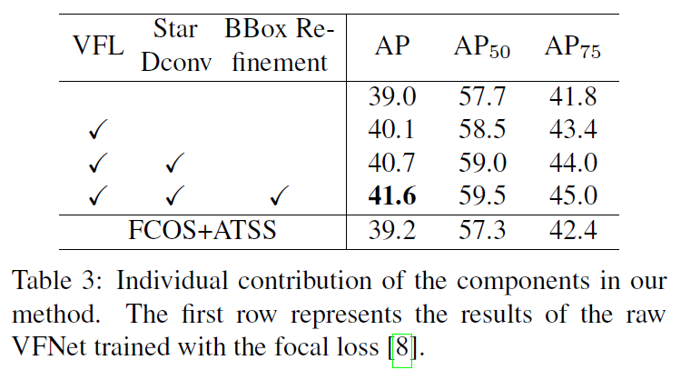

all three result in improvement.

### varifocal loss is better than others

The paper also experimented if varifocal loss is better than vanilla focal loss(FL) and generalized focal loss(GFL). The results are shown below, and we can see that varifocal loss is better than others.

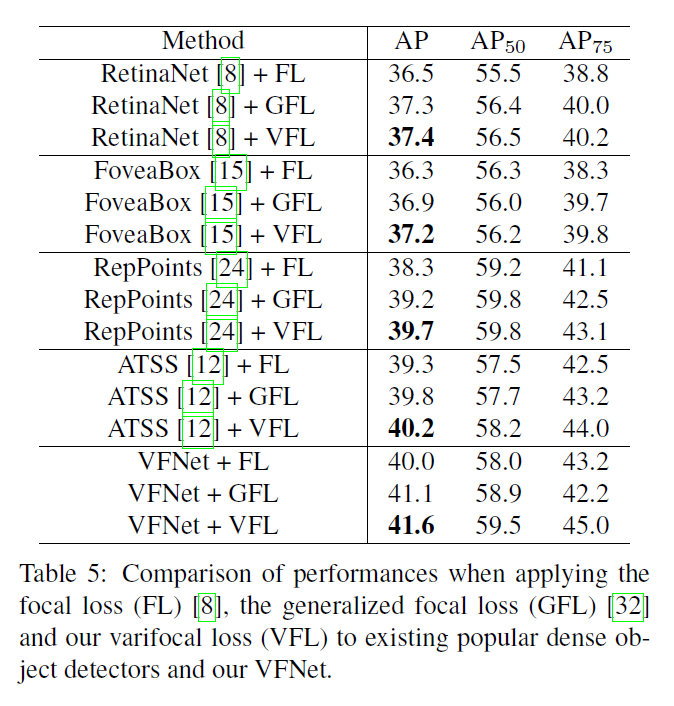
