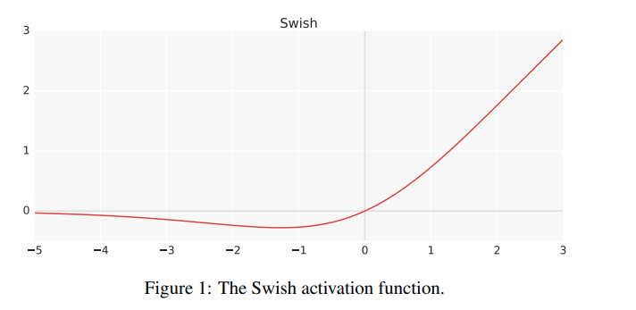
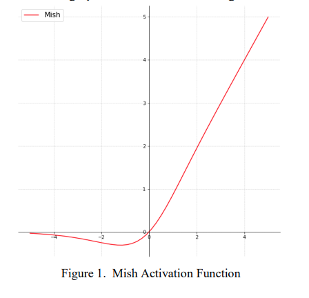
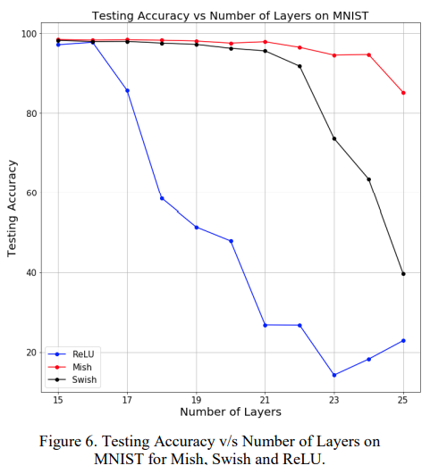

## RELU(2018)

arxiv: <https://arxiv.org/abs/1803.08375>

f(x) = max(0,x)

## GELU(2016)

despite introduced earlier than relu, in DL literature its popularity came after relu due to its characteristics that compensate for the drawbacks of relu.

Like relu, gelu as no upper bound and bounded below. while relu is suddenly zero in negative input ranges, gelu is much smoother in this region. It is differentiable in all ranges, and allows to have gradients(although small) in negative range.

This is advantageous to relu since relu suffers from ‘dying RELU’ problems where significant amount of neuron in the network become zero and don’t practically do anything.

## swish(2017)

arxiv: <https://arxiv.org/pdf/1710.05941v1.pdf>

f(x) = x*sigmoid(x)

graph is similar to gelu.

outperforms relu.

no comparison with gelu in paper.

## mish(2019)

arxiv: <https://arxiv.org/vc/arxiv/papers/1908/1908.08681v2.pdf>

f(x) = x*tanh(softplus(x))

graph is similar to gelu and swish.

according to the paper mish can handle more deeper layered networks than swish, and in other aspects mish is normally slightly better than swish.

But overall, mish and swish performances are nearly identical.

This work does include gelu in comparison experiments.  
interestingly, among various experiments gelu seems to outperform swish in quite a lot of experiements.
