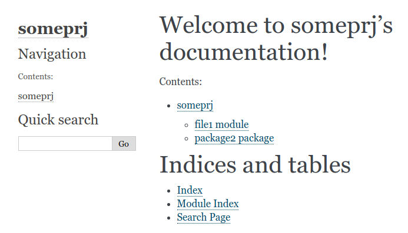
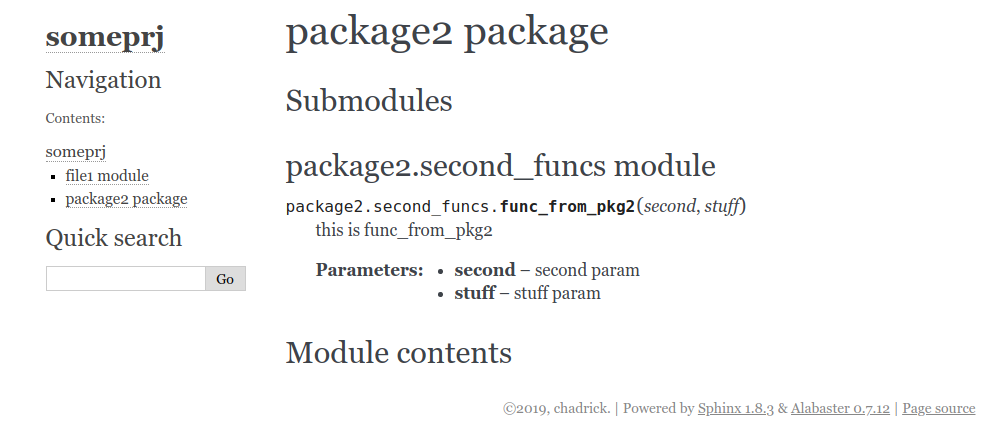

While working with the awesome documentation tool Sphinx, I ran into a situation where I could not seem to make `sphinx-apidoc` to recognize modules under a subdirectory of my project. I triple checked my command but it was fine. The same command worked properly in my other project where it located all the files under a package and created documents for them all. However, this time it seemed to be refusing to recognize and create documents for only a few subdirectories(packages). I found it hard understand what could possibly cause this bizarre behavior all of a sudden.

After extensive hopeless attempt, I found the cause. `sphinx-apidoc` seemed to search through packages(subdirectories) that contained `__init__.py` in them. I usually use python3 which does not require `__init__.py` file to exist in order for the python interpreter to recognize a directory as a package. This naturally lead to the absence of `__init__.py` files in my projects and if they did exist, it was a mistake that auto generated by python2. And to my luck, my previous project did have `__init__.py` files created by accident and `sphinx-apidoc` command worked as expected.

To demonstrate this pesky bug(so I say) that exists in `sphinx-apidoc`, here is a simple project structured in the following way.

```
$ tree .
.
├── docs
│   ├── build
│   ├── Makefile
│   └── source
│       ├── conf.py
│       ├── index.rst
│       ├── _static
│       └── _templates
├── file1.py
├── package1
│   └── first_funcs.py
└── package2
    ├── __init__.py
    └── second_funcs.py
```

I have initialized my sphinx files under `docs/` directory. There are two packages in this project: **package1** and **package2**. Each package contains a module with one dummy function defined in it, and it has docstrings.

How see what happend when I run the `sphinx-apidoc` command upon the project.

```generic
$ cd docs
$ sphinx-apidoc -f -o source/api ..
Creating file source/api/file1.rst.
Creating file source/api/package2.rst.
Creating file source/api/modules.rst.
```

notice that a document has been created for only package2. The only difference between **package1** and **package2** was that package2 contained a `__init__.py` file while the other did not.

Here is a screenshot of the generated html files just to emphasize the difference that this little dummy file can make.





So the next time you run into a situation where `sphinx-apidoc` doesn’t seem to include some packages in its “to document” list, check the existence of `__init__.py` file in that package to verify that this really is a package to `sphinx-apidoc`.
