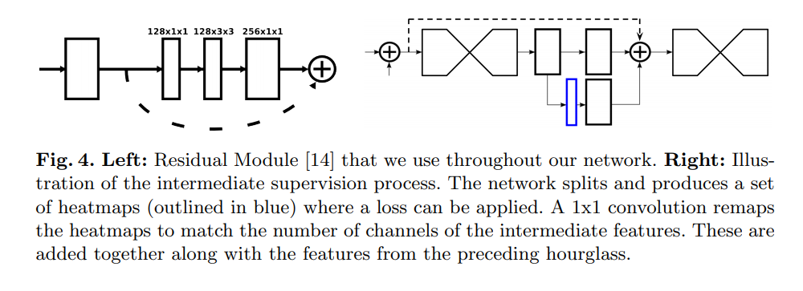
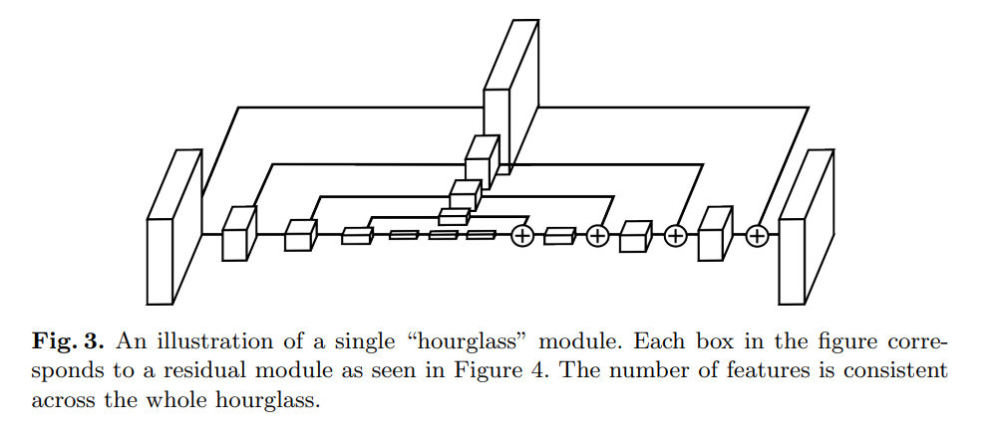
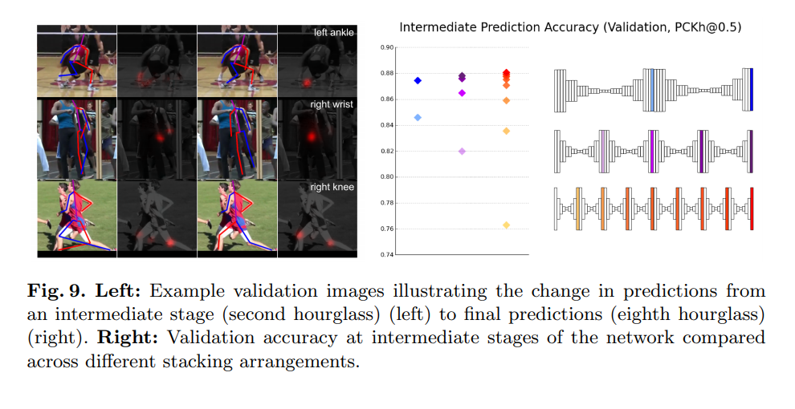
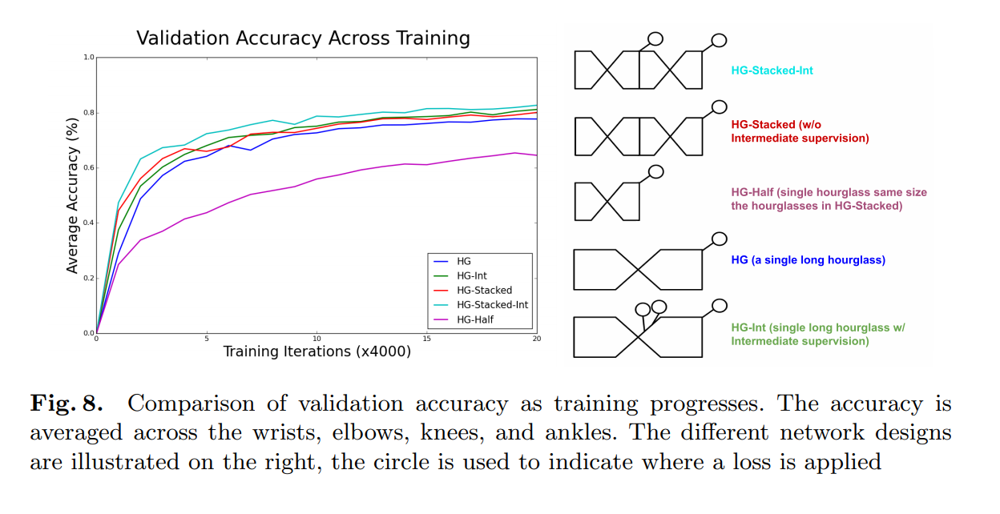

---

title: '"Stacked Hourglass Networks for Human Pose Estimation" paper review'
date: '2020-09-14T00:00:00+00:00'
lastmod: '2020-09-14T00:00:00+00:00'
slug: stacked-hourglass-networks-for-human-pose-estimation-paper-review
categories:
- paper-review
tags:
- "hourglass"
- "segmentation"
- "stacked-hourglass"
- "stacked"
- "networks"
draft: false
---
paper [link](https://arxiv.org/pdf/1603.06937.pdf)

submitted in 2016

I’m only interested in the stacked hourglass architecture, not about pose segmentation performance. So the points listed below are only related to stacked hourglass architecture.

- “encoding-decoding” or “conv-deconv” structure is already introduced. This paper goes one step further and stacks muiltiple “hourglass” structure. While stacking, each hourglass output will be supervised.
- compared to FCN, a single hourglass structure used in this paper has a more symmetrical structure.
- conv layers and maxpooling used in downsampling. nearest neighbor upsampling and elementwise addition is used during upsampling.
- Each hourglass output will go through 1x1 conv layer to be used as intermediate output. this will be added back to the output feature map and then passed on to the next hourglass module.
- The paper does some tests, with single hourglass module and stacked hourglass module.
- use MSE loss
- two ablation studies: 1) effect of intermediate supervision 2) effect of number of stacked hourglasses
- for study on intermediate supervision, baseline is 8-stacked hourglass. when then number of stacks are decreased, each hourglass capacity will be increased for compensation. Results show that more stacks do provide better results.
- for study on intermediate supervision, although intermediate supervison applied to single HG gives good results, doing both is better

