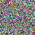

---


title: torchvision fakedata example
date: '2020-12-12T00:00:00+00:00'
lastmod: '2020-12-12T00:00:00+00:00'
slug: torchvision-fakedata-example
categories:
- machine-learning
tags:
- "torchvision"
- "fakedata"
draft: false
---
torchvision supports various datasets and one of them is `fakedata` dataset. I was curious what this actually generated and here is an example

```python
import torchvision, torch

torch.seed()

d = torchvision.datasets.FakeData(10, (3, 50,50), 4)

print(len(d))
print(d\[0\])

a = d\[0\]\[0\]
c = d\[0\]\[1\]

print(c)
a.save('test.png')

"""
output:
10
(<PIL.Image.Image image mode=RGB size=50x50 at 0x7F06F462F050>, tensor(2))
tensor(2)
"""
```



the result is just an random RGB noised image.
